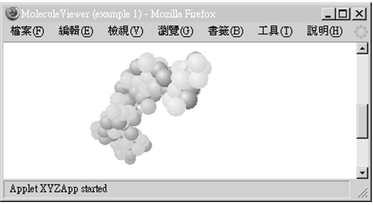
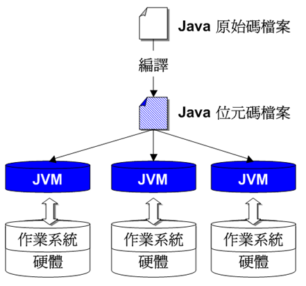
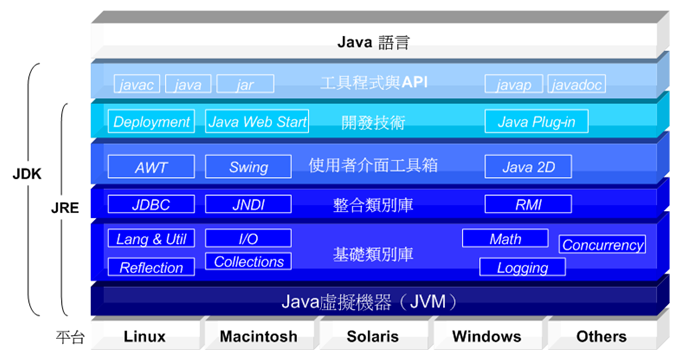

# 第 1 章 瞭解 Java

如果您完全沒有接觸過 Java 或是僅對 Java 有著模糊的認識，那麼試著在這一章中，從 10 多年以來，各時期的 Java 所擔任的角色來瞭解它，或是從 Java 的語言特色來瞭解它、從 Java 應用的平台特色來瞭解它，以及從各式各樣活躍的 Java 社群來瞭解它。如果您是 Java 的初學者，我也在這章最後提示了一些如何學好 Java 的建議。

這一章完全是簡介性的內容，對往後的學習不會有什麼影響，如果您想馬上開始學習 Java ，則可以先跳過這個章節，待日後有空時再回過頭來看看這個章節的內容。

---------------
## 1.1　什麼是 Java

在不同的時間點上，Java 這個名詞有著不同的意義，要瞭解什麼是 Java，從一些歷史性的資料上，您可以對 Java 的角色有所瞭解。

> Java 最早是 Sun 公司（Sun Microsystems Inc.）「綠色專案」（Green Project）中撰寫 Star7 應用程式的一個程式語言，當時的名稱不是 Java，而是取名為 Oak。

綠色專案開始於 1990 年 12 月，由 Patrick Naughton、Mike Sheridan 與 James Gosling 主持，目的是希望構築出下一波電腦應用的趨勢並加以掌握，他們認為下一波電腦應用的趨勢將會集中在消費性數位產品（像是今日的 PDA、手機等消費性電子商品）的使用上，在 1992 年 9 月 3 日 Green Team 專案小組展示了 Star7 手持設備，這個設備具備了無線網路連接、5 吋的 LCD 彩色螢幕、PCMCIA 介面等功能，而 Oak 在綠色專案中的目的，是用來撰寫 Star7 上應用程式的程式語言。

Oak 名稱的由來，是因為 James Gosling 的辦公室窗外有一顆橡樹（Oak），就順手取了這個名稱，但後來發現 Oak 名稱已經被註冊了，工程師們邊喝咖啡邊討論著新的名稱，最後靈機一動而改名為您所常聽到的 Java。

> 全球資訊網（World Wide Web）興起，Java Applet成為網頁互動技術的代表。

1993 年第一個全球資訊網瀏覽器 Mosaic 誕生，James Gosling 認為網際網路與 Java 的一些特性不謀而合，利用 Java Applet 在瀏覽器上展現互動性的媒體，在當時而言，對人們的視覺感官是一種革命性的顛覆，Green Team 仿照了 Mosaic 開發出一個以 Java 技術為基礎的瀏覽器 WebRunner（原命名為BladeRunner），後來改名為 HotJava，雖然 HotJava 只是一個展示性的產品，但它使用 Java Applet 展現的多媒體效果馬上吸引許多人的注意。

**1995 年 5 月 23 日**，Java Development Kits（當時的JDK全名）1.0a2 版本正式對外發表，而在 1996 年 Netscape Navigator 2.0 也正式支援 Java，Microsoft Explorer 亦開始支援 Java，從此 Java 在網際網路的世界中逐漸風行起來，雖然 Star7 產品並不被當時的消費性市場所接受，綠色專案面臨被裁撤的命運，然而全球資訊網（World Wide Web）的興起卻給了 Java 新的生命與舞台。

圖1.1. JDK 所附的 Java Applet 範例（jdk 目錄\demo\applets\MoleculeViewer\ example1.html）

Java 是一個更簡單的物件導向（Object-Oriented）程式語言，具有更高的跨平台可能性。
Java 是一個支援物件導向觀念的程式語言，在使用上比 C++ 更為簡單，它限制或簡化了 C++ 語言在開發程式時的一些功能，雖然犧牲了某些存取或彈性，但讓開發人員避免開發軟體時可能發生的錯誤，並讓程式語言本身使用上更為方便，而 Java 所撰寫出來的程式在不同的平台間具有更高的可攜性，對於「撰寫一次，到處執行」（Write Once, Run Anywhere）這樣的夢想，Java 提供了更高的可能性。
    
> Java可以代表程式語言，但在今日，更多時候代表了軟體開發的架構。

Java 的開發者版本在發表時是以 Java Development Kits 名稱發表，簡稱 JDK，到 J2SE 5.0（Java 2 Platform Standard Edition 5.0）時的 JDK，稱為 J2SE Development Kit 5.0，從 Java SE 6（Java Platform, Standard Edition 6）開始的 JDK6 則稱之為 Java SE Development Kit 6，也就是不再像以前 Java 2 帶有 "2" 這個號碼，版本號 6 或 1.6.0 都使用，6 是產品版本（product version），而 1.6.0 是開發者版本（developer version）。

JDK 除了提供撰寫Java程式時所必要的編譯、執行、除錯等工具之外，更搭配有越來越豐富的 API（Application Programming Interface），隨著應用範圍的越來越廣，Java 演化出三個不同領域的應用平台：**Java SE、Java EE 與 Java ME**（在這之前的舊名稱是 J2SE、J2EE 與 J2ME）。

Java 不再只是單純的程式語言加上 API 文件庫的組成，更提供開發人員在各個領域開發軟體時，一種依循的標準與框架（Framework）工具。
總而言之，隨著時間的推演，Java 這個名詞不再只是表示一個程式語言，而是一種開發軟體的平台，更進一步的也是一種開發軟體時的標準與架構的統稱，事實上語言在整個 Java 的藍圖中只不過是一個極小的部份，學習 Java 本身也不僅僅在於學習如何使用它的語法，更多的時候是在學習如何應用Java所提供的資源與各種標準，以開發出架構更好、更容易維護的軟體。

> **良葛格的話匣子** 在 Design Patterns Elements of Reusable Object-Oriented Software 書中對「框架」作出的解釋是：框架就是一組互相合作的類別組成，它們為特定類型的軟體開發提供了一個可以重複使用的設計。

## 1.2　Java 的特性

Java 本身是個程式語言，所以您可以從程式語言本身的特性來討論它，Java 擁有不同領域的平台，所以您可以從應用領域與平台的特性來探討它，更重要的是 Java 擁有許多活躍的社群、資源與開放原始碼（Open source）專案，這更是在討論 Java 時值得一提的特性。

### 1.2.1 語言特性

作為一個程式語言，Java 擁有許多重要的特性：簡單的（Simple）、物件導向的（Object-oriented）、網路的（Network-savvy）、解譯的（Interpreted）、堅固的（Robust）、安全的（Secure）、可攜的（Portable）、高效能的（High-performance）。以下我針對這幾個重要的特性來加以說明。

- 簡單的（Simple）

  C/C++ 的功能強大是大家所皆知的，即使在眾多程式語言的競爭之下，C/C++ 仍舊在開發軟體的程式語言間佔有相當的地位，然而學習或使用 C/C++ 並不容易，很多時候開發人員並不需要使用到 C/C++ 的一些功能，但為了使用 C/C++ 卻得付出相當的學習成本、開發成本或維護成本。

  設計 Java 的成員們以長年的開發經驗判斷，在使用一些 C/C++ 的功能時，所得到的壞處可能多於好處（尤其是被一些沒有經驗的開發人員使用時），所以 Java 捨棄了 C/C++ 中一些較少使用、難以掌握或可能不安全的功能，像是指標（Pointer）、運算子重載（Operator overloading）、多重繼承（Multiple inheritance）等等。

  Java 除去一些 C/C++ 複雜或不安全的功能，並在許多開發人員常使用的特性上加以簡化而使之易於使用，例如字串在Java中的處理就更為簡單；Java 在設計時參考了許多 C/C++ 的語法與特性，使得學習過 C/C++ 的開發人員可以在短時間內瞭解如何使用 Java。

- 物件導向的（Object-oriented）

    物件導向分析（Object-oriented Analysis）是分析問題的一種方式，物件導向設計（Object-oriented Design）是使用物件導向的思考方式來設計問題的解決方案。很不幸的，要瞭解什麼是物件導向，以及學會使用物件導向的方式進行設計與解決問題，並不是一件簡單的事情，事實上讓您瞭解物件導向正是這本書的目標之一。
    
    這邊您先不用急於瞭解什麼是物件導向，在往後的章節中我會逐漸以實際的例子讓您體會什麼是物件導向，現階段您所要瞭解的是，Java 支援物件導向的設計方式，簡單的說，Java 讓您可以用物件導向的思考與方式來設計並撰寫程式，物件導向的好處之一，就是可以讓您設計出可重用的元件，或者是直接使用別人所撰寫好的 Java 元件，並使開發出來的軟體更具彈性且容易維護。

- 網路的（Network-savvy）

    Java 本身等於就是藉由網路而重生的，它的許多功能與應用都與網路相關，從最初的 Applet、簡化的 Socket、互動式的 JSP/Servlet 網路程式到今日熱門的 Web Service 等，都註定了 Java 在網路相關的領域佔有一席之地，事實 上Java 應用最多的領域也正是網路服務這一塊領域。

- 解譯的（Interpreted）

    您要先知道一件事，程式在一個平台上要能夠執行，必須先編譯為該平台看得懂的原始機器指令（Native machine instructions），但最大的問題在於每個平台所認識的機器指令各不相同，例如 Windows 作業系統認識的機器指令就與 Linux 認識的不相同，專為 Windows 作業系統所撰寫並編譯好的程式，並無法直接拿來在 Linux 作業系統上執行。
    
    為了解決不同平台間執行程式的問題，Java 的程式在進行編譯時，並不直接編譯為與平台相依的原始機器指令，而是編譯為與系統無關的「位元碼」（bytecodes），為了要執行 Java 程式，執行的平台上必須安裝有 JVM（Java Virtual Machine），JVM 就是Java位元碼檔案的虛擬作業系統，Java 位元碼檔案就是 JVM 的可執行檔案，當運行 Java 程式時，Java 即時編譯器（Just In Time compiler, JIT）會將位元碼解譯為目標平台所認得的原始機器指令，藉由 JVM 使得 Java 程式在不同平台上都能執行的目的得以實現。
    
    

圖1.2. JVM 將 Java 位元碼轉換為平台相依的機器指令

> **良葛格的話匣子** 「平台」（Platform）一詞並沒有較嚴謹的定義，在電腦的領域中，平台有時指的是硬體，有時指的是作用於硬體之上的軟體系統，有時則指硬體加上軟體，這邊指的平台是「作業系統」，由於不同的硬體會運行不同的作業系統，所以這邊對平台的定義也就是硬體加上軟體。
您可以在 [Google](http://www.google.com/) 上搜尋 define:platform 來查詢網路上各種對平台的定義。

- 堅固的（Robust）

    Java 將 C/C++ 中一些功能強大但不容易掌握的功能去除掉，以指標（Point）功能為例，即使是有經驗的開發人員在使用指標功能時也得小心翼翼，避免撰寫出使程式崩潰（Crash）的錯誤，諸如此類的功能在 Java 中被去除掉，為的是讓 Java 在使用時更為簡單，撰寫出來的程式更為堅固（Robust）。
    
    捨棄了 C/C++ 的一些特性曾使得許多開發人員質疑沒有了 C/C++ 這些特性，Java 還能開發什麼軟體？但從 Java 正式提出至今日10年來已經證明，Java 確實適用於開發各個領域的軟體，而且更擁有廣大的網路資源。

- 安全的（Secure）

    Java 加入了自動垃圾收集（Garbage collection），讓開發人員無需擔心物件資源的回收問題，例外（Exception）處理架構讓開發人員可以掌握程式中各種突發的例外狀況，另外像是 synchronized、final 等存取關鍵詞的使用，目的都在於加強 Java 程式的安全性。
    
- 可攜的（Portable）

    要讓程式跨平台並不是一件容易的事，有相當多的東西必須考量，例如資料型態所佔記憶體長度就是一個問題，Java 在不同的平台上之資料型態長度是統一的（而 C/C++ 則不然），這是 Java 在提高程式可攜性上最顯而易見的一個例子。
    
- 高效能的（High-performance）

    高效能是 Java 所宣稱的，在某些條件的配合下，Java 號稱可以與 C/C++ 擁有同樣甚至更好的執行效能，但更多的人只是將這個宣稱視為一個商業宣傳的口號，Java 是在執行時期才將中介的位元碼轉譯為原始機器碼，這就花上了一段不短的啟動時間，而早期的 Java 在執行效能上確實是一直被詬病的。
    
    不過在歷經數個版本的變更，Java 一直嘗試提高其執行的效能，像是使 用Java HotSpot 技術，在第一次載入 Java 位元碼時，JIT 會以解譯模式開始載入，分析並嘗試以最佳化編譯為目標平台的原始機器碼。每一次的版本更新，Java皆嘗試在效能上作出改進。

### 1.2.2 應用平台

Java 至今日主要發展出三個領域的應用平台：Java Platform, Standard Edition (Java SE)、Java Platform, Enterprise Edition (Java EE) 與 Java Platform, Micro Edition (Java ME)。

- Java Platform, Standard Edition (Java SE)

    Java SE 是 Java 各應用平台的基礎，想要學習其它的平台應用，必先瞭解 Java SE 以奠定基礎，Java SE 也正是本書主要的介紹對象。

    下圖是整個 Java SE 的組成概念圖：

    

    圖1.3. Java SE的組成概念圖

      Java SE 可以分作四個主要的部份：**JVM、JRE、JDK 與Java語言**。

    為了要能運行 Java 所撰寫好的程式，您的平台上必須有 Java 虛擬機器（Java Virtual Machine, JVM）。 JVM 包括在 Java 執行環境（Java SE Runtime Environment, JRE）中，所以為了要運行 Java 程式，您必須取得 JRE 並進行安裝。如果您要開發 Java 程式，則您必須取得 JDK（Java SE Development Kits），JDK 包括了 JRE 以及開發過程中所需要的一些工具程式，像是 javac、java、appletviewer 等工具程式（關於 JRE 及 JDK 的安裝與使用介紹，會在第 2 章說明）。

    Java 語言只是 Java SE 的一部份，除了語言之外，Java 最重要的就是它提供了龐大且功能強大的 API 類別庫，提供像是字串處理、資料輸入輸出、網路套件、使用者視窗介面等功能，您可以使用這些 API 作為基礎來進行程式的開發，而無須重複開發功能相同的元件，事實上，在熟悉 Java 語言之後，更多的時候，您都是在學習如何使用 Java SE 所提供的 API 來組成您的程式。

- Java Platform, Enterprise Edition (Java EE)

    隨著 Java 的應用領域越來越廣，並逐漸擴及至各級應用軟體的開發，Sun 公司在 1999 年 6 月美國舊金山的 Java One 大會上，公佈了新的 Java 體系架構，該架構根據不同級別的應用開發區分了不同的應用版本： J2SE、J2EE 與 J2ME。這些是當時的名稱，為配合 Java SE 6 中的名稱，以下則稱 為Java SE、JavaEE 與 Java ME。

    Java EE 以 Java SE 的基礎，定義了一系列的服務、API、協定等，適用於開發分散式、多層式（Multi-tiered）、以元件為基礎、以Web為基礎的應用程式，整個 Java EE 的體系是相當龐大的，比較為人所熟悉的技術像是 JSP、Servlet、Enterprise JavaBeans（EJB）、Java Remote Method Invocation（RMI）等，當中的每個服務或技術都可以使用專書進行說明，所以並不是本書說明的範圍，但可以肯定的是，您必須在 Java SE 上奠定良好的基礎再來學習 Java EE 的開發。

- Java Platform, Micro Edition (Java ME)

    Java ME 是 Java 平台版本中最小的一個，目的是作為小型數位設備上開發及部署應用程式的平台，像是消費性電子產品或嵌入式系統等，最為人所熟悉的設備如手機、PDA、股票機等，在近幾年已經相當常見 Java ME 的應用，越來越多的手持裝置都支援 Java ME 所開發出來的程式，像是 Java 遊戲、股票相關程式、記事程式、月曆程式等。

> **良葛格的話匣子** Java SE 6？JDK6？JRE6？您已經搞不清楚這些名稱了嗎？這邊再做個整理。Java SE 是指平台名稱，全名 Java Platform, Standard Edition 6。JDK6 是基於平台的開發程式發行版本，全名 Java SE Development Kit 6。JRE6 則是基於平台的執行環境發行版，全名 Java SE Runtime Environment 6。

### 1.2.3　活躍的社群與豐富的資源

Java 發展至今日獲得廣大開發者的支援，有一個不得不提的特性，即 Java 所擁有的各種豐富資源與各式活躍的社群，來自各個領域的開發人員與大師們各自對 Java 作出了貢獻。

無論是開發工具、開放原始碼的元件、Web 容器、測試工具、各式各樣的軟件專案、各個社群所支持的討論區、取之不盡的文件等，這些資源來自於各個商業化或非商業化的團體，各式各樣活躍的社群造就 Java 無限的資源，這些資源不僅具有實質的應用價值，更具有教育的價值，例如各式各樣的開放原始碼框架（Framework）成品，不僅可以讓您將之使用於實際的產品開發上，還可以讓您從中學習框架的架構與運行機制，即使在某些產品開發上您不使用 Java 來開發程式，也可以運用到這些框架的架構與運行機制。

## 1.3　如何學習 Java

如果您是 Java 的初學者，最想要知道的莫過於如何才能學好 Java？以下是我的幾點建議。

- 奠定 Java 語法基礎

    學習 Java 的第一步，就是學會使用 Java 這個程式語言來撰寫程式，而學習程式語言的第一步，就是熟悉其語法的使用，程式語言就是一門語言，所不同的是這種語言是用來與電腦溝通的，所以要熟悉語言的話，使用的方法莫過於多觀摩別人寫的程式，瞭解別人是如何使用 Java 來解決他們的問題，然後針對同樣的程式進行練習，並從實作中測試自己是否真正瞭解到如何解決問題。
    
- 運用基本的 Java SE API

    除了 Java 語言本身的語法之外，懂得運用 Java SE 的 API 也是一個必要的課題，然而在這麼多的 API 下，您必然想知道哪些API是必要或常用的，我的建議是先掌握字串處理、例外處理、物件容器（Container）、輸入輸出（I/O）、執行緒（Thread）這幾個主題。
    
    API 的內容龐大，沒有任何一本書可以詳細講解每個 API 如何運用，您也不需要將 API 背誦下來，您要懂得查詢 API 文件說明，雖然 API 文件都是英文的，但基本上只要有基本的英文閱讀能力就足以應付查詢需求，以 Java SE 6 來說，您可以下面的網址查詢到 API 文件說明：
    
    http://java.sun.com/javase/6/docs/api/index.html。
    
- 使用搜尋引擎

    作為一個開發人員，懂得使用搜尋引擎來找尋問題的解答是一件必要的能力，我習慣使用 [Google](http://www.google.com/)，幾個簡單的關鍵字通常就可以為您找到問題的答案。
    
- 加入社群參與討論

    在學習的過程中，如果有人可以共同討論的話，將會加速您學習的速度，您可以找一個討論區並摸索當中的資源，這可以省去您不少的學習時間，在中文討論區中我建議多參與 [Java技術論譠](http://www.javaworld.com.tw/)，論譠上有相當豐富的資源，您可以從「新手版FAQ目錄」開始，並記得在發問之前多使用「全文檢索」功能，搜尋論譠上是否已有類似的討論。
    
- 學習地圖
    
    在學習完基本的 Java SE 之後，您會想要實際應用Java來撰寫程式，如果您需要撰寫視窗程式，可以學習 Swing 視窗設計；如果您要撰寫資料庫相關軟體，可以學習 JDBC；如果您想要朝 Web 程式發展，可以學習 JSP/Servlet，如果您想要學習手機程式開發，可以朝 Java ME 方向學習。

    在 Java 的官方網站上，有一篇 Java 技術概念地圖（Java Technology Concept Map），當中以圖表的方式描繪出各種需求下的學習方向參考，您可以瀏覽該圖表來瞭解 Java 各個技術主題之間有什麼關聯，以評估您未來學習的方向，Java 技術概念地圖的網址是：
    
    http://java.sun.com/developer/onlineTraining/new2java/javamap/intro.html。

## 1.4　接下來的主題

每一個章節的內容由淺至深，初學者該掌握的深度要到哪呢？在這個章節中，對於初學者我建議至少掌握以下幾點內容：

- 什麼是位元碼（bytecode）
- Java 可以跨平台的原因
- Java 的三個應用領域（平台）
- Java SE、JDK、JRE、JVM 的差異

我喜歡從實作中學習新的事物並體驗當中運行的原理，並認為這是一個良好的學習方式，這種方式可以同時獲得觀念與實證。我也建議您從實作中學習，所以接下來我會以實作方式來介紹 Java 的每一個環節，首先第一步就是準備好撰寫 Java 程式的環境，包括安裝 JDK、設定環境變數、瞭解主控台（Console）操作以及選擇一個好的編輯器或整合開發環境（Integrated Development Environment）。