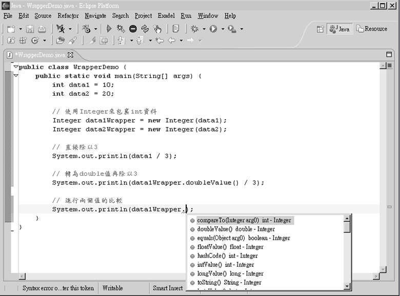

# 第 4 章 從 autoboxing、unboxing 認識物件

在使用 Java 語言撰寫程式時，幾乎都是在處理「物件」（Object），您可以將物件當作一個具體的「工具」，在真正開始學習 Java 的物件導向設計之前，可以先從學習如何使用 Java SE 提供的種種工具開始，然而在第 3 章中學習到基本型態（Primitive type），這些在 J2SE 5.0 前預設並不是以物件的形式存在，您必須親自將之包裹為物件，然後才能像物件一樣的操作它。

在 J2SE 5.0 開始為基本型態提供了自動裝箱（autoboxing）、拆箱（unboxing）的功能，讓您在將基本型態轉換為物件時更為方便，而從中您也可以體會到基本型態與物件的差別。

----------

## 4.1 關於物件

基本型態 long、int、double、float、boolean 等，在 J2SE 5.0 之前必須親自使用 Long、Integer、Double、Float、Boolean 等類別將之包裹為物件，如此才能將之當作物件來操作，即使 J2SE 5.0 開始支援了自動裝箱（autoboxing）、拆箱（unboxing），您仍然有必要瞭解如何親自包裹基本型態，這有助於您瞭解物件與基本型態的差別。

### 4.1.1　使用物件

在 Java 中會經常談到「類別」（Class）與「物件」（Object）這兩個名詞，要詳細談這兩個名詞的差別，就要詳細討論物件導向程式設計的內容，這邊先給您簡單的解釋：「類別就像是物件的設計圖，它定義了物件可操作的功能。」

不以 Java 的術語而以白話來說明的話，物件就像是一件具體的工具，而類別定義了這個工具如何產生。例如您有一張剪刀的設計圖，並依這張設計圖製作了一隻剪刀，則設計圖就類似於我所說的類別，而製作出來的剪刀就類似於我說的工具。

在正式開始學會 Java 物件導向程式設計之前，您要先學會如何使用 J2SE 所提供的一系列標準工具（也就是標準物件），您指明所要使用的設計圖（也就是類別）來產生具體的工具（也就是物件），工具的設計圖內容實際為何您不用擔心，您所要作的就是操作這些工具並配合第 3 章中介紹的流程控制語法，以完成您所需的程式。

舉個簡單的例子，如果您想寫一個程式取得現在的系統時間，您只要產生一個 java.util.Date 工具就可以了，至於 Date 實際上如何向系統取得時間，則無需您來操心，範例 4.1 示範如何取得系統時間。

#### **範例 4.1  NowTime.java**
```java
import java.util.Date;

public class NowTime {
    public static void main(String[] args) {
        Date date = new Date();
        System.out.println(date.toString());
    }
}
```

Date date 表示您指定的工具為 Date 類型，而參考名稱（reference name）為 "date"；new Date() 表示您要程式產生這麼一個 Date 工具。您可以將參考名稱想像成一個名牌，它現在綁在一個 Date 工具上。在取得 Date 的實例（Instance）之後，您就可以透過參考名稱來操作它。這就好比公司員工身上會有個"跑腿"名牌，名牌掛在哪個員工身上，透過"跑腿"名牌呼叫時，有名牌的那個員工就要跑腿。

範例 4.1 中操作 toString() 方法，要求 Date 的實例產生目前的系統時間，然後您將之輸出在文字模式下（有關 Date 操作的詳細說明，請見 18 章），執行結果如下：

    Tue May 03 16:06:46 GMT+08:00 2005

另一個操作物件最顯而易見的就是字串的操作，在 Java 中字串就是物件，是 java.lang.String 類別的一個實例，我會在第 6 章詳細介紹字串的特性，在這邊我先以範例 4.2 展現幾個簡單的字串操作。

#### **範例 4.2  StringDemo.java**
```java
public class StringDemo {
    public static void main(String[] args) {
        String text = "Have a nice day!! :)";
		
        System.out.println("原文：" + text);
        
        // 傳回全為大寫的字串內容
        System.out.println("大寫：" + text.toUpperCase());

        // 轉回全為小寫的字串內容
        System.out.println("小寫：" + text.toLowerCase());

        // 計算字串長度
        System.out.println("長度：" + text.length());

        // 傳回取代文字後的字串
        System.out.println("取代：" + text.replaceAll("nice", "good"));

        // 傳回指定位置後的子字串
        System.out.println("子字串：" + text.substring(5));
    }
}
```

在程式中的每一個陳述都已經說明了每個方法的作用，直接來看執行的結果：

    原文：Have a nice day!! :)
    大寫：HAVE A NICE DAY!! :)
    小寫：have a nice day!! :)
    長度：20
    取代：Have a good day!! :)
    子字串：a nice day!! :)

在 Java 中直接使用 "" 包括的字串就是一個物件，範例 4.3 展現了一個簡單的使用者登入程式，運用了 String 物件的 equals() 方法。

#### **範例 4.3  UserLogin.java**
```java
import java.util.Scanner;

public class UserLogin {
    public static void main(String[] args) {
        Scanner scanner = new Scanner(System.in);

        System.out.print("使用者名稱：");
        String username = scanner.next();

        System.out.print("使用者密碼：");
        String password = scanner.next();

        if("caterpillar".equals(username) 
                  && "1975".equals(password)) {

            System.out.println("秘密資訊在此！");
        }
        else {
            System.out.println(username + 
                    " 您好，輸入的登入資料有誤，請重新輸入！");
        }
    }
}
```

String 物件的 equals() 方法可以用來比對指定的字串是否有相同的字元內容，如果相同就傳回 true，不然就傳回 false，以下是執行的結果：

    使用者名稱：caterpillar
    使用者密碼：1975
    秘密資訊在此！

在範例 4.3 中，您還使用了 Scanner 物件來協助您取得使用者字串的輸入，雖然您並不知道 Scanner 物件實際上如何取得輸入，物件本身包括了如何取得資訊方式，但對您隱藏這些資訊，您只要透過它所提供的方法，就可以完成相對應的操作。

### 4.1.2 包裹（Wrap）基本型態

回過頭來看看基本型態：long、int、double、float、boolean、byte 等。在 Java 中這些並不是物件，它只是純綷的資料，除了數值本身的資訊之外，基本型態不帶有其它的資訊或可操作的方法。

您已經看過幾個操作物件的範例，也知道使用物件的好處，物件本身可以攜帶更多的資訊，所以如果基本型態可以物件的形式存在，它可以帶有更多的訊息並提供相對應的操作方法，在 J2SE 5.0 之前，如果您想要讓基本型態能像物件一樣操作，那麼您要使用 Long、Integer、Double、Float、Boolean、Byte 等類別來包裹（Wrap）基本型態。
Long、Integer、Double、Float、Boolean 等類別是所謂的 Wrapper 類別，正如其名稱所表示的，這些類別的主要目的，就是讓您提供一個物件實例作為「殼」，將基本型態包到這個物件之中，如此您就可以操作這個物件，就好像您將基本型態當作物件一樣操作，您可以直接看看範例 4.4 來瞭解體會。

#### **範例 4.4  WrapperDemo.java**
```java
public class WrapperDemo {
    public static void main(String[] args) {
        int data1 = 10;
        int data2 = 20;
        
        // 使用Integer來包裏int資料
        Integer data1Wrapper = new Integer(data1);
        Integer data2Wrapper = new Integer(data2);
        
        // 直接除以3
        System.out.println(data1 / 3);
        
        // 轉為double值再除以3
        System.out.println(data1Wrapper.doubleValue() / 3);

        // 進行兩個值的比較
        System.out.println(data1Wrapper.compareTo(data2Wrapper));
    }
}   
```

在第 2 章中有提到過，如果您將兩個整數進行相除，預設上會將小數點後的資料去除，而在範例 4.4 中，您將整數使用 Integer 包裹，並使用它的 doubleValue() 傳回 double 值，如此再進行相除時小數點後就不會被去除，而 Integer 上也提供 compareTo() 可以直接比較與另一個 Integer 物件是否相等，如果是就傳回 0，比指定值小的話傳回 -1，比指定值大的話傳回 1，與使用 '==' 只能比較是否相同，compareTo() 方法傳回更多的資訊，執行的結果如下：

    3
    3.3333333333333335
    -1

依照同樣的方式，您也可以將 long、double、float、boolean、byte 等，使用對應的 Long、Double、Float、Boolean、Byte 等類別進行包裹，之後就可以進行物件操作。

> **良葛格的話匣子** 在 IDE 上撰寫程式的話，資料以物件方式存在也可以提高寫程式的效率，因為大部份的 IDE 對物件都會提示可使用的方法，如此在選取物件方法時會很有幫助，例如在 Eclipse 上的一個示範畫面如下：



圖 4.1 Eclipse 上的物件方法提示

## 4.2 自動裝箱、拆箱

基本（Primitive）型態的自動裝箱（autoboxing）、拆箱（unboxing）是 J2SE 5.0 提供的新功能，雖然提供了您不用自行包裹基本型態的方便性，但提供方便的同時表示隱藏了細節，建議您在能夠區分基本型態與物件的差別時再來使用。

### 4.2.1 autoboxing、 unboxing

在 Java 中，所有您要處理的東西「幾乎」都是物件（Object），例如您之前所使用的 Scanner 是物件，字串（String）也是物件，您之後還會看到更多的物件，然而基本（Primitive）資料型態不是物件，也就是您使用 int、double、boolean 等宣告的變數，以及您在程式中直接寫下的字面常量。

在前一個小節中您已經大致看過操作物件的方便性，而使用Java有一段時間的人都知道，有些時候您需要將基本型態轉換為物件，例如使用Map物件要操作put()方法時，需要傳入的引數是物件而不是基本型態。

您要使用包裹型態（Wrapper Types）才能將基本資料型態包裝為物件，前一個小節中您已經知道在 J2SE 5.0 之前，要如下才能將 int 包裝為一個 Integer 物件：

    Integer integer = new Integer(10);
    
在 J2SE 5.0 之後提供了自動裝箱的功能，您可以直接如下撰寫來包裹基本型態：

    Integer integer = 10;
    
在進行編譯時，編譯器在自動根據您寫下的陳述，判斷是否為您進行自動裝箱動作，在上例中您的 integer 參考的會是 Integer 類別的實例；同樣的動作可以適用於 boolean、byte、short、char、long、float、double 等基本型態，分別會使用對應的包裹型態（Wrapper Types）Boolean、Byte、Short、Character、Integer、Long、Float或Double；直接使用自動裝箱功能來改寫一下範例 4.4 作為練習。

#### **範例 4.5  AutoBoxDemo.java**
```java
public class AutoBoxDemo {
    public static void main(String[] args) {
        Integer data1 = 10;
        Integer data2 = 20;
        
        // 轉為double值再除以3
        System.out.println(data1.doubleValue() / 3);

        // 進行兩個值的比較
        System.out.println(data1.compareTo(data2));
    }
}
```

程式看來簡潔了許多，data1與data2在運行時就是Integer的實例，可以直接進行物件操作，執行的結果如下：

    3.3333333333333335
    -1

自動裝箱運用的方法還可以如下：

    int i = 10; 
    Integer integer = i;
    
您也可以使用更一般化的 java.lang.Number 類別來自動裝箱，例如：

    Number number = 3.14f;
    
3.14f 會先被自動裝箱為 Float，然後指定給 number。

J2SE 5.0 中可以自動裝箱，也可以自動拆箱（unboxing），也就是將物件中的基本形態資訊從物件中自動取出，例如下面這樣寫是可以的：

    Integer fooInteger = 10;
    int fooPrimitive = fooInteger;

fooInteger 參考至自動裝箱為 Integer 的實例後，如果被指定給一個 int 型態的變數 fooPrimitive，則會自動變為 int 型態再指定給 fooPrimitive；在運算時，也可以進行自動裝箱與拆箱，例如：

    Integer i = 10;
    System.out.println(i + 10);
    System.out.println(i++);
    
上例中會顯示 20 與 10，編譯器會自動幫您進行自動裝箱與拆箱，也就是 10 會先被裝箱，然後在 i + 10 時會先拆箱，進行加法運算；i++ 該行也是先拆箱再進行遞增運算。再來看一個例子：

    Boolean boo = true;
    System.out.println(boo && false);
    
同樣的 boo 原來是 Boolean 的實例，在進行 AND 運算時，會先將 boo 拆箱，再與 false 進行 AND 運算，結果會顯示 false。

### 4.2.2 小心使用 boxing

自動裝箱與拆箱的功能事實上是編譯器來幫您的忙，編譯器在編譯時期依您所撰寫的語法，決定是否進行裝箱或拆箱動作，例如：

    Integer i = 100;
    
相當於編譯器自動為您作以下的語法編譯：

    Integer i = new Integer(100);
    
所以自動裝箱與拆箱的功能是所謂的「編譯器蜜糖」（Compiler sugar），雖然使用這個功能很方便，但在程式運行階段您還是瞭解 Java 的語義，例如下面的程式是可以通過編譯的：

    Integer i = null;
    int j = i;
    
這樣的語法在編譯時期是合法的，但是在運行時期會有錯誤，因為這種寫法相當於：

    Integer i = null;
    int j = i.intValue();

null 表示 i 沒有參考至任何的物件實體，它可以合法的指定給物件參考名稱，由於實際上 i 並沒有參考至任何的物件，所以也就不可能操作 intValue() 方法，所以上面的寫法在運行時會出現 NullPointerException 的錯誤。

自動裝箱、拆箱的功能提供了方便性，但隱藏了一些細節，所以必須小心，再來看範例 4.6，您以為結果是如何？

#### **範例 4.6  AutoBoxDemo2.java**
```java
public class AutoBoxDemo2 {
    public static void main(String[] args) {
        Integer i1 = 100;
        Integer i2 = 100;
 
        if (i1 == i2) 
            System.out.println("i1 == i2");
        else 
            System.out.println("i1 != i2");
    }
}
```

以自動裝箱與拆箱的機制來看，您可能會覺得結果是顯示 "i1 == i2"，您是對的！那麼範例 4.7 的這個程式，您覺得結果是什麼？

#### **範例 4.7  AutoBoxDemo3.java**
```java
public class AutoBoxDemo3 {
    public static void main(String[] args) {
        Integer i1 = 200;
        Integer i2 = 200;
 
        if (i1 == i2) 
            System.out.println("i1 == i2");
        else 
            System.out.println("i1 != i2");
    }
}
```

結果是顯示 "i1 != i2"，這有些令人訝異，兩個範例語法完全一樣，只不過改個數值而已，結果卻相反。

其實這與 '==' 運算子的比較有關，在第 3 章中介紹過 '==' 是用來比較兩個基本型態的變數值是否相等，事實上 '==' 也用於判斷兩個物件參考名稱是否參考至同一個物件。

在自動裝箱時對於值從 -128 到 127 之間的值，它們被裝箱為 Integer 物件後，會存在記憶體之中被重用，所以範例 4.6 中使用 '==' 進行比較時，i1 與 i2 實際上參考至同一個物件，如果超過了從 -128 到 127 之間的值，被裝箱後的 Integer 物件並不會被重用，即相當於每次裝箱時都新建一個 Integer 物件，所以範例 4.7 使用 '==' 進行比較時，i1 與 i2 參考的是不同的物件。

所以不要過份依賴自動裝箱與拆箱，您還是必須知道基本型態與物件的差異，範例 4.7 最好還是依正規的方式來寫，而不是依賴編譯器蜜糖（Compiler sugar），例如範例 4.7 必須改寫為範例 4.8 才是正確的。

#### **範例 4.8  AutoBoxDemo4.java**
```java
public class AutoBoxDemo4 {
    public static void main(String[] args) {
        Integer i1 = 200;
        Integer i2 = 200;
 
        if (i1.equals(i2)) 
            System.out.println("i1 == i2");
        else 
            System.out.println("i1 != i2");
    }
}
```

結果這次是顯示 "i1 == i2" 了，使用這樣的寫法，相信您也會比較放心一些，對於這些方便但隱藏細節的功能到底要不要用呢？基本上只有一個原則：如果您不確定就不要用。

> **良葛格的話匣子** 基本上我是建議新手不要使用自動裝箱、拆箱的語法，在這邊說明這個功能是為了要完整性介紹 J2SE 5.0 的特性，新手入門的話，最好在對物件有較深入瞭解之後，再來使用這個功能。

## 4.3 接下來的主題

每一個章節的內容由淺至深，初學者該掌握的深度要到哪呢？在這個章節中，對於初學者我建議至少掌握以下幾點內容：

- 瞭解基本型態與物件型態的差異
  接下來的章節要介紹的大部份就都要接觸物件了，像是陣列、字串等，在Java中都是以物件的方式存在，您可以從中瞭解直接操作物件的好處，並在實際操作物件的過程中逐步認識物件。