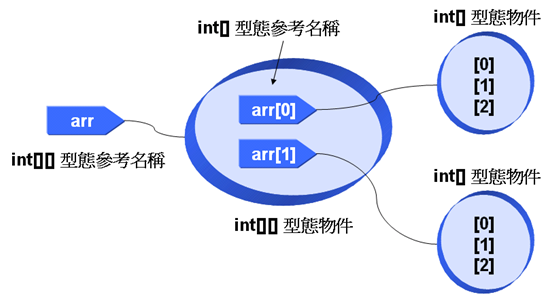
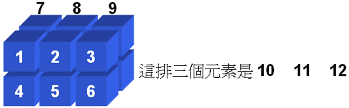
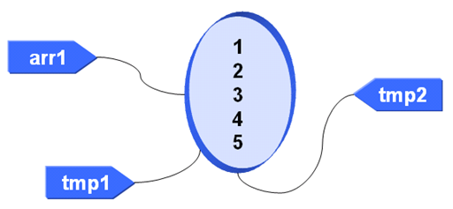
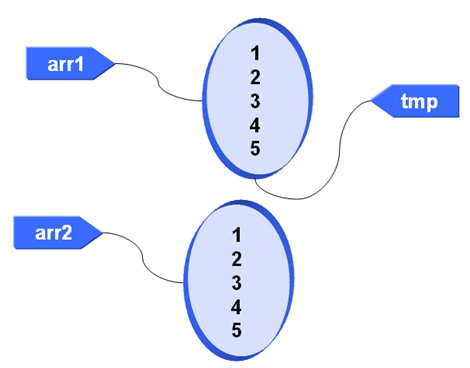
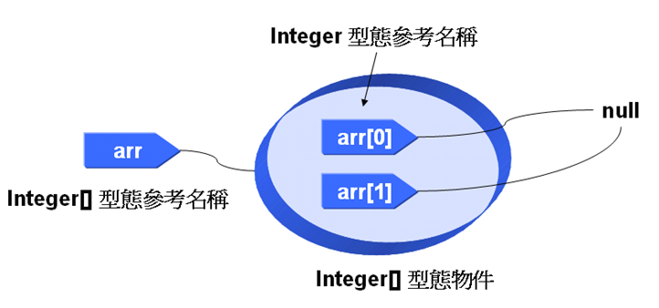
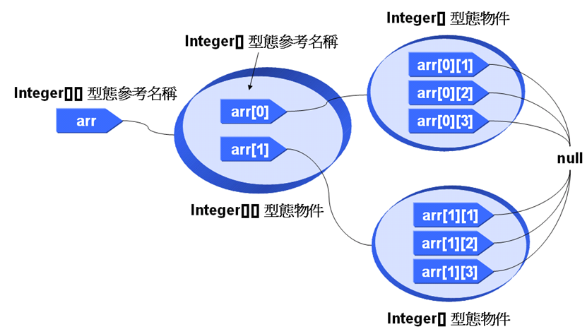

# 第 5 章 陣列

陣列（Array）本質上是一組資料的群組，每筆資料會有一個索引值（Index），您只要指定索引值就可以取出對應的資料，在程式中經常會使用陣列進行資料的整理與存取；在 Java 中，陣列不僅僅是一組資料群組，當您宣告一個陣列時，也就是在生成一個陣列物件，將陣列當作物件來操作，比傳統上的一些程式語言只將陣列當作資料群組多了不少好處。

這個章節會對陣列與物件之間的關係作深入的討論，如果您之前對陣列的認知只是一組資料的話，請在這一個章節中改變這個觀念；另外我也將介紹 J2SE 5.0 中對 Arrays 類別的功能加強，以及 J2SE 5.0 新增的 foreach 語法（Enhanced for loop），看看如何使用 foreach 語法來簡化陣列循序存取時的撰寫方式。

----------

## 5.1 一維陣列、二維陣列

不管在其它語言中是如何，陣列在 Java 中可得看作一個物件，它有一些值得探討的特性，這個小節會先介紹最常使用的一維陣列與二維陣列。

### 5.1.1 一維陣列物件 

您現在要整理全班的 Java 小考成績，您希望寫個小程式，全班共有 40 名學生，所以您必須有 40 個變數來儲存學生的成績，現在問題來了，根據第 3 章學過的變數宣告方式，難道您要宣告 40 個名稱不同的變數來儲存學生的成績資料嗎？

當然不必這麼麻煩，Java 提供「陣列」（Array）讓您可以宣告一個以「索引」（Index）作為識別的資料結構，在 Java 中，您可以這麼宣告一個陣列並初始陣列內容：

    int[] score = {90, 85, 55, 94, 77};

這個程式片段宣告了一個 score 陣列，它的內容包括 90、85、55、94 與 77 這五個元素，您要存取陣列時，必須使用索引值來指定存取陣列中的哪個元素，在Java 中陣列的索引是由0開始，也就是說索引 0 的位置儲存 90、索引 1 的位置儲存 85、索引 2 的位置儲存 55，依此類推，如果您要循序的取出陣列中的每個值並顯示出來，您可以使用 for 迴圈，如範例 5.1 所示。

#### **範例 5.1  SimpleArray.java**
```java
public class SimpleArray {
    public static void main(String[] args) {
        int[] score = {90, 85, 55, 94, 77};
 
        for(int i = 0; i < score.length; i++) 
            System.out.printf("score[%d] = %d\n", i, score[i]); 
    }
}
```
在範例 5.1 中，在每次的 i 遞增後，都會作為陣列的索引指定以取出對應的陣列值，執行的結果如下：

    score[0] = 90
    score[1] = 85
    score[2] = 55
    score[3] = 94
    score[4] = 77

在存取陣列元素時，必須注意到您指定的索引值不可超出陣列範圍，例如在範例 5.1 中，陣列最多可以索引到 4，所以您不可以存取超過 4 的索引值，否則會發生 ArrayIndexOutOfBoundsException 例外，如果您不處理這個例外，程式將會終止，第 10 章會詳細說明例外處理的方法。

範例 5.1 中使用了 length 這個陣列物件的屬性成員，在 Java 中陣列是一個物件，而不是單純的資料集合，陣列物件的 length 屬性成員可以取回陣列的長度，也就是陣列中的元素個數。

當您宣告一個陣列時，其實就是在配置一個陣列物件，實際上範例 5.1 中示範的只是陣列宣告與初始化成員的一個簡易宣告方式，在 Java 中物件都是以 new 來配置記憶體空間，陣列的使用也不例外，事實上一個完整的陣列宣告方式如下所示：

    int[] arr = new int[10];

在上面的宣告中，arr 是個 int[]  型態的參考名稱，程式會為 arr 配置可以儲存 10 個 int 整數的一維陣列物件，索引為 0 到 9，初始值預設為 0，在 Java 中配置陣列之後，若還沒有指定初值，則依資料型態的不同，會預設有不同的初值，如表 5.1 所示。

#### **表 5.1 陣列元素初始值**

| 資料型態  | 初始值
|:------    |:-----
| byte  	| 0 
| short 	| 0 
| int 	    | 0 
| long 	    | 0L 
| float 	| 0.0f 
| double 	| 0.0d 
| char 	    | \u0000
| boolean 	| false 

範例 5.2 使用配置的語法來宣告陣列，並使用 for 迴圈來設定每個元素的值然後顯示出來。
#### **範例 5.2  ArrayDemo.java**
```java
public class ArrayDemo {
    public static void main(String[] args) {
        int[] arr = new int[10];
 
        System.out.print("arr 初始值: "); 
        for(int i = 0; i < arr.length; i++) { 
            System.out.print(arr[i] + " "); 
            arr[i] = i; 
        }

        System.out.print("\narr 設定值: "); 
        for(int i = 0; i < arr.length; i++) 
            System.out.print(arr[i] + " "); 
        System.out.println(); 
    }
}
```
執行結果：

    arr 初始值: 0 0 0 0 0 0 0 0 0 0
    arr 設定值: 0 1 2 3 4 5 6 7 8 9
    
如果您想要在使用 new 新增陣列時一併指定初始值，則可以如下撰寫，注意這個方式不必指定陣列長度：

    int[] score = new int[] {90, 85, 55, 94, 77};
    
事實上這個宣告方式是範例 5.1 中 score 陣列宣告的完整形式，範例 5.3 的是改寫範例 5.1 中 score 宣告方式之後的結果，執行結果與範例 5.1 則是相同的。

#### **範例 5.3  SimpleArray2.java**
```java
public class SimpleArray2 {
    public static void main(String[] args) {
        int[] score = new int[] {90, 85, 55, 94, 77};
 
        for(int i = 0; i < score.length; i++) 
            System.out.printf("score[%d] = %d\n", i, score[i]); 
    }
}
```

由於陣列的記憶體空間是使用 new 配置而來，這意味著您也可以使用動態的方式來宣告陣列長度，而不用在程式中事先決定陣列大小，範例 5.4 示範了如何由使用者的輸入來決定陣列長度，它是一個計算輸入分數平均的程式。

#### **範例 5.4  AverageInput.java**
```java
import java.util.Scanner;

public class AverageInput {
    public static void main(String[] args) {
        Scanner scanner = new Scanner(System.in);
 
        System.out.print("請輸入學生人數: "); 
 
        int length = scanner.nextInt();
        float[] score = new float[length];  // 動態配置長度 
 
        for(int i = 0; i < score.length; i++) {
            System.out.print("輸入分數：");
            float input = scanner.nextFloat();
            score[i] = input;
        }

        System.out.print("\n分數：");
        float total = 0;
        for(int i = 0; i < score.length; i++) {
            total = total + score[i];
            System.out.print(score[i] + " ");
        }

        System.out.printf("\n平均：%.2f", total / score.length);
    }
}
```

執行結果：

    請輸入學生人數: 3
    輸入分數：88.3
    輸入分數：76.2
    輸入分數：90.0

    分數：88.3 76.2 90.0
    平均：84.83
    
在範例 5.4 中，您先宣告一個陣列參考名稱 score，使用 float[] score 表示 score 名稱將參考至一個元素為 float 的一維陣列物件，在使用者輸入指定長度後，您使用這個長度來配置陣列物件，並將這個陣列物件指定給 score 名稱來參考。

> **良葛格的話匣子** 您也可以使用像是 int arr[] 這樣的方式來宣告陣列，這種宣告方式源於 C/C++ 中對陣列宣告的語法，不過在 Java 中建議使用 int[] arr 這樣的宣告方式，這也表明了 arr 是個 int[] 型態的參考名稱。

> 陣列的索引值由 0 開始並不是沒有原因的，事實上索引值表示的是：所指定的陣列元素相對於陣列第一個元素記憶體位置的位移量（Offset）。索引為 0 表示位移量為 0，所以就是指第一個元素，而索引 9 就是指相對於第一個元素的位移量為 9。不過在 Java 中您不直接處理關於記憶體位址的操作，以上的觀念主要是讓您更瞭解一下陣列索引的運作原理。

### 5.1.2 二維陣列物件

一維陣列使用「名稱」與「一個索引」來指定存取陣列中的元素，您也可以宣告二維陣列，二維陣列使用「名稱」與「兩個索引」來指定存取陣列中的元素，其宣告方式與一維陣列類似：

    int[][] arr = {{1, 2, 3}, 
            	   {4, 5, 6}};
                	
從上面這個程式片段來看，就可以清楚的看出二維陣列的索引方式，您宣告了 2 列（Row）3 行（Column）的陣列，使用 { } 與適當的斷行可以協助您指定陣列初值，範例 5.5 簡單的示範二維陣列的存取。

#### **範例 5.5  TwoDimArray.java**
```java
public class TwoDimArray {
    public static void main(String[] args) {
        int[][] arr = 	{{1, 2, 3}, 
                        	{4, 5, 6}}; 

        for(int i = 0; i < arr.length; i++) { 
            for(int j = 0; j < arr[0].length; j++) 
                System.out.print(arr[i][j] + " "); 
            System.out.println(); 
        } 
    }
}
```

執行結果：

    1 2 3
    4 5 6

陣列值 arr[i][j] 表示指定的是第 i 列第 j 行的值。在使用二維陣列物件時，注意 length 所代表的長度，陣列名稱後直接加上 length（如 arr.length），所指的是有幾列（Row）；指定索引後加上 length（如 arr[0].length），指的是該列所擁有的元素，也就是行（Column）數目。

> **良葛格的話匣子** 初學者對於二維陣列的瞭解到這邊就可以了，接下來的內容是進階的二維陣列說明，初學者可以先試著瞭解，如果覺得觀念上有點難，可以先跳過待以後物件觀念更清楚後，再來看接下來的內容。

要瞭解範例 5.5中 length 成員各代表哪一個長度，您必須從物件配置的角度來瞭解。以物件的方式來配置一個二維陣列物件，您要使用以下的語法：

    int[][] arr = new int[2][3];
    
上面這個程式片段中，您配置了 2 列 3 行的二維陣列物件，由於陣列元素的資料型態是 int，所以陣列元素的預設元素為 0。

來細究一下二維陣列的配置細節，其實 arr[0]、arr[1] 是參考名稱，分別參考至兩個 int[] 型態的物件，其長度各為 3，而 arr 名稱的型態是 int[][]，參考至 int[][] 型態的物件，物件中包括 arr[0] 與 arr[1] 兩個名稱，其關係如圖 5.1 所示。



圖 5.1 二維陣列的配置關係

從圖 5.1 中您可以看到，arr 參考至 int[][] 形態的物件，而 arr[0] 與 arr[1] 再分別參考至一個 int[] 物件，所以範例 5.5 中，使用的 arr.length 得到的是 2，而 arr[0].length 得到的長度是 3。有了陣列配置的觀念，您可以改寫範例 5.5 為範例 5.6，讓程式中的 int[] 型態之名稱 foo 來循序取出 arr[0] 與 arr[1] 所參考的 int[] 物件中的每個元素值，執行結果是相同的。

#### **範例 5.6  TwoDimArray2.java**
```java
public class TwoDimArray2 {
    public static void main(String[] args) {
        int[][] arr = {{1, 2, 3}, 
                      	{4, 5, 6}};

        int[] foo = arr[0]; // 將arr[0] 所參考的陣列物件指定給foo

        for(int i = 0; i < foo.length; i++) {
            System.out.print(foo[i] + " ");
        }
        System.out.println();

        foo = arr[1]; // 將arr[1] 所參考的陣列物件指定給foo

        for(int i = 0; i < foo.length; i++) {
            System.out.print(foo[i] + " ");
        }
        System.out.println();
    }
}
```

如果在使用 new 配置二維陣列後想要一併指定初值，則可以如下撰寫：

    int[][] arr = new int[][] {{1, 2, 3}, 
				               {4, 5, 6}};
				               
同樣的道理，您也可以宣告三維以上的陣列，如果要同時宣告初始元素值，可以使用以下的簡便語法：

    int[][][] arr = {
                       {{1, 2, 3}, {4, 5, 6}}, 
                       {{7, 8, 9}, {10, 11, 12}}
                    };
                    
上面這個程式片段所宣告的三維陣列是 2x2x3，您將之想為兩面 2x3 二維陣列交疊在一起就是了，每一面的元素如圖 5.2 所示。



圖 5.2 三維陣列的配置關係

如果要動態宣告三維陣列，就使用以下的語法：

    int[][][] arr = new int[2][2][3]; 
    
比三維以上的更多維陣列之宣告，在Java中也是可行的，但並不建議使用，使用多維陣列會讓元素索引的指定更加困難，此時適當的將資料加以分割，或是使用其它的資料結構來解決，會比直接宣告多維陣列來得實在。

由以上的說明，接下來討論「不規則陣列」。陣列的維度不一定要是四四方方的，您也可以製作一個二維陣列，而每個維度的長度並不相同，範例 5.7 是個簡單的示範。

#### **範例 5.7  TwoDimArray3.java**
```java
public class TwoDimArray3 {
    public static void main(String[] args) {
        int arr[][]; 
 
        arr = new int[2][]; 
        arr[0] = new int[3]; // arr[0] 參考至長度為3的一維陣列
        arr[1] = new int[5]; // arr[1] 參考至長度為5的一維陣列
 
        for(int i = 0; i < arr.length; i++) { 
            for(int j = 0; j < arr[i].length; j++) 
                arr[i][j] = j + 1; 
        } 
 
        for(int i = 0; i < arr.length; i++) { 
            for(int j = 0; j < arr[i].length; j++) 
                System.out.print(arr[i][j] + " "); 
            System.out.println(); 
        } 
    }
}
```

這個例子只是先前說明之觀念延伸，在這個例子中，陣列第一列的長度是3，而第二列的長度是 5，執行結果如下：

    1 2 3
    1 2 3 4 5

> **良葛格的話匣子** 在宣告二維陣列時，也可以使用 int arr[][] 這樣的宣告方式，這種宣告方式源於C/C++中對陣列宣告的語法，不過在 Java 中建議使用 int[][] arr 這樣的宣告方式，這也表示了 arr 是個 int[][] 型態的參考名稱；同樣的，您也可以使用 int arr[][][] 這樣的方式來宣告三維陣列，但鼓勵您使用 int[][][] arr 的宣告方式。

## 5.2 進階陣列觀念

陣列本身若作為物件來操作的話，會有許多特性值得討論，這個小節中將討論一些 Java 中更進階的陣列觀念，並且我也將介紹 J2SE 5.0 中對 Arrays 類別所作的功能加強（JDK6 對於 Arrays 的加強，請查看第 21 章），以及如何使用 J2SE 5.0 新增的 foreach 語法來更簡便的循序存取陣列元素。

### 5.2.1 進階的陣列操作

藉由對陣列物件的進一步探討，您可以稍微瞭解 Java 對物件處理的一些作法，首先來看看一維陣列的參考名稱之宣告：

    int[] arr = null;
    
在這個宣告中，arr 表示一個可以參考至 int 一維陣列物件的參考名稱，但是目前您將這個名稱參考至 null，表示這個名稱參考還沒有參考至實際的物件，在 Java 中，'=' 運算用於基本資料型態時，是將值複製給變數，但當它用於物件時，則是將物件指定給參考名稱來參考，您也可以將同一個物件指定給兩個參考名稱，當物件的值藉由其中一個參考名稱進行操作而變更時，另一個參考名稱所參考到的值也會更動，來看看範例 5.8 的示範。

#### **範例 5.8  AdvancedArray.java**
```java
public class AdvancedArray { 
    public static void main(String[] args) { 
        int[] arr1 = {1, 2, 3, 4, 5}; 
        int[] tmp1 = arr1; 
        int[] tmp2 = arr1; 
 
        System.out.print("透過tmp1取出陣列值：");
        for(int i = 0; i < tmp1.length; i++) 
            System.out.print(tmp1[i] + " "); 

        System.out.print("\n透過tmp2取出陣列值："); 
        for(int i = 0; i < tmp2.length; i++) 
            System.out.print(tmp2[i] + " "); 
 
        tmp1[2] = 9; 
        System.out.print("\n\n透過tmp1取出陣列值：");
        for(int i = 0; i < tmp1.length; i++) 
            System.out.print(tmp1[i] + " "); 

        System.out.print("\n透過tmp2取出陣列值："); 
        for(int i = 0; i < tmp2.length; i++) 
            System.out.print(tmp2[i] + " "); 
        System.out.println();
    } 
}
```

執行結果：

    透過tmp1取出陣列值：1 2 3 4 5
    透過tmp2取出陣列值：1 2 3 4 5

    透過tmp1取出陣列值：1 2 9 4 5
    透過tmp2取出陣列值：1 2 9 4 5

在這個範例中，您藉由 tmp1 名稱改變了索引 2 的元素值，由於 tmp2 也參考至同一陣列物件，所以 tmp2 取出索引 2 的元素值是改變後的值，事實上在範例 5.8 中，有三個參考名稱參考至同一個陣列物件，也就是 arr1、tmp1 與 tmp2，如下圖所示：



圖 5.3 三個名稱參考至同一物件

所以您應該知道，如果取出 arr1 索引 2 的元素，元素值也會是 9。

在宣告 int[] arr 之後，arr 是一個一維陣列物件的參考名稱，所以它可以參考至任何長度的一維陣列物件，這邊使用範例 5.9 來作示範。

#### **範例 5.9  AdvancedArray2.java**
```java
public class AdvancedArray2 { 
    public static void main(String[] args) { 
        int[] arr1 = {1, 2, 3, 4, 5}; 
        int[] arr2 = {5, 6, 7}; 
        int[] tmp = arr1;
 
        System.out.print("使用tmp取出arr1中的元素：");
        for(int i = 0; i < tmp.length; i++) 
            System.out.print(tmp[i] + " "); 
 
        tmp = arr2; 
        System.out.print("\n使用tmp取出arr2中的元素：");
        for(int i = 0; i < tmp.length; i++) 
            System.out.print(tmp[i] + " "); 
        System.out.println();
    } 
} 
```

在範例 5.9 中，tmp 可以參考至擁有5個元素的一維陣列，也可以參考至擁有 3 個元素的一維陣列，執行結果如下：

    使用tmp取出arr1中的元素：1 2 3 4 5
    使用tmp取出arr2中的元素：5 6 7

您瞭解到在 Java 中陣列是一個物件，而使用 '=' 指定時是將物件指定給陣列名稱來參考，也就是相當於圖 5.3 中改變名稱所綁定的物件，而不是將陣列進行複製，如果您想將整個陣列的值複製給另一個陣列該如何作呢？您可以使用迴圈，將整個陣列的元素值走訪一遍，並指定給另一個陣列相對應的索引位置，範例 5.10 示範了進行陣列複製的方法。

#### **範例 5.10  ArrayCopy.java**
```java
public class ArrayCopy { 
    public static void main(String[] args) { 
        int[] arr1 = {1, 2, 3, 4, 5}; 
        int[] arr2 = new int[5]; 
 
        for(int i = 0; i < arr1.length; i++) 
            arr2[i] = arr1[i];
 
        for(int i = 0; i < arr2.length; i++) 
            System.out.print(arr2[i] + " "); 
        System.out.println();
    } 
}
```

執行結果：

    1 2 3 4 5

另一個進行陣列複製的方法是使用 System 類別所提供的 arraycopy() 方法，其語法如下： 

    System.arraycopy(來源, 起始索引, 目的, 起始索引, 複製長度);
    
範例 5.11 改寫了範例 5.10，使用 System.arraycopy() 進行陣列複製，執行結果與範例 5.10 是相同的。

#### **範例 5.11  ArrayCopy2.java**
```java
public class ArrayCopy2 { 
    public static void main(String[] args) { 
        int[] arr1 = {1, 2, 3, 4, 5}; 
        int[] arr2 = new int[5];
 
        System.arraycopy(arr1, 0, arr2, 0, arr1.length);
 
        for(int i = 0; i < arr2.length; i++) 
            System.out.print(arr2[i] + " "); 
        System.out.println();
    } 
} 
```

在 JDK6 中，也為 Arrays 類別新增了陣列複製的 copyOf() 方法，詳情請查看第 21 章。

### 5.2.2 Arrays 類別

對陣列的一些基本操作，像是排序、搜尋與比較等動作是很常見的，在 Java 中提供了 Arrays 類別可以協助您作這幾個動作，Arrays 類別位於 java.util 套件中，它提供了幾個方法可以直接呼叫使用。

#### **表 5.2 Arrays 類別提供的幾個方法說明**

| 名稱              | 說明
|:---               |:---
| sort()            |幫助您對指定的陣列排序，所使用的是快速排序法 
| binarySearch()    |	讓您對已排序的陣列進行二元搜尋，如果找到指定的值就傳回該值所在的索引，否則就傳回負值 
| fill()            | 當您配置一個陣列之後，會依資料型態來給定預設值，例如整數陣列就初始為 0，您可以使用Arrays.fill()方法來將所有的元素設定為指定的值 
| equals()          | 比較兩個陣列中的元素值是否全部相等，如果是將傳回true，否則傳回 false 

範例 5.12 示範了使用 Arrays 來進行陣列的排序與搜尋。

#### **範例 5.12  ArraysMethodDemo.java**
```java
import java.util.Scanner;
import java.util.Arrays;
 
public class ArraysMethodDemo {
    public static void main(String[] args) {
        Scanner scanner = new Scanner(System.in);
 
        int[] arr = {93, 5, 3, 55, 57, 7, 2 ,73, 41, 91};
 
        System.out.print("排序前: "); 
        for(int i = 0; i < arr.length; i++) 
            System.out.print(arr[i] + " "); 
        System.out.println(); 
 
        Arrays.sort(arr);
 
        System.out.print("排序後: "); 
        for(int i = 0; i < arr.length; i++) 
            System.out.print(arr[i] + " ");
 
        System.out.print("\n請輸入搜尋值: "); 
        int key = scanner.nextInt();
        int find = -1;
        if((find = Arrays.binarySearch(arr, key)) > -1) {
            System.out.println("找到值於索引 " + 
                                       find + " 位置"); 
        }
        else 
            System.out.println("找不到指定值"); 
    }
} 
```

執行結果：

    排序前: 93 5 3 55 57 7 2 73 41 91
    排序後: 2 3 5 7 41 55 57 73 91 93
    請輸入搜尋值: 7
    找到值於索引 3 位置

範例 5.13 示範了使用 Arrays 來進行陣列的填充與比較。

#### **範例 5.13  ArraysMethodDemo2.java**
```java
import java.util.Arrays;
 
public class ArraysMethodDemo2 {
    public static void main(String[] args) {
        int[] arr1 = new int[10]; 
        int[] arr2 = new int[10]; 
        int[] arr3 = new int[10]; 
 
        Arrays.fill(arr1, 5); 
        Arrays.fill(arr2, 5); 
        Arrays.fill(arr3, 10); 
 
        System.out.print("arr1: "); 
        for(int i = 0; i < arr1.length; i++) 
            System.out.print(arr1[i] + " "); 
 
        System.out.println("\narr1 = arr2 ? " + 
                         Arrays.equals(arr1, arr2)); 
        System.out.println("arr1 = arr3 ? " + 
                         Arrays.equals(arr1, arr3)); 
    }
} 
```

執行結果：

    arr1: 5 5 5 5 5 5 5 5 5 5
    arr1 = arr2 ? true
    arr1 = arr3 ? false

請注意到，您不可以用 '==' 來比較兩個陣列的元素值是否相等，'==' 使用於物件比對時，是用來測試兩個物件名稱是否參考至同一個物件，也就是測試兩個名稱是不是綁定至同一個物件，範例 5.14 是這個觀念的實際示範。

#### **範例 5.14  TestArrayValue.java**
```java
public class TestArrayValue {
    public static void main(String[] args) { 
        int[] arr1 = {1, 2, 3, 4, 5};
        int[] arr2 = {1, 2, 3, 4, 5};
 
        int[] tmp = arr1;
 
        System.out.println(arr1 == tmp); 
        System.out.println(arr2 == tmp); 
    }    
} 
```

在範例 5.14 中，雖然 arr1 與 arr2 中的元素值是相同的，但實際上 arr1 與 arr2 是參考至不同的兩個陣列物件，您將 arr1 指定給 tmp 來參考，由於 tmp 與 arr1 是參考同一陣列物件，如圖 5.4 所示：



圖 5.4 arr1 與 tmp 是參考至同一物件

所以進行 'arr1==tmp' 比較時會顯示 true，而 tmp 與 arr2 是參考至不同陣列物件，所以進行 'arr2==tmp' 比較時會顯示 false，執行結果如下：

    true
    false

在 J2SE 5.0 中對對 Arrays 類別作了不少的修改與功能新增，由此可見陣列操作在程式中的重要性，這邊介紹 Arrays 中新增的兩個方法：deepEquals() 與 deepToString()。

#### **表 5.3 Arrays 類別新增的兩個方法說明**
|名稱            | 說明
|:------------   |:-----
| deepEquals()	 | 對陣列作深層比較，簡單的說，您可以對二維仍至三維以上的陣列進行比較是否相等
| deepToString() | 將陣列值作深層輸出，簡單的說，您可以對二維仍至三維以上的陣列輸出其字串值

範例 5.15 是個簡單示範，它對三個二維陣列進行深層比較與深層輸出。

#### **範例 5.15  NewArraysDemo.java**
```java
import java.util.Arrays; 
 
public class NewArraysDemo { 
    public static void main(String args[]) { 
        int[][] arr1 = {{1, 2, 3},
                        	 {4, 5, 6},
                        	{7, 8, 9}};
        int[][] arr2 = {{1, 2, 3},
                        	 {4, 5, 6},
                        	 {7, 8, 9}};
        int[][] arr3 = {{0, 1, 3},
                        	 {4, 6, 4},
                        	 {7, 8, 9}};
 
        System.out.println("arr1 內容等於 arr2 ? " + 
                            Arrays.deepEquals(arr1, arr2));
        System.out.println("arr1 內容等於 arr3 ? " + 
                            Arrays.deepEquals(arr1, arr3));
        System.out.println("arr1 deepToString()\n\t" + 
                            Arrays.deepToString(arr1));
    } 
} 
```

執行結果：

    arr1 內容等於 arr2 ? true
    arr1 內容等於 arr3 ? false
    arr1 deepToString()
            [[1, 2, 3], [4, 5, 6], [7, 8, 9]]

當然 Arrays 並不只有以上介紹的功能，總之，如果您之前對 Arrays 沒這麼的重視，現在您可以多關照它幾眼，如果您有陣列操作方面的相關需求，可以先查查  java.util.Arrays 的 API 文件說明，看看有沒有現成的方法可以使用。

### 5.2.3 foreach 與陣列

J2SE 5.0 新增了 foreach 的語法，又稱加強的 for 迴圈（Enhanced for Loop），其應用的對象之一是在陣列的循序存取上，foreach 語法如下：

    for(type element : array) {
    　　System.out.println(element)....
    }
    
直接以實例的方式來說明會更容易瞭解這個語法如何使用，在 J2SE 5.0 之前您可以使用以下的方式來循序存取陣列中的元素：

    int[] arr = {1, 2, 3, 4, 5};
    for(int i = 0; i < arr.length; i++)
        System.out.println(arr[i]);
        
在 J2SE 5.0 中可以使用新的 foreach 語法這麼寫：

    int[] arr = {1, 2, 3, 4, 5};
    for(int element : arr)
        System.out.println(element);
        
每一次從 arr 中取出的元素，會自動設定給 element，您不用自行判斷是否超出了陣列的長度，注意 element 的型態必須與陣列元素的元素的型態相同。

如果是物件的話，作法也是類似，例如存取字串陣列的話，可以如下撰寫：

    String[] names = {"caterpillar", "momor", "bush"};
    for(String name : names)
         System.out.println(name);

那麼二維陣列呢？基本上您要是瞭解陣列本身就是個物件，您自然就會知道如何存取，舉個例子：

    int[][] arr = {{1, 2, 3},
                   {4, 5, 6},
                   {7, 8, 9}};
    for(int[] row : arr) {
        for(int element : row) {
            System.out.println(element);
        }
    }
    
三維以上的陣列使用 foreach 的方式來存取也可以依此類推。

### 5.2.4 物件陣列

如果使用類別型態來宣告陣列，有幾個常見的有趣問題，在這邊先一步一步來看，首先請問您，以下產生幾個物件：

    int[] arr = new int[3];

這個是很基本的問題，答案是一個一維陣列物件，由於元素型態是 int，所以每個元素值初始值是 0。那麼以下的宣告產生幾個物件：

    int[][] arr = new int[2][3];

答案是 3 個，理由可以看看先前圖 5.1 的圖解就可以明白。現在再請問，以下產生幾個物件：

    Integer[] arr = new Integer[3];

有的人會以為這樣會產生 3 個 Integer 的實例，但事實上不是，以上產生的是 1 個一維陣列，由於元素型態是 Integer，所以元素值全部參考至 null，如圖 5.5 所示：



圖 5.5 一維物件陣列示意圖

最後一個問題，請問以下的宣告產生幾個物件？

    Integer[][] arr = new Integer[2][3];

不好想像嗎？這時畫個圖就很清楚了，如圖 5.6 所示：



圖 5.6 二維物件陣列示意圖

當您搞不清楚物件之間的配置關係時，畫圖是很好的表示方式，在上圖中，我們可以看到有3個物件，而由於元素型態是 Integer，所以六個元素參考名稱預設都是參考至 null。

## 5.3 接下來的主題

每一個章節的內容由淺至深，初學者該掌握的深度要到哪呢？在這個章節中，對於初學者我建議至少掌握以下幾點內容：

- 會宣告一維、二維陣列
- 會循序取出一維、二維陣列的元素並顯示在文字模式下
- 記得表 5.1 的陣列元素初始值
- 會使用 Arrays 類別來協助您進行陣列操作

接下來要瞭解的字串（String）與陣列有一些相類似的特性，字串的本質是字元陣列，但在 Java 中字串不僅是字元陣列，而是 String 類別的一個實例，在 Java 中您可以用一些簡單的方式處理字串，不過有些字串的特性是您必須瞭解的，這可以讓您的程式在處理字串上更有效率。