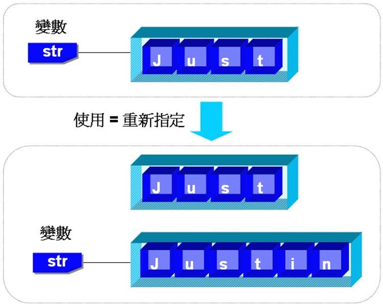
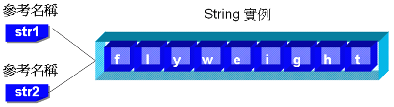
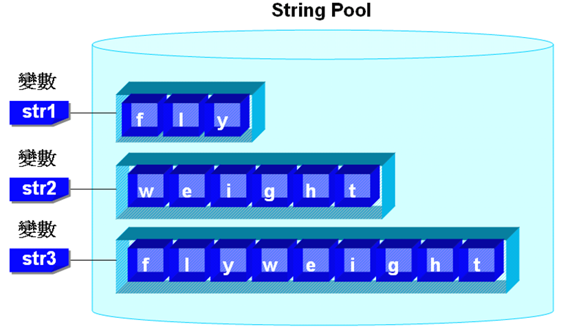
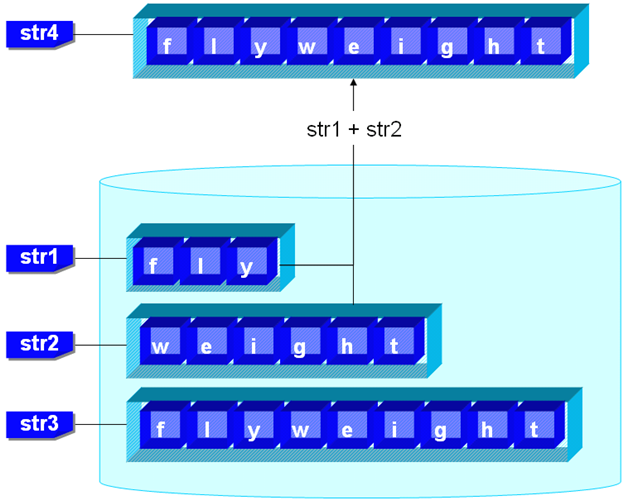
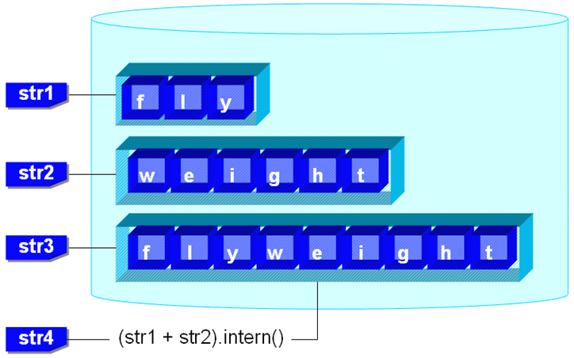

第 6 章 字串
============

字串也許是您在 Java 中最常處理的物件，但也可能是最常被忽視的物件，從這個章節開始，無論如何請重視它，字串運用的好不好，足以影響您程式運行的效率，瞭解字串上可用的操作，則可以讓您省去不少程式撰寫與維護的功夫。

這個章節會將字串（String）分作兩個部份來討論：一個是字串本身的特性，您要瞭解這些特性，才知道如何對字串進行比較、如何將字串用的有效率；一個是介紹字串上可用的幾個操作與可用的 API 輔助，像是字串的分離、正則式（Regular expression）比對、Pattern 與 Matcher 的使用等，您也可以學到如何直接在啟動程式的同時下引數給程式來使用。

---------

6.1 認識字串
-------------

字串的本質是字元（char）型態的陣列，在 Java 中則更將字串視為 String 類別的一個實例，也就是將其視為物件存在於程式之中，這讓字串處理在 Java 中變得簡單，這個小節就先從基本的字串特性開始認識。

## 6.1.1 String 類別

由字元所組成的一串文字符號被稱之為「字串」，例如 "Hello" 這個字串就是由 'H'、'e'、'l'、'l'、'o' 這五個字元所組成，在某些程式語言中，字串是以字元陣列的方式存在：


圖 6.1 字串的本質是字元陣列

在 Java 中字串不僅僅是字元陣列，而是 String 類別的一個實例，可以使用 String 類別來建構，例如您可以使用以下的方式來宣告一個字串參考名稱，並指向一個字串實例：

    String text = "字串的使用";
    System.out.println(text);
    
注意字串的直接指定必須使用 "" 來包括您的文字，字串的每個字元是使用 Unicode 字元來建構，在建構一個字串物件之後，您可以直接在輸出串流（out）中指定字串物件的參考名稱來輸出字串。

字串的串接在 Java 中可以直接使用 '+' 運算子，'+'  本來是加法運算子，而它被重新定義（Override）為可以直接用於字串的串接，例如您可以如下將兩個字串接在一起輸出：

    String msg = "哈囉！"; 
    msg = msg + "Java程式設計！"; 
    System.out.println(msg); 
    
這一段程式碼會在文字模式上顯示 "哈囉！Java 程式設計！"。
字串在 Java 中以 String 類別的一個實例存在，所以每個字串物件本身會擁有幾個可操作的方法，表 6.1 先介紹幾個常用的方法。

#### **表 6.1 String 物件上的幾個方法**

| 方法          | 說明
|:--            |:--
| length() 	    | 取得字串的字元長度 
| equals() 	    | 判斷原字串中的字元是否相等於指定字串中的字元 
| toLowerCase() | 轉換字串中的英文字元為小寫 
| toUpperCase() | 轉換字串中的英文字元為大寫 

範例 6.1 示範了以上的幾個字串操作方法的使用。

#### **範例 6.1  StringDemo.java**
```java
public class StringDemo { 
    public static void main(String[] args) { 
        String text = "hello"; 
 
        System.out.println("字串內容: " + text); 
        System.out.println("字串長度: " + text.length()); 
        System.out.println("等於hello? " + 
                                 text.equals("hello")); 
        System.out.println("轉為大寫: " + 
                                 text.toUpperCase()); 
        System.out.println("轉為小寫: " + 
                                 text.toLowerCase()); 
    } 
} 
```

執行結果：

    字串內容: hello
    字串長度: 5
    等於hello? true
    轉為大寫: HELLO
    轉為小寫: hello

如果您要將輸入的字串轉換為整數、浮點數等資料型態，您可以使用表 6.2 中各類別所提供的各個靜態（static）剖析方法。

#### **表 6.2 將字串剖析為數值型態**

|方法                       | 說明
|:--                        |:--
| Byte.parseByte(字串) 	    | 將字串剖析為位元 
| Short.parseShort(字串)    | 將字串剖析為short整數 
| Integer.parseInt(字串) 	| 將字串剖析為int整數 
| Long.parseLong(字串) 	    | 將字串剖析為long整數 
| Float.parseFloat(字串) 	| 將字串剖析為float浮點數 
| Double.parseDouble(字串) 	| 將字串剖析為double浮點數 

注意如果指定的字串無法剖析為指定的資料型態數值，則會發生 NumberFormatException 例外。
之前宣告字串時，都是以這樣的樣子來宣告：

    String str = "caterpillar"; 
    
這樣的宣告方式看來像是基本資料型態宣告，但事實上 String 並不是 Java 的基本資料型態，String 是 java.lang 套件下所提供的類別，如果以配置物件的觀念來宣告字串，應該是這樣的：

    String str = new String("caterpillar"); 
    
不過事實上兩種宣告方式是有所差別的，這待會 6.1.2 再詳細說明，在這邊只要先記得這個差異性就可以了。

字串的本質是由字元陣列所組成，所以使用 String 類別宣告字串後，該字串會具有陣列索引的性質，表 6.3 介紹幾個與使用索引取得字元的相關方法。

#### **表 6.3 取得字串中的字元之方法**

| 方法                              | 說明
|:--                                |:--
| char charAt(int index) 	        | 傳回指定索引處的字元 
| int indexOf(int ch) 	            | 傳回指定字元第一個找到的索引位置 
| int indexOf(String str) 	        | 傳回指定字串第一個找到的索引位置 
| int lastIndexOf(int ch) 	        | 傳回指定字元最後一個找到的索引位置 
| String substring(int beginIndex) 	| 取出指定索引處至字串尾端的子字串 
| String substring(int beginIndex, int endIndex) 	| 取出指定索引範圍子字串 
| char[] toCharArray()          	| 將字串轉換為字元陣列

範例 6.2 為表 6.3 作了幾個簡單的示範。

#### **範例 6.2  CharAtString.java**
```java
public class CharAtString { 
    public static void main(String[] args) { 
        String text = "One's left brain has nothing right.\n" 
                 + "One's right brain has nothing left.\n"; 
 
        System.out.println("字串內容: "); 
        for(int i = 0; i < text.length(); i++) 
            System.out.print(text.charAt(i)); 

        System.out.println("\n第一個left: " + 
                              text.indexOf("left")); 
        System.out.println("最後一個left: " + 
                              text.lastIndexOf("left")); 
 
        char[] charArr = text.toCharArray(); 
        System.out.println("\n字元Array內容: "); 
        for(int i = 0; i < charArr.length; i++) 
            System.out.print(charArr[i]); 
    } 
} 
```

執行結果：

    字串內容:
    One's left brain has nothing right.
    One's right brain has nothing left.

    第一個left: 6
    最後一個left: 66

    字元Array內容:
    One's left brain has nothing right.
    One's right brain has nothing left.
    
在建構字串物件時，除了直接在 '=' 後使用 "" 來指定字串常數之外，您也可以使用字元陣列來建構，例如使用字元陣列 name，建構出一個內容為 "caterpillar" 的字串：

    char[] name = {'c', 'a', 't', 'e', 'r', 'p', 'i', 'l', 'l', 'a', 'r'};  
    String str = new String(name);
    
除了以上所介紹的幾個方法之外，您應該查詢 API 手冊，瞭解更多有關於 String 類別的方法，例如 String 上還有 endsWith() 方法可以判斷字串是不是以指定的文字作為結束，您可以使用這個方法來過濾檔案名稱，範例 6.3 就使用 endsWith() 來過濾出副檔名為 jpg 的檔案。

#### **範例6.3  FileFilter.java**
```java
public class FileFilter { 
    public static void main(String[] args) { 
        String[] filenames = {"caterpillar.jpg", "cater.gif", 
                 "bush.jpg", "wuwu.jpg", "clockman.gif"};

        System.out.print("過濾出jpg檔案: "); 

        for(int i = 0; i < filenames.length; i++) {
            if(filenames[i].endsWith("jpg")) {
                System.out.print(filenames[i] + " "); 
            }
        }
        System.out.println(""); 
    } 
} 
```

執行結果：

    過濾出jpg檔案: caterpillar.jpg bush.jpg wuwu.jpg

> **良葛格的話匣子** 在宣告字串一併指定字串值時，如果字串長度過長，可以分作兩行來寫，這樣比較容易閱讀，例如：
>
    String text = "One's left brain has nothing right.\n" 
                + "One's right brain has nothing left.\n";

## 6.1.2 不可變（immutable）字串

在 Java 中使用字串有一個非常重要的觀念必須記得，一個字串物件一旦被配置，它的內容就是固定不可變的（immutable），例如下面這個宣告：

    String str = "caterpillar"; 
    
這個宣告會配置一個長度為 11、內容為 "caterpillar" 的字串物件，您無法改變這個字串物件的內容；不要以為下面的陳述就是改變一個字串物件的內容：

    String str = "Just"; 
    str = "Justin"; 
    
事實上在這個程式片段中會有兩個字串物件，一個是 "Just" 字串物件，長度為 4，一個是 "Justin" 字串物件，長度為 6，兩個是不同的字串物件，您並不是在 "Just" 字串後加上 "in" 字串，而是讓 str 名稱參考至 "Justin" 字串物件，圖 6.2 展示出這個概念。



圖 6.2 使用 '=' 作字串指定的意義

在 Java 中，使用 '=' 將一個字串物件指定給一個參考名稱，其意義為改變該名稱所參考的物件，原來被參考的字串物件若沒有其它名稱來參考它，就會在適當的時機被 Java 的「垃圾回收」 （Garbage collection）機制回收，在 Java 中，程式設計人員通常不用關心無用物件的資源釋放問題，Java 會檢查物件是否不再被參考，如果沒有被任何名稱參考的物件將會被回收。

在 Java 執行時會維護一個String池（Pool），對於一些可以共享的字串物件，會先在 String 池中查找是否存在相同的 String 內容（字元相同），如果有就直接傳回，而不是直接創造一個新的 String 物件，以減少記憶體的耗用，如果您在程式中使用下頁的方式來宣告，則實際上是指向同一個字串物件：

    String str1 = "flyweight";
    String str2 = "flyweight"; 
    System.out.println(str1 == str2);
    
當您直接在程式中使用 "" 來包括一個字串時，該字串就會在 String 池中，上面的程式片段中的 "flyweight" 就是這樣的情況，"flyweight" 在程式中會有一個實例，而 str1 與 str2 同時參考至 "flyweight"，圖 6.3 表示了這個概念。



圖 6.3 字串參考名稱str1、str2同時參考至"flyweight"

在 Java 中如果 '==' 被使用於兩個參考名稱時，它是用於比較兩個參考名稱是否參考至同一物件，所以在圖 6.3 中當 str1==str2 比較時，程式的執行結果會顯示 true。

再來看看關於 String 的 intern() 方法，先看一下 API 說明的節錄（翻譯）：

    在 intern() 方法被呼叫時，如果池（Pool）中已經包括了相同的 String 物件（相同與否由 equals() 方法決定），那麼會從池中返回該字串，否則的話原 String 物件會被加入池中，並返回這個 String 物件的參考。
    
這段話其實說明了「Flyweight模式」（請見本章後的網路索引） 的運作方式，直接使用範例 6.4 來說明會更清楚。

#### **範例 6.4  InternString.java**
```java
public class InternString { 
    public static void main(String[] args) { 
        String str1 = "fly"; 
        String str2 = "weight"; 
        String str3 = "flyweight"; 
        String str4 = null; 

        str4 = str1 + str2;
        System.out.println(str3 == str4); 

        str4 = (str1 + str2).intern(); 
        System.out.println(str3 == str4); 
    } 
}
```

使用圖形來說明這個範例，在宣告 str1、str2、str3 後，String 池中的狀況如圖 6.4 所示。



圖 6.4 字串池示意

在 Java 中，使用 '+' 串接字串的話會產生一個新的字串物件，所以在程式中第一次比較 str3 與 str4 物件是否為同一物件時，結果會是 false，如圖 6.5 所示。



圖 6.5 字串加法會產生新的字串

intern() 方法會先檢查 String 池中是否存在字元部份相同的字串物件，如果有的話就傳回，由於程式中之前已經有宣告 "flyweight" 字串物件，intern() 在 String 池中發現了它，所以直接傳回，這時再進行比較，str3 與 str4 所指向的其實會是同一物件，所以結果會是 true，如圖 6.6所示。



圖 6.6 intern() 會返回 String 池中字串物件之參考

由以上的說明也帶出一個觀念，'==' 在 Java 中被用來比較兩個參考名稱是否參考至同一物件，所以您不可以用 '==' 來比較兩個字串的字元內容是否相同，例如：

    String str1 = new String("caterpillar");
    String str2 = new String("caterpillar");
    System.out.println(str1 == str2);

雖然兩個字串物件的字元值完全相同，但實際上在這個程式片段中，您產生了兩個 String 的實例，str1 與 str2 分別參考至不同的實例，所以使用 '==' 比較時結果會顯示 false，如果您要比較兩個字串物件的字元值是否相同，您要使用 equals() 方法，以下的寫法才會顯示 true 的結果：

    String str1 = new String("caterpillar");
    String str2 = new String("caterpillar");
    System.out.println(str1.equals(str2));

一個常見的問題是：上面的程式片段產生了幾個 String 的實例？很多人會回答 2 個，但答案是 3 個，因為 "caterpillar" 就是一個，它存在於字串池中，而您又使用 new 建構出兩個 String 物件，分別由 str1 與 str2 參考，所以總共會有 3 個 String 實例。

## 6.1.3 StringBuilder 類別

一個 String 物件的長度是固定的，您不能改變它的內容，或者是附加新的字元至 String 物件中，您也許會使用 '+' 來串接字串以達到附加新字元或字串的目的，但 '+' 會產生一個新的 String 實例，如果您的程式對這種附加字串的需求很頻繁，並不建議使用 '+' 來進行字串的串接，在物件導向程式設計中，最好是能重複運用已生成的物件，物件的生成需要記憶體空間與時間，不斷的產生 String 實例是一件沒有效率的行為。

在 J2SE 5.0 開始提供 java.lang.StringBuilder 類別，使用這個類別所產生的物件預設會有 16 個字元的長度，您也可以自行指定初始長度，如果附加的字元超出可容納的長度，則 StringBuilder 物件會自動增加長度以容納被附加的字元，如果您有頻繁作字串附加的需求，使用 StringBuilder 會讓程式的效率大大提昇，來寫個簡單的測試程式就可以知道效能差距有多大。

#### **範例 6.5  AppendStringTest.java**
```java
public class AppendStringTest {
    public static void main(String[] args) {
        String text = "";

        long beginTime = System.currentTimeMillis();
        for(int i = 0; i < 10000; i++)
            text = text + i;
        long endTime = System.currentTimeMillis();
        System.out.println("執行時間：" + (endTime - beginTime));

        StringBuilder builder = new StringBuilder("");
        beginTime = System.currentTimeMillis();
        for(int i = 0; i < 10000; i++)
            builder.append(String.valueOf(i));
        endTime = System.currentTimeMillis();
        System.out.println("執行時間：" + (endTime - beginTime));
    }
}
```

在範例 6.5 中首先使用 '+' 來串接字串，您使用 System.currentTimeMillis() 取得 for 迴圈執行前、後的系統時間，如此就可以得知 for 迴圈執行了多久，以下是我的電腦上的測試數據：

    執行時間：4641
    執行時間：16
    
您可以看到執行的時間差距很大，這說明了使用 '+' 串接字串所帶來負擔，如果您有經常作附加字串的需求，建議使用 StringBuilder，事實上就範例 6.5 來說，第二個 for 迴圈執行時間還可以更短，因為 append() 也可以接受基本資料型態，所以不必特地使用 String.valueOf() 方法從 int 取得 String，改為以下的方式，執行時間可以更大幅縮短：

    for(int i = 0; i < 10000; i++)
        builder.append(i);

使用 StringBuilder 最後若要輸出字串結果，可以呼叫其 toString() 方法，您可以使用 length() 方法得知目前物件中的字元長度，而 capacity() 可傳回該物件目前可容納的字元容量，另外 StringBuilder 還有像是 insert() 方法可以將字元插入指定的位置，如果該位置以後有字元，則將所有的字元往後移；deleteChar() 方法可以刪除指定位置的字元，而 reserve() 方法可以反轉字串，詳細的使用可以查詢看看 java.lang.StringBuilder 的 API 文件說明。

StringBuilder 是 J2SE 5.0 才新增的類別，在 J2SE 5.0 之前的版本若有相同的需求，是使用 java.lang.StringBuffer，事實上，StringBuilder 被設計為與 StringBuffer 具有相同的操作介面，在單機非「多執行緒」（Multithread）的情況下使用 StringBuilder 會有較好的效率，因為 StringBuilder 沒有處理「同步」（Synchronized）問題；StringBuffer 則會處理同步問題，如果您的 StringBuilder 會在多執行緒下被操作，則要改用 StringBuffer，讓物件自行管理同步問題，關於多執行緒的觀念，會在第 15 章詳細說明。

6.2 字串進階運用
---------------

待續 ...