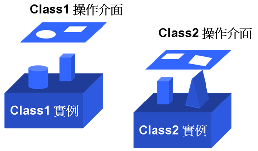
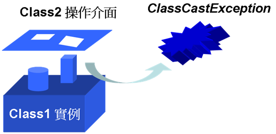
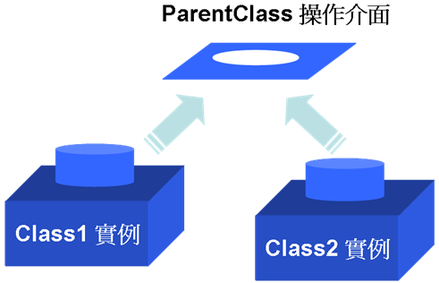

# 第 8 章 繼承（Inheritance）、多型（Polymorphism）

在程式設計中，「繼承」（Inheritance）是一把雙面刃，用的好的話可讓整個程式架構具有相當的彈性，用不好的話整個程式會難以維護與修改。「多型」機制本身並不直覺，但使用適當的話可以動態調整物件的呼叫，並降低物件之間的依賴關係。在物件導向的世界中，除了識別出物件並定義類別之外，如何善用「繼承」與「多型」的機制來架構程式，往往都是整個物件導向設計的重心。

這個章節將介紹在 Java 中如何實現繼承與多型，主要側重於語法方面的講解，但會穿插使用繼承與多型時該注意的一些基本觀念與應用，您會瞭解如何擴充類別、如何實作介面，並且認識到在 Java 中，所有物件都是繼承 java.lang.Object 類別的事實。

------------------

## 8.1 繼承

您可以基於某個父類別對物件的定義加以擴充，而制訂出一個新的子類別定義，子類別可以繼承父類別原來的某些定義，並也可能增加原來的父類別所沒有的定義，或者是重新定義父類別中的某些特性，事實上，在您開始學會使用 "class" 關鍵字定義類別的同時，您也已經使用了繼承的功能，因為在 Java 中，所有的類別都直接或間接的繼承了 java.lang.Object 類別。

### 8.1.1 擴充（extends）父類別

假設您先前已經為您的動物園遊戲撰寫了一些 Bird 相關類別，現在想要將之擴充，讓動物園擁有像是雞、麻雀等更多鳥的種類，那麼您可以擴充 Bird 類別，這麼一來許多 Bird 中所使用的功能都可以留下來，並基於它擴充一些新的 Chicken、Sparrow 類別，您不用重寫所有的功能，您可以「擴充」（extends）原先已定義好的類別再增加新的定義。

Java 中使用 "extends" 作為其擴充父類別的關鍵字，其實就相當於一般所常稱的「繼承」（Inherit），以動物園中最鳥類為例，假設您原先已定義好一個 Bird 類別，如範例 8.1 所示。

#### **範例 8.1  Bird.java**
```java
public class Bird {
    private String name;

    public Bird() {
    }

    public Bird(String name) {
        this.name = name;
    }

    public void walk() {
        System.out.println("走路");
    }

    public String getName() {
        return name;
    }

    public void setName(String name) {
        this.name = name;
    }
} 
```

您可以繼承 Bird 並將之擴充為 Chicken 類別，在擴充（繼承）的關係中，被擴充的類別為「父類別」（Parent class）或「基礎類別」（Base class），而擴充父類別的類別就稱之為「子類別」（Child class）或「衍生類別」（Derived class），父類別跟子類別之間，有「is a」的關係，例如雞「是一種」鳥（Chicken is a bird）。在 Java 中要擴充類別定義時，您要使用 "extends" 關鍵字，並指定要被擴充的類別，如範例 8.2 所示。

#### **範例 8.2  Chicken.java**
```java
public class Chicken extends Bird { // 擴充Bird類別
    private String crest; // 新增私有成員，雞冠描述

    public Chicken() {
        super();
    }

    // 定義建構方法
    public Chicken(String name, String crest) {
        super(name);
        this.crest = crest;
    }

    // 新增方法
    public void setCrest(String crest) {
        this.crest = crest;
    }

    public String getCrest() {
        return crest;
    }

    public void wu() {
       System.out.println("咕咕叫…");
    }
} 
```

當您擴充某個類別時，該類別的所有 "public" 成員都可以在衍生類別中被呼叫使用，而 "private" 成員則不可以直接在衍生類別中被呼叫使用；在這個例子中，Bird 類別中已經有 name 成員，您讓 Chicken 擴充 Bird 並新增了 crest 成員，而方法上您新增 "public" 的 getCrest() 等方法，而 getName() 與 walk() 等方法則直接繼承父類別中已定義的內容。

在擴充某個類別之後，您可以一併初始父類別的建構方法，以完成相對應的初始動作，這可以使用 super() 方法來達到，它表示呼叫基底類別的建構方法，super() 必須在建構方法一開始就呼叫，在子類別的建構方法中，如果不用 super() 指定使用父類別中的哪個建構方法來初始，則預設會呼叫父類別中無參數的建構方法。

父類別的 "public" 成員可以直接在衍生類別中使用，而 "private" 成員則不行，"private" 類別只限於定義它的類別之內來存取，如果您想要與父類別的 "private" 成員溝通，就只能透過父類別中繼承下來的 "public" 方法成員，例如範例中的 getName() 方法。

範例 8.3 示範了如何使用擴充了 Bird 的 Chicken 類別。

#### **範例 8.3  ExtendDemo.java**
```java
public class ExtendDemo { 
    public static void main(String[] args) {
        Chicken chicken1 = new Chicken("小克", "紅色小雞冠");
        Chicken chicken2 = new Chicken();
 
        System.out.printf("小雞1 - 名稱 %s, 雞冠是 %s。 \n", 
            chicken1.getName(), chicken1.getCrest());
        chicken1.wu();

        System.out.printf("小雞2 - 名稱 %s, 雞冠是 %s。 \n", 
            chicken2.getName(), chicken2.getCrest());
        chicken2.wu();
    } 
}
```

Chicken 類別的實例可以直接使用繼承下來的 getName() 方法，並可使用自己的 getCrest()、wu() 方法，執行結果如下所示：

    小雞1 - 名稱 小克, 雞冠是 紅色小雞冠。
    咕咕叫…
    小雞2 - 名稱 null, 雞冠是 null。
    咕咕叫…

> **良葛格的話匣子** 以上是就 Java 的 "extends" 關鍵字之字面意義，只是先對 Java 的繼承作個簡單的介紹，繼承並不只有擴充父類別定義的作用，您可以重新定義（Override）父類別中的方法，或者是將兩個類似的類別行為提取（Pull up）至「抽象類別」（Abstract class）中，將兩個類別歸為同一類，讓它們擁有相同的父類別，這在稍後還會一一介紹。

### 8.1.2 被保護的（protected）成員

在之前的範例中，資料成員都預設為 "private" 成員，也就是私用成員，私用成員只能在物件內部使用，不能直接透過參考名稱加上 "." 呼叫使用，即使是擴充了該類別的衍生類別也無法直接使用父類別的私用成員，您只能透過父類別所提供的 "public" 方法成員來呼叫或設定私用成員。

然而有些時候，您希望擴充了基底類別的衍生類別，也能夠直接存取基底類別中的成員，而不是透過 "public" 方法成員，但也不是將資料成員宣告為 "public"，因為您只想這些成員被子類別物件所使用，而不希望這些成員被其它外部物件直接呼叫使用。

您可以宣告這些成員為「被保護的」（protected）成員，保護的意思表示存取該成員是有條件限制的，當您將類別的成員宣告為受保護的成員之後，繼承的類別就可以直接使用這些成員，但這些成員仍然受到保護，不同套件（package）的物件不可直接呼叫使用 protected 成員（關於套件的說明，請看第 9 章）。

要宣告一個成員成為受保護的成員，就使用 "protected" 關鍵字，範例 8.4 是個實際的例子，您將資料成員宣告為受保護的成員。

#### **範例 8.4  Rectangle.java**
```java
public class Rectangle { 
    // 受保護的member 
    protected int x;
    protected int y;
    protected int width;
    protected int height; 

    public Rectangle() { 
    } 

    public Rectangle(int x, int y, 
                     int width, int height) { 
        this.x = x;  
        this.y = y; 
        this.width = width;   
        this.height = height; 
    } 

    public void setX(int x) { this.x = x; } 
    public void setY(int y) { this.y = y; } 
    public void setWidth(int width) { this.width = width; } 
    public void setHeight(int height) { this.height = height; } 

    public int getX() { return x; } 
    public int getY() { return y; } 
    public int getWidth() { return width; } 
    public int getHeight() { return height; } 

    public int getArea() { return width*height; } 
}
```

成員如果被宣告為 "protected"，則擴充它的子類別就可以直接使用該資料成員，而不用透過 "public" 方法成員來呼叫，如範例 8.5 所示範的。

#### **範例 8.5  Cubic.java**
```java
public class Cubic extends Rectangle { 
    protected int z; 
    protected int length; 

    public Cubic() {
        super();
    } 

    public Cubic(int x, int y, int z, 
                 int length, int width, int height) { 
        super(x, y, width, height); 
        this.z = z; 
        this.length = length; 
    } 

    public void setZ(int z) { this.z = z; }
    public void setLength(int length) { this.length = length; }

    public int getZ() { return z; }
    public int getLength() { return length; } 

    public int getVolumn() { 
        // 可以直接使用父類別中的width、height成員
        return length*width*height; 
    } 
}
```

可以直接使用繼承下來的受保護成員確實比較方便，方法成員也可以宣告為受保護的成員。父類別中想要讓子類別擁有的資料成員會宣告為 "protected"，父類別中想要子類別也可以使用的工具方法也會宣告為 "protected"，這些方法對不同套件的物件來說，可能是呼叫它並沒有意義或是有權限上的危險性，但您在衍生類別中仍可能使用到這些方法。

> **良葛格的話匣子** 在設計類別的過程中，並不是一開始就決定哪些資料成員或方法要設定為 "protected"，通常資料成員或非公開的方法都會先宣告為 "private"，當物件的職責擴大而要開始使用繼承時，再逐步考量哪些成員要設定為 "protected"。

### 8.1.3 重新定義（Override）方法

類別是物件的定義書，如果父類別中的定義並不符合您的需求，可以在擴充類別的同時重新定義，您可以重新定義方法的實作內容、成員的存取權限，或是成員的返回值型態（重新定義返回值型態是 J2SE 5.0 新功能）。

舉個例子來說，看看下面這個類別：

    public class SimpleArray {
        protected int[] array;

        public SimpleArray(int i) {
            array = new int[i];
        }
        public void setElement(int i, int data) {
            array[i] = data;
        }
        ....
    } 
    
這個類別設計一個簡單的陣列工具類別，不過您覺得它的 setElement() 方法不夠安全，您希望增加一些陣列的長度檢查動作，於是您擴充該類別並重新定義 setElement() 方法：

    public class SafeArray extends SimpleArray {
        public SafeArray(int i) {
            super(i);
        }
        // 重新定義setElement()
        public void setElement(int i, int data) {
            if(i < array.length)
                super.setElement(i, data);
        }
        ....
    }

這麼一來，以 SafeArray 類別的定義所產生的物件，就可以使用新的定義方法，就 SafeArray 類別來說，由於操作介面與 SimpleArray 是一致的，所以您可以這麼使用：

    SimpleArray simpleArray = new SafeArray();
    simpleArray.setElement();
    
SafeArray 與 SimpleArray 擁有一致的操作介面，因為 SafeArray 是 SimpleArray 型態的子類，擁有從父類中繼承下來的 setElement() 操作介面，雖然您使用 SimpleArray 型態的介面來操作 SafeArray 的實例，但由於實際運作的物件是 SafeArray 的實例，所以被呼叫執行的會是 SafeArray 中重新定義過的 setElement() 方法，這是「多型」（Polymorphism）操作的一個例子，8.2 中對多型操作還會再作說明。

在上頁的程式片段中您看到 super() 與 super 的使用，如果您在衍生類別中想要呼叫基底類別的建構方法，可以使用 super() 方法；若您要在衍生類別中呼叫基底類別方法，則可以如使用 super.methodName()，但使用 super() 呼叫父類別建構方法或使用 super.methodName() 呼叫父類別中方法是有條件的，也就是父類別中的方法或建構方法不能是 "private"，也就是不能是私用成員。

重新定義方法時要注意的是，您可以增大父類別中的方法權限，但不可以縮小父類別的方法權限，也就是若原來成員是 "public" 的話，您不可以在父類別中重新定義它為 "private" 或 "protected"，所以在擴充 SimpleArray 時，您就不可以這麼作：

    public class SafeArray extends SimpleArray {
         // 不可以縮小父類別中同名方法的權限
        private void setElement(int i, int data) {
         ....
        }
    }
 
嘗試將 setElement() 方法從 "public" 權限縮小至 "private" 權限是不行的，在進行編譯時編譯器會回報以下的錯誤訊息：

    setElement(int,int) in SafeArray cannot override setElement(int,in t) in SimpleArray;     attempting to assign weaker accessprivileges; was public
    private void setElement(int i, int data) {
    ^
    1 error
    
從 J2SE 5.0 開始在重新定義方法時，您可以重新定義返回值的型態，例如您原先設計了一個 Bird 類別：

    public class Bird {
        protected String name;

        public Bird(String name) {
            this.name = name;
        }
        public Bird getCopied() {
            return new Bird(name);
        }
    }
    
getCopied() 方法原來返回的是Bird物件，現在打算擴充Bird類別，您繼承它並定義了一個 Chicken 類別，在 J2SE 5.0 之前，您會很苦惱於不能重新定義返回值型態，因此您勢必要重新寫一個方法名稱來傳回 Chicken 型態的返回值，但是從 J2SE 5.0 開始，重新定義返回值型態是可行的，重新定義返回值型態有限制條件，重新定義的返回值型態必須是父類別中同一方法返回型態的子類別，例如 Chicken 可以這麼定義：

    public class Chicken extends Bird {
        protected String crest;
 
        public Point3D(String name, String crest) {
            super(name);
            this.crest = crest;
        }
        // 重新定義返回值型態為Point3D
        public Chicken getCopied() {
            return new Chicken(name, crest);
        }
    }
    
在 getCopied() 方法的返回值型態上，父類別中返回的是Bird型態，子類別在重新定義 getCopied() 方法時，可以重新定義一個 Bird 型態的子類別型態之返回值，在上面的程式片段中，所重新定義的返回值型態是 Chicken，它是 Bird 的子類別。

注意！您無法重新定義 static 方法，一個方法要被重新定義，它必須是非 static 的，如果您在子類別中定義一個有同樣簽署（signature）的 static 成員，那不是重新定義，那是定義一個屬於該子類別的 static 成員。

### 8.1.4 Object 類別

在 Java 中只要使用 "class" 關鍵字定義類別，您就開始使用繼承的機制了，因為在 Java 中所有的物件都擴充自 java.lang.Object 類別，Object 類別是 Java 程式中所有類別的父類別，每個類別都直接或間接繼承自 Object 類別，當您如下定義一個類別時：

    public class Foo { 
        // 實作 
    } 
    
在 Java 中定義類別時如果沒有指定要繼承的類別，則自動繼承 Object 類別，上面的程式片段即等於您如下定義類別：

    public class Foo extends Object { 
        // 實作 
    } 
    
由於 Object 類別是 Java 中所有類別的父類別，所以使用 Object 宣告的名稱，可以參考至任何的物件而不會發生任何錯誤，因為每一個物件都是 Object 的子物件，舉個簡單的例子，您可以製作一個簡單的集合（Collection）類別，並將一些自訂的類別之實例加入其中，範例 8.6 是個簡單示範。

#### **範例 8.6  SimpleCollection.java**
```java
public class SimpleCollection { 
    private Object[] objArr; 
    private int index = 0; 
 
    public SimpleCollection() { 
        // 預設10個物件空間 
        objArr = new Object[10]; 
    } 
 
    public SimpleCollection(int capacity) { 
        objArr = new Object[capacity]; 
    } 
 
    public void add(Object o) { 
        objArr[index] = o; 
        index++; 
    } 
 
    public int getLength() { 
        return index; 
    } 
 
    public Object get(int i) { 
        return objArr[i]; 
    } 
}
```

接著您如範例 8.7、範例 8.8定義兩個簡單的類別。

#### **範例 8.7  Foo1.java**
```java
public class Foo1 { 
    private String name; 

    public Foo1(String name) { 
        this.name = name; 
    }

    public void showName() { 
        System.out.println("foo1 名稱：" + name); 
    } 
}
```

#### **範例 8.8  Foo2.java**
```java
public class Foo2 { 
    private String name; 

    public Foo2(String name) { 
        this.name = name; 
    }

    public void showName() { 
        System.out.println("foo2 名稱：" + name); 
    } 
}
```

範例 8.6 的 SimpleCollection 以 Object 陣列來儲存物件，您可以撰寫一個簡單的測試類別來執行看看。

#### **範例 8.9  SimpleCollectionDemo.java**
```java
public class SimpleCollectionDemo { 
    public static void main(String[] args) { 
        SimpleCollection simpleCollection = 
                            new SimpleCollection(); 
 
        simpleCollection.add(new Foo1("一號 Foo1")); 
        simpleCollection.add(new Foo2("一號 Foo2")); 
 
        Foo1 f1 = (Foo1) simpleCollection.get(0); 
        f1.showName();
 
        Foo2 f2 = (Foo2) simpleCollection.get(1); 
        f2.showName();
    } 
} 
```

在程式中，SimpleCollection 物件可以加入任何型態的物件至其中，因為所有的物件都是 Object 的子物件，從 SimpleCollection 指定索引取回物件時，您要將物件的類型從 Object 轉換為原來的類型，如此就可以操作物件上的方法，執行結果如下：

    foo1 名稱：一號 Foo1
    foo2 名稱：一號 Foo2


事實上，如果您需要某種型式的物件容器，Java SE 中就已經有提供了，像是 java.util.List、java.util.Map、java.util.Set 等，您可以先看看 Java SE 所提供的種種容器類別是不是符合您的需求，關於這些容器類別，在第 13 章中也會介紹。

Object 類別定義了幾個方法，包括 "protected" 權限的 clone()、finalize()，以及 "public" 權限的 equals()、toString()、hashCode()、notify()、notifyAll()、wait()、getClass() 等方法。除了getClass()、notify()、notifyAll()、wait()等方法之外，其它方法您都可以在繼承之後加以重新定義（因為 getClass()、notify()、notifyAll()、wait() 等方法被宣告為 "final"，所以無法重新定義，關於 "final"，8.1.7 就會介紹），以符合您所建立的類別需求。

finalize() 已經在 7.2.4 介紹過了；clone() 用於物件複製，稍後即會介紹；notify()、notifyAll()、wait() 是有關於執行緒（Thread）操作，會在第15章介紹；getClass() 可以取得類別的 Class 實例，會在第 16 章介紹它的用途；以下先介紹 toString()、equals()、hashCode() 方法的使用。

##### 8.1.5 toString()、equals()、hashCode() 方法

Object 的 toString() 方法是對物件的文字描述，它會返回 String 實例，您在定義物件之後可以重新定義 toString() 方法，為您的物件提供特定的文字描述，Object 的 toString() 預設會傳回類別名稱及 16 進位制的編碼，也就是傳回以下的字串：

    getClass().getName() + '@' + Integer.toHexString(hashCode())
    
getClass() 方法是 Object 中定義的方法，它會傳回物件於執行時期的 Class 實例， 再使用 Class 實例的 getName() 方法可以取得類別名稱；hashCode() 傳回該物件的「雜湊碼」（Hash code）。Object 的 toString() 方法預設在某些場合是有用的，例如 StringBuilder 就改寫了 toString() 方法，您可以呼叫 StringBuilder 實例的 toString() 方法以得到建構好的 String 實例（6.1.3 曾經介紹過 StringBuilder），範例 8.10是個簡單的示範。

#### **範例 8.10  ToStringDemo.java**
```java
public class ToStringDemo {
    public static void main(String[] args) {
        StringBuilder builder = new StringBuilder();

        for(int i = 0; i < 10; i++)
            builder.append(i);

        System.out.println(builder.toString());
    }
} 
```

執行結果：

    0123456789
    
> **良葛格的話匣子** 「雜湊碼」（Hash code）由雜湊函數計算得到，在資料結構上可用於資料的定址，Java 中的 java.util.HashMap（第 13 章會介紹）也是利用雜湊的原理來快速儲存與尋找物件，雖然在 Java 中您不用瞭解雜湊的原理，也可以直接使用像 HashMap 類別以得到使用雜湊的好處，但有機會的話，仍建議您看看資料結構中有關於雜湊的原理介紹。

接著介紹 equals() 與 hashCode() 方法，Object 預設的 equals() 本身是比較物件的記憶體位址是否相同，您可以重新定義 equals() 方法，以定義您自己的物件在什麼條件下可視為相等的物件，然而在重新定義 equals() 方法時，建議同時重新定義 hashCode() 方法，因為在以雜湊（hash）為基礎的相關環境中，需要比較兩個物件是否為相同的物件時，除了使用 equals() 之外，還會依 hashCode() 方法來作判斷，例如加入 java.util.HashSet 容器（第 13 章中會介紹）中的物件就必須重新定義 equals() 與 hashCode() 方法，以作為加入 HashSet 中唯一物件的識別。

來看看重新定義 equals() 與 hashCode() 方法的實際例子，您可以根據物件中真正包括的的資料成員來比較兩個物件是否相同，如範例 8.11 所示範的。

#### **範例 8.11  Cat.java**
```java
import java.util.Date;

public class Cat {
    private String name;
    private Date birthday;

    public Cat() {
    }

    public void setName(String name) { this.name = name; }
    public String getName() { return name; }

    public void setBirthday(Date birthday) { this.birthday = birthday; }
    public Date getBirthday() { return birthday; }

    public boolean equals(Object other) { 
        if (this == other) 
            return true; 

        if (!(other instanceof Cat)) 
            return false; 

        final Cat cat = (Cat) other; 

        if (!getName().equals(cat.getName())) 
            return false; 

        if (!getBirthday().equals(cat.getBirthday())) 
            return false; 

        return true; 
    } 

    public int hashCode() { 
        int result = getName().hashCode(); 
        result = 29 * result + getBirthday().hashCode(); 
        return result; 
    } 
} 
```

這是一個根據「商務鍵值」（Business key）實作 equals() 與 hashCode() 的例子，實際上開始實作時要根據您實際的需求，決定如何利用相關的商務鍵值來組合以重新定義這兩個方法。

### 8.1.6 clone() 方法

clone() 方法是有關於如何複製物件本身的方法，您可以重新定義您的複製方法，不過物件的複製要深入的話必須考慮很多細節，因為繼承類別、實作介面、物件依賴等重重的關係，會使得要完整複製一個物件的資訊變得困難，在以下我將介紹一個最基本的作法：實作 java.lang.Cloneable 介面（Interface）。

關於介面會在下一節中詳細介紹，然而因為 Cloneable 介面沒有定義任何的方法，所以目前您只需要先知道，要進行物件複製，您需要在定義類別上掛上一個識別介面，表示這個類別的實例支援自身複製。直接以實際的例子來說明，首先您可以定義一個 Point 類別，並讓這個類別的實例可以複製自己，如範例 8.12 所示。

#### **範例 8.12  Point.java**
```
public class Point implements Cloneable { // 要實作Cloneable
    private int x;
    private int y;

    public Point() {}
    public Point(int x, int y) { 
        this.x = x; 
        this.y = y;
    }

    public void setX(int x) { this.x = x; }
    public void setY(int y) { this.y = y; }

    public int getX() { return x; }
    public int getY() { return y; }    

    public Object clone() throws CloneNotSupportedException {
        // 呼叫父類別的clone()來進行複製
        return super.clone(); 
    }   
}
```

接著再定義一個 Table 類別，當中定義了 Point 為它的資料成員之一，當您複製 Table 的實例時，理所當然的也要複製資料成員，範例 8.13 的程式碼示範了如何定義 clone() 方法。

#### **範例 8.13  Table.java**
```java
public class Table implements Cloneable { // 要實作Cloneable
    private Point center;

    public void setCenter(Point center) {
        this.center = center;
    }
    public Point getCenter() {
        return center;
    }

    public Object clone () 
                     throws CloneNotSupportedException {
        // 呼叫父類的clone()來複製
        Table table = (Table) super.clone();

        if(this.center != null) {
            // 複製Point類型的資料成員
            table.center = (Point) center.clone(); 
        }
        
        return table; 
    }
}
```

注意 Point 類別與 Table 類別都實作了 Cloneable 介面，要支援複製自身的物件，其定義類別時必須實作 Cloneable 介面，如果不實作這個介面的類別，其實例的 clone() 方法被呼叫時，會丟出 CloneNotSupportedException 例外，Java 中的 clone() 方法是繼承自 Object，為了方便直接呼叫，您將其存取權限從 "protected" 改為 "public"（您也可以再定義一個"public"方法來傳回複製的物件，這邊改成 "public" 只是為了方便，可以少寫幾行程式碼）。

接著來寫一個簡單的測試類別，範例 8.14 的 Table 實例會被複製，您可以改變複製品的內容，但原作品的內容並不會受到影響，表示兩個實例是不相互干涉的。

#### **範例 8.14  CloneDemo.java**
```java
public class CloneDemo {
    public static void main(String[] args) 
                         throws CloneNotSupportedException {
        Table table = new Table();
        table.setCenter(new Point(2, 3));
        Point originalCenter = table.getCenter();

        Table clonedTable = (Table) table.clone();
        Point clonedCenter = clonedTable.getCenter();

        System.out.printf("原來的Table中心：(%d, %d)\n", 
           originalCenter.getX(), originalCenter.getY());
        System.out.printf("複製的Table中心：(%d, %d)\n", 
           clonedCenter.getX(), clonedCenter.getY());

        clonedCenter.setX(10);
        clonedCenter.setY(10);

        // 改變複製品的內容，對原來的物件不會有影響
        System.out.printf("原來的Table中心：(%d, %d)\n", 
           originalCenter.getX(), originalCenter.getY());
        System.out.printf("複製的Table中心：(%d, %d)\n", 
           clonedCenter.getX(), clonedCenter.getY());
    }
}
```

執行結果如下：

    原來的Table中心：(2, 3)
    複製的Table中心：(2, 3)
    原來的Table中心：(2, 3)
    複製的Table中心：(10, 10)

### 8.1.7 final 關鍵字

"final" 關鍵字可以使用在變數宣告時，表示該變數一旦設定之後，就不可以再改變該變數的值，例如在下面的程式碼片段中，PI 這個變數一旦設定，就不可以再有指定值給 PI 的動作：

    final double PI = 3.14159;
    
如果在定義方法成員時使用 "final"，表示該方法成員在無法被子類別重新定義（Override），例如：

    public class Ball { 
        private double radius; 

        public final double getRadius() { 
            return radius; 
        } 
        // .... 
    } 
    
您在繼承 Ball 類別後，由於 getRadius() 方法被宣告為 "final"，所以在子類別中 getRadius() 方法不能再被重新定義。
如果您在宣告類別時加上 final 關鍵字，則表示要終止被擴充，這個類別不可以被其它類別繼承，例如：

    public final class Ball {
        // .... 
    }
    
## 8.2 多型（Polymorphism）

多型操作指的是使用同一個操作介面，以操作不同的物件實例，多型操作在物件導向上是為了降低對操作介面的依賴程度，進而增加程式架構的彈性與可維護性。多型操作是物件導向上一個重要的特性，這個小節會介紹多型的觀念，以及「抽象類別」（Abstract）與「介面」（Interface）應用的幾個實例。

### 8.2.1 多型導論

先來解釋一下這句話：多型操作指的是使用同一個操作介面，以操作不同的物件實例。首先來解釋一下何謂操作介面，就 Java 程式而言，操作介面通常指的就是您在類別上定義的公開方法，透過這些介面，您可以對物件實例加以操作。



圖 8.1 透過對應介面來操作物件

圖 8.1 中上方的平面相當於類別定義的介面，方塊上凸出的部份相當於物件實例上可操作的方法，要操作物件上的方法必須使用對應型態的操作介面，而如果您使用不正確的類別型態來轉換物件的操作介面，則會發生 java.lang.ClassCastException 例外，例如：

    Class1 c1 = new Class1();
    Class2 c2 = (Class2) c1; // 丟出ClassCastException例外



圖 8.2 不正確的型態轉換會丟出 ClassCastException 例外


回到多型操作的解釋上，現在假設 Class1 上定義了 doSomething() 方法，而 Class2 上也定義了 doSomething() 方法，而您定義了兩個 execute() 方法來分別操作 Class1 與 Class2 的實例：

    public void execute(Class1 c1) {
        c1.doSomething();
    }
    public void execute(Class2 c2) {
        c2.doSomething();
    }
    
很顯然的，您的程式中 execute() 分別依賴了 Class1 與 Class2 兩個類別，與其依賴兩個類別，不如定義一個父類別 ParentClass 類別，當中定義有 doSomething()，並讓 Class1 與 Class2 都繼承 ParentClass 類別並重新定義自己的 doSomething() 方法，如此您就可以將程式中的 execute() 改成：

    public void execute(ParentClass c) {
        c.doSomething();
    }
    
這是可以行的通的，因為介面與實例上的操作方法是一致的，如圖 8.3 所示。



圖 8.3 Class1 與 Class2 是 ParentClass 的子類，可以透過 ParentClass 來操作

這就是多型操作所指的，使用同一個操作介面，以操作不同的物件實例。由於從分別依賴 Class1 與 Class2 改為只依賴 ParentClass，程式對個別物件的依賴程式降低了，日後在修改、維護或調整程式時的彈性也增加了，這是繼承上多型操作的一個實例。

以上是對多型的一個簡介，實際上在設計並不依賴於具體類別，而是依賴於抽象，Java 中在實現多型時，可以讓程式依賴於「抽象類別」（Abstract class）或是「介面」（Interface），雖然兩者都可以實現多型操作，但實際上兩者的語義與應用場合是不同的，接下來我將分別介紹兩者的使用方式與應用實例。

### 8.2.2 抽象類別（Abstract class）

在 Java 中定義類別時，可以僅宣告方法名稱而不實作當中的邏輯，這樣的方法稱之為「抽象方法」（Abstract method），如果一個方法中包括了抽象方法，則該類別稱之為「抽象類別」（Abstract class），抽象類別是擁有未實作方法的類別，所以它不能被用來生成物件，它只能被繼承擴充，並於繼承後實作未完成的抽象方法，在 Java 中要宣告抽象方法與抽象類別，您要使用 "abstract" 關鍵字，以下舉個實際的例子，先假設您設計了兩個類別：ConcreteCircle 與 HollowCircle。

    public class ConcreteCircle {
        private double radius;
        public void setRedius(int radius) { this.radius = radius; }
        public double getRadius() { return radius; }
        public void render() {
            System.out.printf("畫一個半徑 %f 的實心圓\n", getRadius());
        }
    }
    
    public class HollowCircle {
        private double radius;
        public void setRedius(int radius) { this.radius = radius; }
        public double getRadius() { return radius; }
        public void render() {
            System.out.printf("畫一個半徑 %f 的空心圓\n", getRadius());
        }
    }
    
顯然的，這兩個類別除了 render() 方法的實作內容不同之外，其它的定義是一樣的，而且這兩個類別所定義的顯然都是「圓」的一種類型，您可以定義一個抽象的 AbstractCircle 類別，將 ConcreteCircle 與 HollowCircle 中相同的行為與定義提取（Pull up）至抽象類別中，如範例 8.15 所示。

#### **範例 8.15  AbstractCircle.java**
```java
public abstract class AbstractCircle {
    protected double radius;

    public void setRedius(int radius) { this.radius = radius; }
    public double getRadius() { return radius; }

    public abstract void render();
}
```

注意到在類別宣告上使用了 "abstract" 關鍵字，所以 AbstractCircle 是個抽象類別，它只能被繼承，而 render() 方法上也使用了 "abstract" 關鍵字，表示它是個抽象方法，目前還不用實作這個方法，繼承了 AbstractCircle 的類別必須實作 render() 方法，接著您可以讓 ConcreteCircle 與 HollowCircle 類別繼承 AbstractCircle 方法並實作 render() 方法，如範例 8.16、範例 8.17 所示範的。

#### **範例8.16  ConcreteCircle.java**
```java
public class ConcreteCircle extends AbstractCircle {
    public ConcreteCircle() {}

    public ConcreteCircle(double radius) {
        this.radius = radius;
    }

    public void render() {
        System.out.printf("畫一個半徑 %f 的實心圓\n", getRadius());
    }
}
```

#### **範例 8.17  HollowCircle.java**
```java
public class HollowCircle extends AbstractCircle {
    public HollowCircle() {}

    public HollowCircle(double radius) {
        this.radius = radius;
    }

    public void render() {
        System.out.printf("畫一個半徑 %f 的空心圓\n", getRadius());
    }
}
```

由於共同的定義被提取至 AbstractCircle 類別中，並於擴充時繼承了下來，所以在 ConcreteCircle 與 HollowCircle 中不用重複定義，只要定義個別對 render() 的處理方式就行了，而由於 ConcreteCircle 與 HollowCircle 都是 AbstractCircle 的子類別，因而可以使用 AbstractCircle 上有定義的操作介面，來操作子類別實例上的方法，如範例 8.18 所示範的。

#### **範例 8.18  CircleDemo.java**
```java
public class CircleDemo {
    public static void main(String[] args) {
        renderCircle(new ConcreteCircle(3.33));
        renderCircle(new HollowCircle(10.2));
    }

    public static void renderCircle(AbstractCircle circle) {
        circle.render();
    }
}
```

由於 AbstractCircle 上有定義 render() 方法，所以可用於操作子類別實例的方法，這是繼承上多型操作的一個實例應用，執行結果如下所示：

    畫一個半徑 3.330000 的實心圓
    畫一個半徑 10.200000 的空心圓

以上所舉的例子是 8.2.1 多型導論的具體例子，對 renderCircle() 方法來說，它只需依賴 AbstractCircle 類別，而不用個別為 ConcreteCircle 與 HollowCircle 類別撰寫個別的 renderCircle() 方法。

> **良葛格的話匣子** 將抽象類別的名稱加上 Abstract 作為開頭，可表明這是個抽象類別，用意在提醒開發人員不要使用這個類別來產生實例（事實上也無法產生實例）。
> 
> 在程式撰寫的過程中會像這邊所介紹的，將已有的程式加以「重構」（Refactor），讓物件職責與程式架構更有彈性，事實上這邊的例子就使用了重構中的「Pull up field」與「Pull up method」方法，重構手法是程式開發的經驗集成，如果您對這些經驗有興趣，建議您看看這本書：
>
>    Refactoring: Improving the Design of Existing Code
>    by Martin Fowler, Kent Beck, John Brant, William Opdyke, don Roberts

### 8.2.3 抽象類別應用

為了加深您對抽象類別的瞭解與應用方式，再來舉一個例子說明抽象類別，在範例 8.19中 定義了一個簡單的比大小遊戲抽象類別。

#### **範例 8.19  AbstractGuessGame.java**
```java
public abstract class AbstractGuessGame {
    private int number;
 
    public void setNumber(int number) {
        this.number = number;
    }
 
    public void start() {
        showMessage("歡迎");
        int guess = 0;
        do {
            guess = getUserInput();
            if(guess > number) {
                showMessage("輸入的數字較大");
            }
            else if(guess < number) {
                showMessage("輸入的數字較小");
            }
            else {
                showMessage("猜中了");
            }
        } while(guess != number);
    }

    protected abstract void showMessage(String message);
    protected abstract int getUserInput();
}
```

這是個抽象類別，您在類別定義了 start() 方法，當中先實作比大小遊戲的基本規則，然而並不實作如何取得使用者輸入及訊息的顯示方式，只先定義了抽象方法 showMessage() 與  getUserInput()，使用 AbstractGuessGame 類別的辦法是擴充它，並實作當中的抽象方法，例如您可以實作一個簡單的文字介面遊戲類別，如範例 8.20 所示。

#### **範例 8.20  TextModeGame.java**
```java
import java.util.Scanner;
 
public class TextModeGame extends AbstractGuessGame {
    private Scanner scanner;
 
    public TextModeGame() {
        scanner = new Scanner(System.in);
    }
 
    protected void showMessage(String message) {
        for(int i = 0; i < message.length()*2; i++) {
            System.out.print("*");
        }
        System.out.println("\n"+ message);
        for(int i = 0; i < message.length()*2; i++) {
            System.out.print("*");
        }
    }
  
    protected int getUserInput() {
        System.out.print("\n輸入數字：");
        return scanner.nextInt();
    }
}
```

範例 8.21 是啟動遊戲的示範類別。

#### **範例 8.21  GuessGameDemo.java**
```java
public class GuessGameDemo {
    public static void main(String[] args) {
        AbstractGuessGame guessGame = 
                    new TextModeGame();
        guessGame.setNumber(50);
        guessGame.start();
    }
}
```

執行結果：

    ****
    歡迎
    ****
    輸入數字：10
    **************
    輸入的數字較小
    **************
    輸入數字：50
    ******
    猜中了
    ******

如果您想要實作一個有視窗介面的比大小遊戲，則您可以擴充 AbstractGuessGame 並在抽象方法 showMessage() 與 getUserInput() 中實作有視窗介面的訊息顯示；藉由在抽象類別中先定義好程式的執行流程，並將某些相依方法留待子類別中執行，這是抽象類別的應用場合之一。

> **良葛格的話匣子** 事實上這邊的例子是「Template Method 模式」的一個實例，Template Method 模式是Gof（Gang of Four）設計模式（Design Pattern）名書中23種模式中的一個，建議您在具備基本的物件導向觀念之後看看設計模式的相關書籍，可以增加您在物件導向程式設計上的功力，Gof 設計模式書是：
>
>    Design Patterns Elements of Reusable Object-Oriented Software by Erich Gamma, Richard Helm, Ralph Johnson, John Vlissides
>
> 我的網站上也整理有一些設計模式相關資料，並附有簡單的Java程式實例，您也可以一併參考：
>
> - https://openhome.cc/Gossip/DesignPattern/

### 8.2.4 介面（Interface）

表面上看來，介面有點像是完全沒有任何方法被實作的抽象類別，但實際上兩者在語義與應用上是有差別的。「繼承某抽象類別的類別必定是該抽象類別的一個子類」，由於同屬一個類型，只要父類別中有定義同名方法，您就可以透過父類別型態來操作子類實例中被重新定義的方法，也就是透過父類別型態進行多型操作，但「實作某介面的類別並不被歸屬於哪一類」，一個物件上可以實作多個介面。

考慮您有一個方法 doRequest()，您事先並無法知道什麼型態的物件會被傳進來，或者是這個方法可以接受任何類型的物件，您想要操作物件上的某個特定方法，例如 doSomething() 方法，問題是傳進來的物件是任意的，除非您定義一個抽象類別並宣告 doSomething() 抽象方法，然後讓所有的類別都繼承這個抽象類別，否則的話您的 doRequest() 方法似乎無法實作出來，實際上這麼作也沒有價值。

介面的目的在定義一組可操作的方法，實作某介面的類別必須實作該介面所定義的所有方法，只要物件有實作某個介面，就可以透過該介面來操作物件上對應的方法，無論該物件實際上屬於哪一個類別，像上面所述及的問題，就要靠要介面來解決。

介面的宣告是使用 "interface" 關鍵字，宣告方式如下： 

    [public] interface 介面名稱 {
        權限設定 傳回型態 方法(參數列); 
        權限設定 傳回型態 方法(參數列); 
        // .... 
    }
    
在宣告介面時方法上的權限設定可以省略，如果省略的話，預設是 "public"，來看宣告介面的一個實例。

#### **範例 8.22  IRequest.java**
```java
public interface IRequest {
     public void execute();
}
```

在定義類別時，您可以使用"implements"關鍵字來指定要實作哪個介面，介面中所有定義的方法都要實作，範例 8.23、範例 8.24 都實作了範例 8.22 的 IRequest 介面。

#### **範例 8.23  HelloRequest.java**
```java
public class HelloRequest implements IRequest {
    private String name;
 
    public HelloRequest(String name) {
        this.name = name;
    }
 
    public void execute() {
        System.out.printf("哈囉 %s！%n", name);
    }
}
```

#### **範例 8.24  WelcomeRequest.java**
```java
public class WelcomeRequest implements IRequest {
    private String place;
 
    public WelcomeRequest(String place) {
        this.place = place;
    }
 
    public void execute() {
        System.out.printf("歡迎來到 %s！%n", place);
    }
}
```

假設您設計了一個 doRequest()方法，雖然 HelloRequest 與 WelcomeRequest 是兩種不同的類型（類別），但它們都實現了 IRequest，所以 doRequest() 只要知道 IRequest 定義了什麼方法，就可以操作 HelloRequest 與 WelcomeRequest 的實例，而不用知道傳入的物件到底是什麼類別的實例，範例 8.25 是這個觀念的簡單示範。

#### **範例 8.25  RequestDemo.java**
```java
public class RequestDemo {
    public static void main(String[] args) {
        for(int i = 0; i < 10; i++) {
            int n = (int) (Math.random() * 10) % 2; // 隨機產生
            switch (n) {
                case 0:
                    doRequest(new HelloRequest("良葛格"));
                    break;
                case 1:
                    doRequest(new WelcomeRequest("Wiki 網站"));
            }
        }
    }
 
    public static void doRequest(IRequest request) {
        request.execute();
    }
}
```

在範例 8.25 中傳遞給 doRequest() 的物件是隨機的，雖然實際上傳入的物件並不知道到底是HelloRequest的實例，或者是 WelcomeRequest 的實例，但 doRequest() 知道傳入的物件都有實作 IRequest 介面上的方法，所以執行時就按照 IRequest 定義的方法來操作物件，執行結果如下：

    哈囉 良葛格！
    哈囉 良葛格！
    哈囉 良葛格！
    歡迎來到 Wiki 網站！
    哈囉 良葛格！
    哈囉 良葛格！
    歡迎來到 Wiki 網站！
    哈囉 良葛格！
    歡迎來到 Wiki 網站！
    歡迎來到 Wiki 網站！

在 Java 中您可以一次實作多個介面，實作多個介面的方式如下：

    public class 類別名稱 implements 介面1, 介面2, 介面3 { 
        // 介面實作
    }
    
當您實作多個介面時，記得必須實作每一個介面中所定義的方法，由於實作了多個介面，所以要操作物件時，必要時必須作「介面轉換」，如此程式才知道如何正確的操作物件，假設 someObject 實作了 ISomeInterface1 與 ISomeInterface2 兩個介面，則您可以如下對物件進行介面轉換與操作：

    ISomeInterface1 obj1 = (ISomeInterface1) someObject;
    obj1.doSomeMethodOfISomeInterface1();

    ISomeInterface2 obj2 = (ISomeInterface2) someObject;
    obj2.doSomeMethodOfISomeInterface2();
    
簡單的說，您每多實作一個介面，就要多遵守一個實作協議。介面也可以進行繼承的動作，同樣也是使用 "extends" 關鍵字來繼承父介面，例如：

    public interface 名稱 extends 介面1, 介面2 { 
        // ... 
    }
    
不同於類別一次只能繼承一個父類別，一個介面可以同時繼承多個父介面，實作子介面的類別必須將所有在父介面和子介面中定義的方法實作出來。

> **良葛格的話匣子**
在定義介面名稱時，可以使用 'I' 作為開頭，例如 IRequest 這樣的名稱，表明它是一個介面（Interface）。
>
> 事實上範例 8.25 是「Command 模式」的一個簡化實例，同樣的也可以參考 Gof 的設計模式書籍，我的網站上也有 Command 模式的介紹。

> 在設計上鼓勵依賴關係儘量發生在介面上，雖然抽象類別也可以達到多型操作的目的，但依賴於抽象類別，表示您也依賴於某個類型（類別），而依賴於介面則不管物件實際上是哪個類型（類別）的實例，只要知道物件實作了哪個介面就可以了，比抽象類別的依賴多了一些彈性。

## 8.3 接下來的主題-

每一個章節的內容由淺至深，初學者該掌握的深度要到哪呢？在這個章節中，對於初學者我建議至少掌握以下幾點內容：

- 知道如何擴充（extends）類別
- 瞭解 "public"、"protected"、"private" 權限設定
- 知道如何重新定義方法
- 知道 Object 是 Java 中所有類別的父類別
- 瞭解 "final" 的用途
- 會定義抽象類別及實現抽象類別
- 會定義介面及實現介面

下一個章節的內容與類別的管理有關，您所定義的每一個類別，在編譯過後實際上都會以一個 .class 檔案儲存下來，該如何管理這些檔案，在 Java 中有一些機制可以使用，像是套件（Package）管理，您也可以看到一些不同的類別定義方式，像是「內部類別」（Inner class）、「匿名類別」（Anonymous class）等等。


