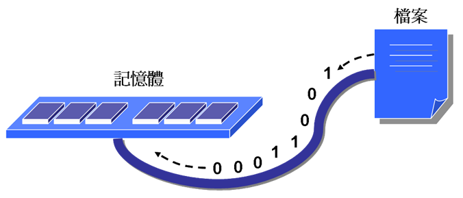
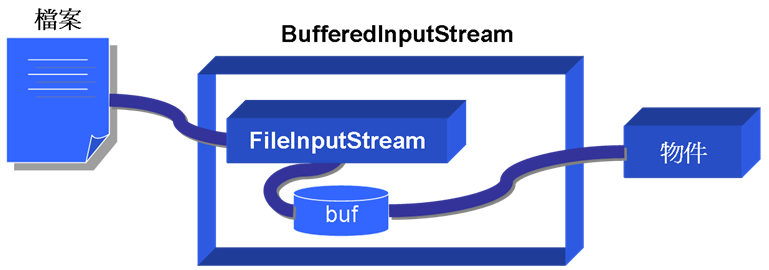
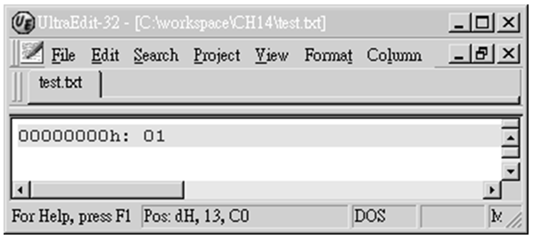
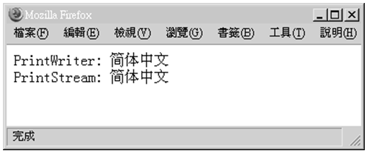

# 第 14 章 輸入輸出

輸入輸出（Input/Output）泛指對某個設備或環境進行資料的輸入或輸出，例如對磁碟進行輸入輸出、對視訊設備進行輸入輸出、對網路主機進行輸入輸出等，可以想像的，因設備或環境的不同，會有各式各樣的輸入輸出問題與解決方案，輸入輸出問題在程式設計中實際上是一個很複雜的問題。

對於輸入輸出的問題，Java 將之抽象化為串流（Stream）物件來解決，對不同的輸入輸出問題，會有相應的串流物件提供解決的方案，這一個章節就是要學習 Java 中各式各樣解決輸入輸出問題的物件，然而輸入輸出問題所涉及的領域相當的廣，基於學習的角度來看必須選擇一個主題來專門討論，所以這一個章節主題會圍繞在檔案輸入輸出，有了這一個章節的基礎，在瞭解其它領域的輸入輸出問題時就不難入手。

-----------------

## 14.1 檔案

在正式瞭解 Java 中如何處理檔案輸入輸出之前，要先瞭解一下在 Java 中如何表示一個檔案，這個小節也將介紹簡單的隨機檔案存取，讓您初步瞭解檔案輸入輸出時一些必須注意的事項。

### 14.1.1 File 類別

不同的作業系統對於檔案系統路徑的設定各有差別，例如在 Windows 中，一個路徑的表示法可能是：

    "C:\\Workspace\\CH14\\"
    
而在 Linux 下的路徑設定可能會像是：

    "/home/justin/workspace/ch14"
    
Windows 的路徑指定是使用 UNC（Universal Naming Convention）路徑名，以 '\\' 開始表示磁碟根目錄，如果沒有以 '\\' 開始表示相對於目前工作目錄的路徑，C 是可選的磁碟指定，後面跟隨著':'字元。而 UNIX-Like 系統沒有 Windows 系統的 C、D、E 這樣的磁碟機概念，UNIX-Like 系統的路徑指定以 '/' 開始表示從根目錄開始的絕對路徑，不以 '/' 開始表示相對於目前工作目錄的路徑。

在程式中設定路徑時會有系統相依性的問題，java.io.File 類別提供一個抽象的、與系統獨立的路徑表示，您給它一個路徑字串，它會將它轉換為與系統無關的抽象路徑表示，這個路徑可以指向一個檔案、目錄或是 URI（Uniform Resource Identifier）。

一個 File 的實例被建立時，它就不能再被改變內容，File 實例除了用作一個檔案或目錄的抽象表示之外，它還提供了不少相關操作方法，您可以用它來對檔案系統作一些查詢與設定的動作，要注意的是，不管是檔案或是目錄，在 Java 中都是以 File 的實例來表示。

範例 14.1 是一個設定與操作 File 實例的簡單示範，您可以指定查詢某個目錄下的所有檔案與目錄名稱。

#### **範例 14.1  FileDemo.java**
```java
package onlyfun.caterpillar;
 
import java.io.*;
import java.util.*;

public class FileDemo {
    public static void main(String[] args) {
        try { 
            File file = new File(args[0]);
            if(file.isFile()) { // 是否為檔案
                System.out.println(args[0] + " 檔案"); 
                System.out.print(
                      file.canRead() ? "可讀 " : "不可讀 "); 
                System.out.print(
                      file.canWrite() ? "可寫 " : "不可寫 "); 
                System.out.println(
                      file.length() + "位元組"); 
            } 
            else { 
                // 列出所有的檔案及目錄
                File[] files = file.listFiles(); 
                ArrayList<File> fileList = 
                                    new ArrayList<File>(); 
                for(int i = 0; i < files.length; i++) { 
                    // 先列出目錄 
                    if(files[i].isDirectory()) { //是否為目錄
                        // 取得路徑名
                        System.out.println("[" + 
                                files[i].getPath() + "]"); 
                    }
                    else {
                        // 檔案先存入fileList，待會再列出
                        fileList.add(files[i]); 
                    }
                } 
 
                // 列出檔案 
                for(File f: fileList) {
                    System.out.println(f.toString());
                }
                System.out.println(); 
            } 
        } 
        catch(ArrayIndexOutOfBoundsException e) { 
            System.out.println(
                        "using: java FileDemo pathname"); 
        } 
    }
}
```

執行結果：

    java onlyfun.caterpillar.FileDemo C:\
    [C:\WINDOWS]
    [C:\workspace]
    [C:\Documents and Settings]
    [C:\Program Files]
    [C:\System Volume Information]
    C:\pagefile.sys
    C:\A3N_A3L.10
    C:\bootfont.bin
    C:\ntldr
    ...略

這邊先簡單的介紹一下 File 類別，File 類別主要是檔案的抽象代表，要作檔案輸出輸入的話，必須配合其它相關類別來使用，接下來會配合各小節的內容並適時的使用 File 類別。

### 14.1.2 RandomAccessFile 類別

在正式介紹如何使用 Java 的輸入輸出相關類別來進行檔案存取前，先簡單的透過使用 java.io.RandomAccessFile 來存取檔案，以認識一些檔案存取時所必須注意的概念與事項。

檔案存取通常是「循序的」，每在檔案中存取一次，檔案的讀取位置就會相對於目前的位置前進一次，然而有時候您必須指定檔案的某個區段進行讀取或寫入的動作，也就是進行「隨機存取」（Random access），即要能在檔案中隨意的移動讀取位置，這時您可以使用 RandomAccessFile，使用它的 seek() 方法來指定檔案存取的位置，指定的單位是位元組。

為了移動存取位置時的方便，通常在隨機存取檔案中會固定每一筆資料的長度，例如長度固定為每一筆學生個人資料，Java 中並沒有直接的方法可以寫入一筆固定長度資料（像 C/C++ 中的 structure），所以在固定每一筆長度的方面您必須自行設計，範例 14.2 先設計一個學生資料的類別。

#### **範例 14.2  Student.java**
```java
package onlyfun.caterpillar;
 
public class Student {
    private String name; 
    private int score; 
 
    public Student() { 
        setName("noname"); 
    } 
 
    public Student(String name, int score) {
        setName(name);
        this.score = score; 
    } 
 
    public void setName(String name) {
        StringBuilder builder = null;
        if(name != null) 
            builder = new StringBuilder(name); 
        else 
            builder = new StringBuilder(15); 
 
        builder.setLength(15); // 最長 15 字元
        this.name = builder.toString();
    }
    
    public void setScore(int score) {
        this.score = score;
    }
 
    public String getName() { 
        return name; 
    } 
 
    public int getScore() { 
        return score; 
    } 
     // 每筆資料固定寫入34位元組 
    public static int size() { 
        return 34; 
    } 
} 
```

對於每一筆學生資料的實例在寫入檔案時，會固定以 34 位元組的長度寫入，也就是 15 個字元（30 位元組）加上一個 int 整數的長度（4 位元組），範例 14.2 中是使用 StringBuilder 來固定字元長度，您可以使用 size() 方法來取得長度資訊，範例 14.3 則示範了如何使用 RandomAccessFile 來寫入檔案，並可隨機指定一筆您所想讀出的資料。

#### **範例 14.3  RandomAccessFileDemo.java**
```java
package onlyfun.caterpillar;
 
import java.io.*;
import java.util.*;
 
public class RandomAccessFileDemo {
    public static void main(String[] args) {
        Student[] students = {
                new Student("Justin", 90), 
                new Student("momor", 95), 
                new Student("Bush", 88), 
                new Student("caterpillar", 84)}; 
        
        try {
            File file = new File(args[0]);
            // 建立RandomAccessFile實例並以讀寫模式開啟檔案
            RandomAccessFile randomAccessFile = 
                    new RandomAccessFile(file, "rw"); 
            
            for(int i = 0; i < students.length; i++) { 
              // 使用對應的write方法寫入資料
              randomAccessFile.writeChars(students[i].getName());
              randomAccessFile.writeInt(students[i].getScore()); 
            }
 
            Scanner scanner = new Scanner(System.in);
 
            System.out.print("讀取第幾筆資料？"); 
            
            int num = scanner.nextInt(); 
            
            // 使用seek()方法操作存取位置
            randomAccessFile.seek((num-1) * Student.size()); 
            Student student = new Student(); 

            // 使用對應的read方法讀出資料
            student.setName(readName(randomAccessFile));
            student.setScore(randomAccessFile.readInt());

            System.out.println("姓名：" + student.getName());
            System.out.println("分數：" + student.getScore());
 
            // 設定關閉檔案
            randomAccessFile.close(); 
        }
        catch(ArrayIndexOutOfBoundsException e) {
            System.out.println("請指定檔案名稱");
        } 
        catch(IOException e) { 
            e.printStackTrace(); 
        }
    }
 
    private static String readName(RandomAccessFile randomAccessfile)
                               throws IOException { 
        char[] name = new char[15]; 
 
        for(int i = 0; i < name.length; i++) 
            name[i] = randomAccessfile.readChar(); 

        // 將空字元取代為空白字元並傳回
        return new String(name).replace('\0', ' '); 
    } 
} 
```

執行結果：

    java onlyfun.caterpillar.RandomAccessFileDemo student.dat
    讀取第幾筆資料？2
    姓名：momor
    分數：95

RandomAccessFile 上的相關方法操作都在註解中有說明了，您可以看到讀寫檔案時幾個必要的流程：

- 開啟檔案並指定讀寫方式

  在 Java 中當您實例化一個與檔案相關的輸入輸出類別，就會進行開啟檔案的動作，在實例化的同時要指定檔案是要以讀出（r）、寫入（w）或可讀可寫（rw）的方式開啟，您可以將檔案看到是一個容器，要讀出或寫入資料都必須打開容器的瓶蓋。
  
- 使用對應的寫入方法

  要對檔案進行寫入，要使用對應的寫入方法，在 Java 中通常是 write 的名稱作為開頭，在低階的檔案寫入中，要寫入某種型態的資料，就要使用對應該型態的方法，例如 writeInt()、writeChar() 等。
  
- 使用對應的讀出方法

  要對檔案進行讀出，要使用對應的讀出方法，在Java中通常是read的名稱作為開頭，在低階的檔案讀出中，要讀出某種型態的資料，就要使用對應該型態的方法，例如readInt()、readChar()等。

- 關閉檔案

  您可以將檔案看到是一個容器，要讀出或寫入資料都必須打開容器的瓶蓋，而不進行讀出或寫入時，就要將瓶蓋關閉，對於某些檔案存取物件來說，關閉檔案的動作意味著將「緩衝區」（Buffer）的資料全部寫入檔案，如果不作關閉檔案的動作，某些資料可能沒有寫入檔案而遺失。

## 14.2 位元串流

電腦中的資料都是以 0 與 1 的方式來儲存，如果您要在兩個裝置之間進行資料的存取，當然也是以 0 與 1 位元的方式來進行，Java 將資料於目的地及來源之間的流動抽象化為一個串流（Stream），而串流當中流動的則是位元資料。

### 14.2.1 InputStream、OutputStream

電腦中實際上資料的流動是透過電路，而上面流動的則是電流，電流的電位有低位與高位，即數位的 0 與 1 位元，而從程式的觀點來說，通常會將資料目的地（例如記憶體）與來源（例如檔案）之間的資料流動抽象化為一個串流（Stream），而當中流動的則是位元資料。



圖 14.1 資料的流動抽象化為串流的概念
 
在 Java SE 中有兩個類別用來作串流的抽象表示：java.io.InputStream 與 java.io.OutputStream。

InputStream 是所有表示位元輸入串流的類別之父類別，它是一個抽象類別，繼承它的子類別要重新定義當中所定義的抽象方法。InputStream 是從裝置來源地讀取資料的抽象表示，例如System中的標準輸入串流 in 物件就是一個 InputStream 類型的實例，在 Java 程式開始之後，in 串流物件就會開啟，目的是從標準輸入裝置中讀取資料，這個裝置通常是鍵盤或是使用者定義的輸入裝置。

OutputStream 是所有表示位元輸出串流的類別之父類別，它是一個抽象類別，子類別要重新定義當中所定義的抽象方法，OutputStream 是用於將資料寫入目的地的抽象表示，例如 System 中的標準輸出串流物件 out 其類型是 java.io.PrintStream，這個類別是 OutputStream 的子類別（java.io.FilterOutputStream 繼承 OutputStream， PrintStream 再繼承 FilterOutputStream），在程式開始之後，out 串流物件就會開啟，您可以透過 out 來將資料寫至目的地裝置，這個裝置通常是螢幕顯示或使用者定義的輸出裝置。

範例 14.4 可以讀取鍵盤輸入串流，in 物件的 read() 方法一次讀取一個位元組的資料，讀入的資料以 int 型態傳回，所以再使用 out 物件將資料顯示出來時，就是 10 進位方式。

#### **範例 14.4  StreamDemo.java**
```java
package onlyfun.caterpillar;
 
import java.io.*;
 
public class StreamDemo { 
    public static void main(String[] args) { 
        try { 
            System.out.print("輸入字元: "); 
            System.out.println("輸入字元十進位表示: " + 
                                    System.in.read());  
        } 
        catch(IOException e) { 
            e.printStackTrace(); 
        } 
    } 
} 
```

執行結果：

    輸入字元: A
    輸入字元十進位表示: 65

字元 'A' 輸入後由標準輸入串流 in 讀取，'A' 的位元表示以十進位來看就是 65，這是 'A' 字元的編碼（查查ASCII編碼表就知道了）。

一般來說很少直接操作 InputStream 或 OutputStream 上的方法，因為這些方法比較低階，通常您會操作它們的子類別，這些子類別上所定義的方法在進行輸入輸出時更為方便。

### 14.2.2 FileInputStream、FileOutputStream

java.io.FileInputStream 是 InputStream 的子類，由開頭 File 名稱上就可以知道，FileInputStream 與從指定的檔案中讀取資料至目的地有關，而 java.io.FileOutputStream 是 OutputStream 的子類，顧名思義，FileOnputStream 主要與從來源地寫入資料至指定的檔案中有關。

當您建立一個 FileInputStream 或 FileOutputStream 的實例時，必須指定檔案位置及檔案名稱，實例被建立時檔案的串流就會開啟，而不使用串流時，您必須關閉檔案串流，以釋放與串流相依的系統資源，完成檔案讀寫的動作。

FileInputStream 可以使用 read() 方法一次讀入一個位元組，並以 int 型態傳回，或者是使用 read() 方法時讀入至一個 byte 陣列，byte 陣列的元素有多少個，就讀入多少個位元組，在將整個檔案讀取完成或寫入完畢的過程中，這麼一個 byte 陣列通常被當作「緩衝區」（Buffer），因為這麼一個 byte 陣列通常扮演承接資料的中間角色。

範例 14.5 是使用 FileInputStream 與 FileOutputStream 的一個例子，程式可以複製檔案，它會先從來源檔案讀取資料至一個 byte 陣列中，然後再將 byte 陣列的資料寫入目的檔案。

#### **範例 14.5  FileStreamDemo.java**
```java
package onlyfun.caterpillar;
 
import java.io.*; 
 
public class FileStreamDemo {
    public static void main(String[] args) {
        try { 
            byte[] buffer = new byte[1024]; 

            // 來源檔案
            FileInputStream fileInputStream = 
                new FileInputStream(new File(args[0])); 
            // 目的檔案
            FileOutputStream fileOutputStream = 
                new FileOutputStream(new File(args[1])); 

            // available()可取得未讀取的資料長度
            System.out.println("複製檔案：" + 
                    fileInputStream.available() + "位元組"); 
            
            while(true) { 
                if(fileInputStream.available() < 1024) { 
                    // 剩餘的資料比1024位元組少
                    // 一位元一位元讀出再寫入目的檔案
                    int remain = -1; 
                    while((remain = fileInputStream.read())
                                           != -1) {
                        fileOutputStream.write(remain); 
                    }
                    break; 
                } 
                else { 
                    // 從來源檔案讀取資料至緩衝區 
                    fileInputStream.read(buffer); 
                    // 將陣列資料寫入目的檔案 
                    fileOutputStream.write(buffer); 
                } 
            } 

            // 關閉串流 
            fileInputStream.close(); 
            fileOutputStream.close(); 

            System.out.println("複製完成"); 
        } 
        catch(ArrayIndexOutOfBoundsException e) { 
            System.out.println(
                      "using: java FileStreamDemo src des"); 
            e.printStackTrace(); 
        } 
        catch(IOException e) { 
            e.printStackTrace(); 
        } 
    }
} 
```

程式中示範了兩個 read() 方法，一個方法可以讀入指定長度的資料至陣列，另一個方法一次可以讀入一個位元組，每次讀取之後，讀取的游標都會往前進，如果讀不到資料則傳回 -1，您使用 available() 方法獲得還有多少位元組可以讀取；除了使用 File 來建立 FileInputStream、FileOutputStream 的實例之外，您也可以直接使用字串指定路徑來建立。

    // 來源檔案
    FileInputStream fileInputStream = 
                    new FileInputStream(args[0]); 
    // 目的檔案
    FileOutputStream fileOutputStream = 
                    new FileOutputStream(args[1]);

在不使用檔案串流時，記得使用 close() 方法自行關閉串流，以釋放與串流相依的系統資源，一個執行的結果範例如下，將 FileDemo.java 複製為 FileDemo.txt：

    java onlyfun.caterpillar.FileStreamDemo FileDemo.java FileDemo.txt
    複製檔案：1723位元組
    複製完成

預設上 FileOutputStream 會以新建檔案的方式來開啟串流，如果您指定的檔案名稱已經存在，則原檔案會被覆蓋，如果想以附加的模式來寫入檔案，則可以在建構 FileOutputStream 實例時指定為附加模式，例如：

    FileOutputStream fileOutputStream = 
                    new FileOutputStream(args[1], true);

建構方法的第二個 append 參數如果設定為 true，在開啟串流時如果檔案不存在則會新建一個檔案，如果檔案存在就直接開啟串流，並將寫入的資料附加至檔案未端。

### 14.2.3 BufferedInputStream、BufferedOutputStream

在介紹 FileInputStream、 FileOutputStream 的例子中，您使用了一個 byte 陣列來作為資料讀入目的地，而後對陣列資料進行處理。可以的話，即使目前用不到，為了效率起見，可以儘量讀取多一點的資料。以檔案存取為例的話，磁碟存取的速度是遠低於記憶體中的資料存取速度，為了減少對磁碟的存取，通常從檔案中一次讀入一定長度的資料，而寫入時也是一次寫入一定長度的資料，這可以增加檔案存取的效率。

java.io.BufferedInputStream 與 java.io.BufferedOutputStream 可以為 InputStream、OutputStream 類的物件增加緩衝區功能，建構 BufferedInputStream 實例時，需要給定一個 InputStream 型態的實例，您操作 BufferedInputStream 時，實際上最後是操作 InputStream 實例，同樣的在建構 BufferedOutputStream 時，也需要給定一個 OutputStream 的實例，您操作 BufferedOutputStream 時，實際上最後是操作 OutputStream 實例。

BufferedInputStream 的資料成員 buf 是個位元陣列，預設為 2048位 元組，當讀取資料來源時，例如檔案，BufferedInputStream 會儘量將 buf 填滿，當您使用 read() 方法時，實際上是先讀取 buf 中的資料，而不是直接對資料來源作讀取，當 buf 中的資料不足時，BufferedInputStream 才會再操作給定的 InputStream 物件之 read() 方法，從指定的裝置中提取資料。



圖 14.2 BufferedInputStream 在內部有 buf 成員作為緩衝區

BufferedOutputStream 的資料成員 buf 是個位元陣列，預設為 512 個位元組，當使用 write() 方法寫入資料時，實際上會先將資料寫至 buf 中，當 buf 已滿時才會操作給定的 OutputStream 物件之 write() 方法，將 buf 資料寫至目的地，而不是每次都對目的地作寫入的動作。

來將範例 14.5 作個改寫，這次不用自行設定緩衝區，而使用 BufferedInputStream、 BufferedOutputStream 讓程式看來簡單一些，也比較有效率。

#### **範例 14.6  BufferedStreamDemo.java**
```java
package onlyfun.caterpillar;
 
import java.io.*;
 
public class BufferedStreamDemo {
    public static void main(String[] args) {
        try {
            byte[] data = new byte[1]; 

            File srcFile = new File(args[0]); 
            File desFile = new File(args[1]); 

            BufferedInputStream bufferedInputStream = 
                new BufferedInputStream(
                         new FileInputStream(srcFile)); 
            BufferedOutputStream bufferedOutputStream = 
                new BufferedOutputStream(
                         new FileOutputStream(desFile));
 
            System.out.println("複製檔案：" + 
                             srcFile.length() + "位元組");

            while(bufferedInputStream.read(data) != -1) { 
                bufferedOutputStream.write(data); 
            }
            
            // 將緩衝區中的資料全部寫出 
            bufferedOutputStream.flush();
 
            // 關閉串流 
            bufferedInputStream.close(); 
            bufferedOutputStream.close(); 

            System.out.println("複製完成"); 
        } 
        catch(ArrayIndexOutOfBoundsException e) { 
            System.out.println(
                    "using: java UseFileStream src des"); 
            e.printStackTrace(); 
        } 
        catch(IOException e) { 
            e.printStackTrace(); 
        } 
    }
} 
```

為了確保緩衝區中的資料一定被寫出至目的地，建議最後執行flush()將緩衝區中的資料全部寫出目的串流中，這個範例的執行結果與範例14.5是相同的。

BufferedInputStream、BufferedOutputStream 並沒有改變 InputStream 或 OutputStream 的行為，讀入或寫出時的動作還是 InputStream、OutputStream 負責，BufferedInputStream、BufferedOutputStream 只是在操作對應的方法之前，動態的為它們加上一些額外功能（像是緩衝區功能），在這邊是以檔案存取串流為例，實際上您可以在其它串流物件上也使用 BufferedInputStream、BufferedOutputStream 功能。

### 14.2.4 DataInputStream、DataOutputStream

java.io.DataInputStream、java.io.DataOutputStream 可提供一些對 Java 基本資料型態寫入的方法，像是讀寫 int、double、 boolean 等的方法，由於 Java 的資料型態大小是規定好的，在寫入或讀出這些基本資料型態時，就不用擔心不同平台間資料大小不同的問題。

這邊還是舉檔案存取來進行說明，有時候您只是要儲存一個物件的成員資料，而不是整個物件的資訊，成員資料的型態假設都是 Java 的基本資料型態，這樣的需求不必要使用到與 Object 輸入、輸出相關的串流物件，您可以使用 DataInputStream、DataOutputStream 來寫入或讀出資料。

使用範例來直接介紹如何使用 DataInputStream 與 DataOutputStream，首先設計一個 Member 類別。

#### **範例 14.7  Member.java**
```java
package onlyfun.caterpillar;

public class Member {
    private String name;
    private int age;

    public Member() {
    }

    public Member(String name, int age) {
        this.name = name;
        this.age = age;
    }

    public void setName(String name) {
        this.name = name;
    }

    public void setAge(int age) {
        this.age = age;
    }

    public String getName() {
        return name;
    }

    public int getAge() {
        return age;
    }
}
```

您打算將 Member 類別實例的成員資料寫入檔案中，並打算在讀入檔案資料後，將這些資料還原為 Member 物件，範例 14.8 簡單示範了如何實作這個需求。

#### **範例 14.8  DataStreamDemo.java**
```java
package onlyfun.caterpillar;
 
import java.io.*;
 
public class DataStreamDemo {
    public static void main(String[] args) {
        Member[] members = {new Member("Justin", 90), 
                              new Member("momor", 95), 
                              new Member("Bush", 88)}; 
        try { 
            DataOutputStream dataOutputStream = 
                new DataOutputStream( 
                         new FileOutputStream(args[0])); 
            
            for(Member member : members) { 
               // 寫入UTF字串
               dataOutputStream.writeUTF(member.getName()); 
               // 寫入int資料
               dataOutputStream.writeInt(member.getAge()); 
            } 
            // 出清所有資料至目的地
            dataOutputStream.flush(); 
            // 關閉串流
            dataOutputStream.close(); 
            
            DataInputStream dataInputStream = 
                new DataInputStream( 
                         new FileInputStream(args[0])); 
            // 讀出資料並還原為物件
            for(int i = 0; i < members.length; i++) { 
                // 讀出UTF字串
                String name = dataInputStream.readUTF(); 
                // 讀出int資料
                int score = dataInputStream.readInt();
                members[i] = new Member(name, score); 
            } 
            // 關閉串流
            dataInputStream.close(); 

            // 顯示還原後的資料
            for(Member member : members) { 
               System.out.printf("%s\t%d%n", 
                       member.getName(), member.getAge());
            } 
        } 
        catch(IOException e) { 
            e.printStackTrace(); 
        } 
    }
}
```

在從檔案中讀出資料時，您不用費心的自行判斷讀入字串時或讀入 int 型態時何時該停止，使用對應的 readUTF() 或 readInt() 方法就可以正確的讀入完整型態資料。同樣的，DataInputStream、DataOutputStream 並沒有改變 InputStream 或 OutputStream 的行為，讀入或寫出時的動作還是 InputStream、OutputStream 負責， DataInputStream、DataOutputStream 只是在操作對應的方法時，動態的為它們加上型態判斷功能，在這邊雖然是以檔案存取串流為例，實際上您可以在其它串流物件上也使用 DataInputStream、DataOutputStream 功能。

### 14.2.5 ObjectInputStream、ObjectOutputStream

在 Java 程式執行的過程中，很多資料都是以物件的方式存在於記憶體之中，有時候您會希望直接將記憶體中整個物件儲存至檔案，而不是只儲存物件中的某些基本型態成員資訊，而在下一次程式運行時，您希望可以從檔案中讀出資料並還原為物件，這時您可以使用 java.io.ObjectInputStream、java.io.ObjectOutputStream 來進行這項工作。

如果要直接儲存物件，定義該物件的類別必須實作 java.io.Serializable 介面，不過 Serializable 介面中並沒有規範任何必須實作的方法，所以這邊所謂實作的意義，其實像是對物件貼上一個標誌，代表該物件是「可序列化的」（Serializable）。

為了說明如何直接儲存物件，先來實作一個 User 類別。

#### **範例 14.9  User.java**
```java
package onlyfun.caterpillar;

import java.io.Serializable;

public class User implements Serializable {
    private static final long serialVersionUID = 1L;
    
    private String name;
    private int number; 

    public User() { 
    } 

    public User(String name, int number) { 
        this.name = name; 
        this.number = number; 
    } 

    public void setName(String name) {
        this.name = name;
    }
    
    public void setNumber(int number) {
        this.number = number;
    }

    public String getName() { 
        return name; 
    } 

    public int getNumber() { 
        return number; 
    } 
}
```

您注意到 serialVersionUID，這代表了可序列化物件的版本，如果您沒有提供這個版本訊息，則實作 Serializable 介面的類別會自動依類別名稱、實現的介面、成員等來產生，如果是自動產生的，則下次您更改了 User 類，則自動產生的 serialVersionUID 也會跟著變更，當從檔案讀回物件時兩個物件的 serialVersionUID 不相同的話，就會丟出 java.io.InvalidClassException，如果您想要維持版本訊息的一致，則要明確宣告 serialVersionUID。

ObjectInputStream、ObjectOutputStream 為 InputStream、OutputStream 的實例加上了可以讓使用者寫入物件、讀出物件的功能，在寫入物件時，您要使用 writeObject() 方法，讀出物件時則使用 readObject() 方法，被讀出的物件都是以 Object 的型態傳回，所以必須將之轉換為物件原來的型態，才能正確的操作被讀回的物件，範例 14.10 示範了如何儲存 User 物件至檔案中然後再將它讀回並還原為 User 實例，程式有些長，請耐心看完。

#### **範例 14.10  ObjectStreamDemo.java**
```java
package onlyfun.caterpillar;
 
import java.io.*;
import java.util.*;
 
public class ObjectStreamDemo {
    public static void main(String[] args) {
        User[] users = {new User("cater", 101),
                        new User("justin", 102)}; 
        // 寫入新檔
        writeObjectsToFile(users, args[0]);

        try {
            // 讀取檔案資料
            users = readObjectsFromFile(args[0]);
            // 顯示讀回的物件
            for(User user : users) {
                System.out.printf("%s\t%d%n", user.getName(), user.getNumber());
            }
            System.out.println();
            
            users = new User[2];
            users[0] = new User("momor", 103);
            users[1] = new User("becky", 104);
            
            // 附加新物件至檔案
            appendObjectsToFile(users, args[0]);
            
            // 讀取檔案資料
            users = readObjectsFromFile(args[0]);
            // 顯示讀回的物件
            for(User user : users) {
                System.out.printf("%s\t%d%n", user.getName(), user.getNumber());
            }
        }
        catch(ArrayIndexOutOfBoundsException e) {
            System.out.println("沒有指定檔名");
        }
        catch(FileNotFoundException e) {
            e.printStackTrace();
        }
    }

    // 將指定的物件寫入至指定的檔案
    public static void writeObjectsToFile(
                         Object[] objs, String filename) { 
        File file = new File(filename);
 
        try { 
            ObjectOutputStream objOutputStream = 
                new ObjectOutputStream(
                      new FileOutputStream(file)); 
            for(Object obj : objs) {
                // 將物件寫入檔案
                objOutputStream.writeObject(obj); 
            }
            // 關閉串流
            objOutputStream.close(); 
        } 
        catch(IOException e) { 
            e.printStackTrace(); 
        }
    }
    
    // 將指定檔案中的物件資料讀回
    public static User[] readObjectsFromFile(
                             String filename) 
                               throws FileNotFoundException {
        File file = new File(filename); 
 
        // 如果檔案不存在就丟出例外
        if(!file.exists()) 
            throw new FileNotFoundException(); 
 
        // 使用List先儲存讀回的物件
        List<User> list = new ArrayList<User>();
        
        try {
            FileInputStream fileInputStream = 
                new FileInputStream(file);
            ObjectInputStream objInputStream = 
                new ObjectInputStream(fileInputStream); 
            
            while(fileInputStream.available() > 0) {
                list.add((User) objInputStream.readObject());
            }
            objInputStream.close(); 
        } 
        catch(ClassNotFoundException e) { 
            e.printStackTrace(); 
        } 
        catch(IOException e) { 
            e.printStackTrace(); 
        }
 
        User[] users = new User[list.size()];
        return list.toArray(users);
    }
 
    // 將物件附加至指定的檔案之後
    public static void appendObjectsToFile(
                           Object[] objs, String filename) 
                               throws FileNotFoundException {
  
        File file = new File(filename); 
 
        // 如果檔案不存在則丟出例外
        if(!file.exists()) 
             throw new FileNotFoundException(); 

        try {
            // 附加模式
            ObjectOutputStream objOutputStream = 
               new ObjectOutputStream(
                  new FileOutputStream(file, true)) { 
                    // 如果要附加物件至檔案後
                    // 必須重新定義這個方法
                    protected void writeStreamHeader() 
                                     throws IOException {} 
               };  
 
            for(Object obj : objs) {
                // 將物件寫入檔案
                objOutputStream.writeObject(obj); 
            }
            objOutputStream.close(); 
        } 
        catch(IOException e) { 
            e.printStackTrace(); 
        } 
    }
}
```

範例中必要的地方都已加上註解，雖然程式很長，但範例中已經將寫入物件至檔案、從檔案讀出物件、附加物件至檔案的程式邏輯集中在 writeObjectsToFile()、readObjectsFromFile() 與 appendObjectsToFile() 三個方法中，執行結果如下：

    cater   101
    justin  102

    cater   101
    justin  102
    momor   103
    becky   104

注意在試圖將物件附加至一個先前已寫入物件的檔案時，由於 ObjectOutputStream 在寫入資料時，還會加上一個特別的串流頭（Stream header），而讀取檔案時會檢查這個串流頭，如果一個檔案中被多次附加物件，那麼該檔案中會有多個串流頭，如此讀取檢查時就會發現不一致，這會丟出 java.io.StreamCorrupedException，為了解決這個問題，您可以重新定義 ObjectOutputStream 的 writeStreamHeader() 方法，如果是以附加的方式來寫入物件，就不寫入串流頭：

    ObjectOutputStream objOutputStream = 
        new ObjectOutputStream(
            new FileOutputStream(file, true)) { 
                protected void writeStreamHeader() 
                                     throws IOException {} 
            };  

序列化物件的功能並不只應用於檔案的讀取或寫入，您也可以應用於其它領域，像是將物件直接透過網路進行傳送或是傳送影像的位元陣列資料等。

> **良葛格的話匣子** 這邊只是對序列化的一個簡介，記得看看 API 文件中有關於 ObjectInputStream 與 ObjectOutputStream 的介紹，瞭解更多有關於物件寫入與讀出的細節，使用 Google 查詢關鍵字「序列化」也可以找到不少文件。

### 14.2.6 SequenceInputStream

您想要將一個檔案分割為數個檔案，接下來要將之再度組合還原為一個檔案，最基本的作法是使用數個 FileInputStream 來開啟分割後的檔案，然後一個一個檔案的讀取，並使用同一個 FileOutputStream 實例寫到同一個檔案中，您必須要自行判斷每一個分割檔案的讀取是否完畢，如果完畢就換讀取下一個檔案。

如果您使用 java.io.SequenceInputStream 就不用這麼麻煩，SequenceInputStream 可以看作是數個 InputStream 物件的組合，當一個 InputStream 物件的內容讀取完畢後，它就會取出下一個 InputStream 物件，直到所有的 InputStream 物件都讀取完畢為止。

範例 14.11 是 SequenceInputStream 的使用示範，您可以將指定的檔案進行分割，也可以將分割後的檔案還原為一個檔案。

#### **範例 14.11  SequenceStreamDemo.java**
```java
package onlyfun.caterpillar;

import java.util.*;
import java.io.*;

public class SequenceStreamDemo {
    public static void main(String[] args) {
        try { 
            // args[0]: 指定分割（s）或連接（c）
            switch (args[0].charAt(1)) {
                case 's':
                    // args[1]: 每個分割檔案的大小
                    int size = Integer.parseInt(args[1]);
                    // args[2]: 指定要被分割的檔案名稱
                    seperate(args[2], size); 
                    break;
                case 'c':
                    // args[1]: 指定要被組合的檔案個數
                    int number = Integer.parseInt(args[1]);
                    // args[2]: 組合後的檔案名稱
                    concatenate(args[2], number); 
                    break;
            }
        } 
        catch(ArrayIndexOutOfBoundsException e) { 
            System.out.println(
                "Using: java UseSequenceStream [-s/-c]" + 
                " (size/number) filename"); 
            System.out.println("-s: 分割檔案\n-c: 組合檔案"); 
        } 
        catch(IOException e) { 
            e.printStackTrace(); 
        } 
    }

    // 分割檔案
    public static void seperate(String filename, int size) 
                                    throws IOException { 
        FileInputStream fileInputStream = 
            new FileInputStream(new File(filename)); 
        BufferedInputStream bufInputStream = 
            new BufferedInputStream(fileInputStream); 

        byte[] data = new byte[1]; 
        int count = 0;  
        // 從原檔案大小及指定分割的大小
        // 決定要分割為幾個檔案 
        if(fileInputStream.available() % size == 0) 
            count = fileInputStream.available() / size; 
        else 
            count = fileInputStream.available() / size + 1; 
 
        // 開始進行分割
        for(int i = 0; i < count; i++) { 
            int num = 0; 
            // 分割的檔案加上底線與編號
            File file = new File(filename + "_" + (i + 1));
            BufferedOutputStream bufOutputStream = 
                new BufferedOutputStream( 
                       new FileOutputStream(file)); 
 
            while(bufInputStream.read(data) != -1) { 
                bufOutputStream.write(data); 
                num++; 
                if(num == size) { // 分割出一個檔案
                    bufOutputStream.flush(); 
                    bufOutputStream.close(); 
                    break; 
                } 
            } 
 
            if(num < size) { 
                bufOutputStream.flush(); 
                bufOutputStream.close(); 
            } 
        } 
 
        System.out.println("分割為" + count + "個檔案"); 
    } 

    // 連接檔案
    public static void concatenate(String filename, 
                          int number) throws IOException {
        // 收集檔案用的List
        List<InputStream> list = 
                new ArrayList<InputStream>();
        
        for(int i = 0; i < number; i++) {
            // 檔案名必須為底線加上編號
            File file = new File(filename + "_" + (i+1));
            list.add(i, new FileInputStream(file));
        }
        
        final Iterator<InputStream> iterator = list.iterator();
        
        // SequenceInputStream 需要一個Enumeration物件來建構
        Enumeration<InputStream> enumation = 
            new Enumeration<InputStream>() {
                public boolean hasMoreElements() {
                    return iterator.hasNext();
                }

                public InputStream nextElement() {
                    return iterator.next();
                }
            };
 
        // 建立SequenceInputStream
        // 並使用BufferedInputStream
        BufferedInputStream bufInputStream = 
            new BufferedInputStream( 
                    new SequenceInputStream(enumation), 
                    8192); 

        BufferedOutputStream bufOutputStream = 
                    new BufferedOutputStream( 
                       new FileOutputStream(filename), 8192); 

        byte[] data = new byte[1]; 
        // 讀取所有檔案資料並寫入目的地檔案
        while(bufInputStream.read(data) != -1) 
            bufOutputStream.write(data); 

        bufInputStream.close(); 
        bufOutputStream.flush(); 
        bufOutputStream.close(); 
        System.out.println("組合" + number + "個檔案 OK!!"); 
    } 
}
```

分割檔案時必須指定 '-s' 以及分割後的每個檔案大小，執行的一個例子如下：

    java onlyfun.caterpillar.SequenceStreamDemo -s 1048576 test.zip
    分割為6個檔案

分割後的檔名是原檔名加上底線與編號，例如 test.zip_1、test.zip_2 等，合併檔案時必須要指定 '-c'、合併的檔案數與來源檔案名稱，例如將之前分割過後的檔案合併為一個檔案：

    java onlyfun.caterpillar.SequenceStreamDemo -c 6 test.zip
    組合6個檔案 OK!!
    
### 14.2.7 PrintStream

之前所介紹過的 OutputStream 物件，都是直接將記憶體中的資料原封不變的寫至目的地（例如一個檔案），舉個例子來說，如果您將 int 型態 1 使用之前介紹的 OutputStream 物件輸出至檔案，則檔案中所儲存的是 int 型態 1 在記憶體中的值，例如範例 14.12 的輸出結果。

#### **範例 14.12  StreamTest.java**
```java
package onlyfun.caterpillar;
 
import java.io.*;
 
public class StreamTest { 
    public static void main(String[] args) 
                            throws IOException { 
        FileOutputStream file = 
            new FileOutputStream(
                 new File("test.txt")); 
        file.write(1); 
        file.close(); 
    } 
} 
```

執行範例 14.12 後會產生一個 test.txt 檔案，開啟檔案之後，您不會看到顯示 1，而可能看到一個怪異的符號，由於使用 write() 方法，這會將1在記憶體中的值之低位元組 0000001 寫入檔案中，而純文件檔案在顯示檔案內容時，會以作業系統的預設編碼顯示對應的字元，如果您使用文字編輯軟體（像 vi 或 UltraEdit）觀看 test.txt 的 16 進位表示，其結果會顯示 01（16 進位表示）。



圖 14.3 使用 UltraEdit 十六進位編輯模式觀看範例 14.12 的輸出檔案

有時候您所想要儲存的結果是資料轉換為字元之後的結果，例如程式的執行結果是 3.14159，您會希望使用 3.14159 等字元來儲存，也就是俗稱的儲存為純文字檔案，如此當您使用簡單的純文字編輯器觀看時，就可以直接看到以 3.14159 等字元顯示的畫面。在範例 14.12 中，若想使用純文字檔案看到 test.txt 的顯示結果是 1，則您必須先將記憶體中的整數 1，也就是二進位 00000000 00000000 00000000 00000001 轉換為對應的 '1' 字元編碼，也就是 0x31（十進位表示為 49）並加以儲存。

使用 java.io.PrintStream 可以自動為您進行字元轉換的動作，預設會使用作業系統的編碼來處理對應的字元轉換動作，直接使用範例 14.13 來作示範。

#### **範例 14.13  PrintStreamDemo.java**
```java
package onlyfun.caterpillar;
 
import java.io.*;
 
public class PrintStreamDemo {
    public static void main(String[] args) 
                           throws FileNotFoundException {
        PrintStream printStream = new PrintStream( 
                new FileOutputStream(
                        new File("test.txt")));

        printStream.println(1);
 
        printStream.close();
    }
} 
```

執行程式之後使用純文字編輯器開啟 test.txt，其內容會是顯示字元 '1' 了，print() 或 println() 接受 int、char、String、double 等資料型態，println() 會在輸出之後加上換行字元，而 print() 則不會。

> **良葛格的話匣子** 注意在檔案儲存上實際並沒有二進位檔案或是純文字檔案的分別，所有的檔案所儲存的都是二進位的資料，一般俗稱的純文字檔案，其實正確的說，是指儲存的結果是經過字元轉換，例如將 int 型態1轉換為字元 '1' 的編碼結果並加以儲存。

### 14.2.8 ByteArrayInputStream、ByteArrayOutputStream

串流的來源或目的地不一定是檔案，也可以是記憶體中的一個空間，例如一個位元陣列，java.io.ByteArrayInputStream、java.io.ByteArray OutputStream 即是將位元陣列當作串流輸入來源、輸出目的地的類別。

ByteArrayInputStream 可以將一個陣列當作串流輸入的來源，而 ByteArrayOutputStream 則可以將一個位元陣列當作串流輸出的目的地，在這邊舉一個簡單的檔案位元編輯程式作為例子，您可以開啟一個簡單的文字檔案，當中有簡單的 ABCDEFG 等字元，在讀取檔案之後，您可以直接以程式來指定檔案中位元的位置來修改所指定的字元，作法是將檔案讀入陣列中，指定陣列索引修改元素，然後重新將陣列存回檔案，範例 14.14 是實作的程式內容。

#### **範例 14.14  PrintStreamDemo.java**
```java
package onlyfun.caterpillar;
 
import java.io.*;
import java.util.*;
 
public class ByteArrayStreamDemo {
    public static void main(String[] args) {
        try { 
            File file = new File(args[0]); 
            BufferedInputStream bufferedInputStream = 
                new BufferedInputStream( 
                     new FileInputStream(file)); 

            ByteArrayOutputStream arrayOutputStream = 
                new ByteArrayOutputStream(); 

            byte[] bytes = new byte[1];             

            // 將檔案內容寫入位元陣列串流
            while(bufferedInputStream.read(bytes) != -1) {
                arrayOutputStream.write(bytes);
            }
            arrayOutputStream.close(); 
            bufferedInputStream.close(); 

            // 以字元方式顯示位元陣列內容 
            bytes = arrayOutputStream.toByteArray(); 
            for(int i = 0; i < bytes.length; i++) {
                System.out.print((char) bytes[i]);
            }
            System.out.println(); 

            // 讓使用者輸入位置與字元修改位元陣列內容 
            Scanner scanner = new Scanner(System.in);

            System.out.print("輸入修改位置："); 
            int pos = scanner.nextInt();
            System.out.print("輸入修改字元："); 
            // 修改陣列中對應的字元
            bytes[pos-1] = (byte) scanner.next().charAt(0);

            // 將位元陣列內容存回檔案 
            ByteArrayInputStream byteArrayInputStream = 
                new ByteArrayInputStream(bytes); 
            BufferedOutputStream bufOutputStream = 
                new BufferedOutputStream( 
                     new FileOutputStream(file)); 
            byte[] tmp = new byte[1]; 
            while(byteArrayInputStream.read(tmp) != -1) 
                bufOutputStream.write(tmp); 
            byteArrayInputStream.close(); 
            bufOutputStream.flush(); 
            bufOutputStream.close(); 
        } 
        catch(ArrayIndexOutOfBoundsException e) { 
            System.out.println("請指定檔案名稱");
        } 
        catch(IOException e) { 
            e.printStackTrace(); 
        } 
    }
} 
```

執行結果：

    java onlyfun.caterpillar.ByteArrayStreamDemo test.txt
    ABCDEFG
    輸入修改位置：3
    輸入修改字元：X
    
再開啟 test.txt 時，您會發現 'C' 已經被覆蓋為 'X'。

> **良葛格的話匣子** 範例 14.14 只是個簡單的示範，實際上由於字元在 Java 中使用 Unicode，是兩個位元組長度，所以這個範例只能用於修改 ASCII 字元（因為 Unicode 的前 128 位元與 ASCII 相容），範例 14.21 會介紹可以修改中文字元與 ASCII 字元的程式。

### 14.2.9 PushbackInputStream

java.io.PushbackInputStream 擁有一個 PushBack 緩衝區，您從 PushbackInputStream 讀出資料後，只要 PushBack 緩衝區沒有滿，就可以使用 unread() 將資料推回串流的前端。

舉個使用 PushbackInputStream 的例子，假設一個文字檔案中同時儲存有 ASCII 碼範圍的英文字元與 Big5 碼範圍的中文字元，您希望判斷出哪些位置是 ASCII 而哪些位置是 Big5 中文字的位置，Big5 中文字使用兩個位元組來表示一個中文字，而 ASCII 只使用一個位元組來表示英文字元。

Big5 中文為了與 ASCII 相容，採低位元組範圍為 0xA4 至 0xF9，而高位元組為 0x40 到 0x7E 以及 0xA1 至 0xFE，儲存時低位元組先存，再存高位元組，所以讀取時只要先讀到位元組是在 0xA4 至 0xF9，就表示它可能是一個中文字的前半資料。

為了說明 PushbackInputStream 的功能，在範例 14.15 中一次從檔案中讀取兩個位元組，並檢查兩個位元組合併後的整數值是否在 0xA440 與 0xFFFF 之間，如此可以簡單的判斷其兩個位元組合併後是否為Big5碼，如果是 Big5 碼則使用這兩個位元組產生 String 實例以顯示中文字元，如果不在這個範圍之內，則可能是個 ASCII 範圍內的字元，您可以顯示第一個位元組的字元表示，並將讀出的第二個位元組推回串流，以待下一次可以重新讀取。

#### **範例 14.15  PushbackStreamDemo.java**
```java
package onlyfun.caterpillar;
 
import java.io.*; 
 
public class PushbackStreamDemo {
    public static void main(String[] args) {
        try { 
            PushbackInputStream pushbackInputStream = 
                new PushbackInputStream( 
                         new FileInputStream(args[0])); 
            byte[] array = new byte[2]; 
            int tmp = 0; 
            int count = 0; 

            while((count = pushbackInputStream.read(array))
                                             != -1) {
                // 兩個位元組轉換為整數 
                tmp = (short)((array[0] << 8) | 
                      (array[1] & 0xff)); 
                tmp = tmp & 0xFFFF; 
 
                // 判斷是否為BIG5，如果是則顯示BIG5中文字
                if(tmp >= 0xA440 && tmp < 0xFFFF) {
                    System.out.println("BIG5: " + 
                             new String(array));
                } 
                else { 
                    // 將第二個位元組推回串流 
                    pushbackInputStream.unread(array, 1, 1); 
                    // 顯示ASCII範圍的字元
                    System.out.println("ASCII: " + 
                            (char)array[0]); 
                } 
            } 
 
            pushbackInputStream.close(); 
        } 
        catch(ArrayIndexOutOfBoundsException e) {
            System.out.println("請指定檔案名稱");
        }
        catch(IOException e) { 
            e.printStackTrace(); 
        } 
    }
}
```

假設您指定的文字檔案 test.txt 中有以下的文字："這T是e一s個t測試"。則執行的結果如下：

    java onlyfun.caterpillar. PushbackStreamDemo test.txt
    BIG5: 這
    ASCII: T
    BIG5: 是
    ASCII: e
    BIG5: 一
    ASCII: s
    BIG5: 個
    ASCII: t
    BIG5: 測
    BIG5: 試

## 14.3 字元串流

java.io.Reader、java.io.Writer 與其子類別等是處理「字元串流」（Character Stream）的相關類別，簡單的說，就是對串流資料以一個字元（兩個位元組）的長度為單位來處理（0~65535、0x0000-0xffff），並進行適當的字元編碼轉換處理，白話的說法就是，Reader、Writer 與其子類別可以用於進行所謂「純文字檔案」的字元讀寫。

### 14.3.1 Reader、Writer

java.io.Reader、java.io.Writer 支援 Unicode 標準字元集（Character set）（位元組串流則只支援ISO-Latin-1 8-bit），在處理串流資料時，會根據系統預設的字元編碼來進行字元轉換，Reader、Writer 是抽象類別，在進行文字檔案的字元讀寫時真正會使用其子類別，子類別通常會重新定義相關的方法。

在範例 14.15 中您讀入一個含Big5中文字及ASCII字元的文字檔案，當時對 Big5 中文字的處理是新建一個 String 實例，這邊改寫一下該範例，使用 Reader 的子類別 java.io.InputStreamReader 來轉換讀入的兩個位元組為中文字元，並顯示在螢幕上。

#### **範例 14.16  ReaderDemo.java**
```java
package onlyfun.caterpillar;
 
import java.io.*; 
 
public class ReaderDemo {
    public static void main(String[] args) {
        try { 
            PushbackInputStream pushbackInputStream = 
                new PushbackInputStream( 
                         new FileInputStream(args[0])); 
            byte[] array = new byte[2]; 

            ByteArrayInputStream byteArrayStream = 
                new ByteArrayInputStream(array);

            // reader會從已讀的位元陣列中取出資料
            InputStreamReader reader = 
                new InputStreamReader(byteArrayStream); 

            int tmp = 0; 
            int count = 0; 

            while((count = pushbackInputStream.read(array))
                                             != -1) {
                // 兩個位元組轉換為整數 
                tmp = (short)((array[0] << 8) | 
                      (array[1] & 0xff)); 
                tmp = tmp & 0xFFFF; 
 
                // 判斷是否為BIG5，如果是則顯示BIG5中文字
                if(tmp >= 0xA440 && tmp < 0xFFFF) {
                    System.out.println("BIG5: " + 
                                   (char) reader.read()); 
                    // 重置ArrayInputStream的讀取游標
                    // 下次reader才會再重頭讀取資料
                    byteArrayStream.reset(); 
                } 
                else { 
                    // 將第二個位元組推回串流 
                    pushbackInputStream.unread(array, 1, 1); 
                    // 顯示ASCII範圍的字元
                    System.out.println("ASCII: " + 
                            (char)array[0]); 
                } 
            } 
 
            pushbackInputStream.close(); 
        } 
        catch(ArrayIndexOutOfBoundsException e) {
            System.out.println("請指定檔案名稱");
        }
        catch(IOException e) { 
            e.printStackTrace(); 
        } 
    }
} 
```

範例 14.16 要注意的是 Reader 的 read() 方法，這個方法每次會讀入一個字元的資料，並以系統預設的編碼作字元轉換，然後以 int 型態傳回，執行的結果與範例 14.15 是相同的，您也可以直接在建構 Reader 的實例時，自行指定讀取時的編碼，例如：

    InputStreamReader reader = 
            new InputStreamReader(byteArrayStream, "Big5");
            
### 14.3.2 InputStreamReader、OutputStreamWriter

若想要對 InputStream、OutputStream 進行字元處理，您可以使用 java.io.InputStreamReader、java.io.OutputStreamWriter 為它們加上字元處理的功能，它們分別為 Reader、Writer 的子類別。

舉個例子來說，若想要顯示純文字檔案的內容，您不用費心的自行判斷字元編碼（例如範例 14.15 中要費心的自行判斷是 ASCII 英文字母或 Big5 中文字），只要將 InputStream、OutputStream 的實例作為建構 InputStreamReader、OutputStreamWriter 時的引數，之後就可以操作 InputStreamReader、OutputStreamWriter 來進行文字檔案的讀取，讓它們為您作字元判斷與轉換的動作。

範例 14.17 可以開啟一個純文字檔案，顯示當中的字元內容，為了示範 OutputStreamWriter 的功能，範例會將文字檔案複製為另一個文字檔案 "backup_原檔名"。

#### **範例 14.17  StreamReaderWriterDemo.java**
```java
package onlyfun.caterpillar;
 
import java.io.*;
 
public class StreamReaderWriterDemo {
    public static void main(String[] args) {
        try { 
            FileInputStream fileInputStream = 
                new FileInputStream(args[0]); 
            // 為FileInputStream加上字元處理功能
            InputStreamReader inputStreamReader = 
                new InputStreamReader(fileInputStream); 

            FileOutputStream fileOutputStream = 
                new FileOutputStream("backup_" + args[0]); 
            // 為FileOutputStream加上字元處理功能
            OutputStreamWriter outputStreamWriter = 
                new OutputStreamWriter(fileOutputStream); 
            
            int ch = 0; 
            // 以字元方式顯示檔案內容 
            while((ch = inputStreamReader.read()) != -1) { 
                System.out.print((char) ch); 
                outputStreamWriter.write(ch); 
            } 
            System.out.println(); 

            inputStreamReader.close(); 
            outputStreamWriter.close(); 
        } 
        catch(ArrayIndexOutOfBoundsException e) { 
            System.out.println("沒有指定檔案");
        } 
        catch(IOException e) { 
            e.printStackTrace(); 
        } 
    }
} 
```

在這邊您使用 FileInputStream、FileOutputStream 為例，但 InputStreamReader、 OutputStreamWriter 可以分別以任何 InputStream、OutputStream 子類別的實例作為建構物件時的引數，之前提過，InputStreamReader、OutputStreamWriter 在存取時是以系統的預設字元編碼來進行字元轉換，您也可以自行指定字元編碼，例如指定讀取檔案時的字元編碼為 Big5：

    InputStreamReader inputStreamReader =
            new InputStreamReader(fileInputStream, "Big5");
            
關於可設定的編碼，您可以參考「支援的編碼」（Supported Encodings）：

 - http://java.sun.com/javase/6/docs/technotes/guides/intl/encoding.doc.html 

### 14.3.3 FileReader、FileWriter

如果您想要存取的是一個文字檔案，您可以直接使用 java.io.FileReader、java.io.FileWriter 類別，它們分別繼承自 InputStreamReader 與 OutputStreamWriter，您可以直接指定檔案名稱或 File 物件來開啟指定的文字檔案，並讀入串流轉換後的字元，字元的轉換會根據系統預設的編碼（若要指定編碼，則還是使用 InputStreamReader 與 OutputStreamWriter）。

FileReader、FileWriter 的使用非常簡單，直接舉個例子。在 Linux 下撰寫的文字檔案，其斷行字元是 '\n'，而在 Windows 下撰寫的文字檔案其斷行是 '\r' 與 '\n' 兩個連續字元，如果您在 Windows 下使用記事本開啟一個 Linux 下撰寫的文字檔案，其在顯示上並不會有斷行的效果，且 '\n' 字元會被用一個黑色方塊來顯示。

範例 14.18 是一個簡單的程式，可以讀入 Linux 下撰寫的文字檔案，再寫入另一個檔案，在讀取過程中若遇到到 '\n' 字元時，就取代為 '\r' 與 '\n' 兩個連續字元，如此新的檔案在 Windows 的記事本程式中，就可以有斷行顯示的效果。

#### **範例 14.18  FileReaderWriterDemo.java**
```java
package onlyfun.caterpillar;
 
import java.io.*;
 
public class FileReaderWriterDemo {
    public static void main(String[] args) {
        try { 
            FileReader fileReader = 
                new FileReader(args[0]); 
            FileWriter fileWriter = 
                new FileWriter(args[0] + ".txt"); 
 
            int in = 0; 
            char[] wlnChar = {'\r', '\n'}; 
            while((in = fileReader.read()) != -1) { 
                if(in == '\n') {
                    // 寫入"\r\n"
                    fileWriter.write(wlnChar); 
                }
                else 
                    fileWriter.write(in); 
            } 
            fileReader.close(); 
            fileWriter.close(); 
        } 
        catch(ArrayIndexOutOfBoundsException e) { 
            System.out.println("請指定檔案");
        } 
        catch(IOException e) { 
            e.printStackTrace(); 
        } 
    }
} 
```

### 14.3.4 BufferedReader、BufferedWriter

java.io.BufferedReader 與 java.io.BufferedWriter 類別各擁有 8192 字元的緩衝區，當 BufferedReader 在讀取文字檔案時，會先儘量從檔案中讀入字元資料並置入緩衝區，而之後若使用 read() 方法時，會先從緩衝區中進行讀取，如果緩衝區資料不足，才會再從檔案中讀取，使用 BufferedWriter 時，寫入的資料並不會先輸出至目的地，而是先儲存至緩衝區中，如果緩衝區中的資料滿了，才會一次對目的地進行寫出，例如一個檔案，藉由緩衝區可減少對磁碟的輸入輸出動作，以提高檔案存取的效率。

之前在介紹取得使用者輸入時，就使用過 BufferedReader，您從標準輸入串流 System.in 中直接讀取使用者輸入時，每當使用者輸入一個字元，則 System.in 就讀取一個字元，為了要能一次讀取一行使用者的輸入，您使用了 BufferedReader 來對使用者輸入的字元進行緩衝，readLine() 方法會在讀取到使用者的換行字元時，再一次將整行字串傳入。

System.in 是個位元串流，為了轉換為字元串流，可使用 InputStreamReader 為其進行字元轉換，然後再使用 BufferedReader 為其增加緩衝功能，例如：

    BufferedReader reader = 
         new BufferedReader(new InputStreamReader(System.in));

範例 14.19 示範了 BufferedReader 與 BufferedWriter 的使用，您可以在文字模式下輸入字元，程式會將您輸入的文字儲存至指定的檔案中，如果要結束程式，輸入 "quit" 字串即可。

#### **範例 14.19  BufferedReaderWriterDemo.java**
```java
package onlyfun.caterpillar;
 
import java.io.*; 
 
public class BufferedReaderWriterDemo { 
    public static void main(String[] args) { 
        try { 
            // 緩衝System.in輸入串流
            BufferedReader bufReader = 
                new BufferedReader(
                      new InputStreamReader(System.in)); 
            // 緩衝FileWriter字元輸出串流
            BufferedWriter bufWriter = 
                new BufferedWriter(new FileWriter(args[0])); 
 
            String input = null; 

            // 每讀一行進行一次寫入動作
            while(!(input = 
                      bufReader.readLine()).equals("quit")) { 
                bufWriter.write(keyin); 
                // newLine()方法寫入與作業系統相依的換行字元
                bufWriter.newLine(); 
            } 
 
            bufReader.close(); 
            bufWriter.close(); 
        } 
        catch(ArrayIndexOutOfBoundsException e) { 
            System.out.println("沒有指定檔案");
        } 
        catch(IOException e) { 
            e.printStackTrace(); 
        } 
    } 
} 
```

由於換行字元依作業系統不同而有所區別，在 Windows 下是 '\r\n'，在 Linux 下是 '\n'，在 Mac OS 下是 '\r'，您可以使用 newLine() 方法，由執行環境依當時的作業系統決定該輸出哪一種換行字元。

### 14.3.5 PrintWriter

之前 14.2.7 曾經介紹過 PrintStream，它可以將Java的基本資料型態等資料，直接轉換為系統預設編碼下對應的字元，再輸出至 OutputStream中，而這邊要介紹的 java.io.PrintWriter 其功能上與 PrintStream 類似，除了接受 OutputStream 實例作為引數之外，PrintWriter 還可以接受 Writer 物件作為輸出的對象，當您原先是使用 Writer 物件在作字元處理，而現在想要套用 println() 之類的方法時，使用 PrintWriter 會是比較方便的作法。

範例 14.20 顯示 了PrintStream 與 PrintWriter 兩個物件在處理相同輸出目的時的作法，程式會輸出簡體中文 GB2312 編碼的文字至指定的檔案中。

#### **範例 14.20  StreamWriterDemo.java**
```java
package onlyfun.caterpillar;
 
 import java.io.*;
 
 public class StreamWriterDemo {
    public static void main(String[] args) {
        try {
            // 「簡體中文」四個字的 GB2312 編碼
            byte[] sim = {(byte)0xbc, (byte)0xf2, 
                          (byte)0xcc, (byte)0xe5,
                          (byte)0xd6, (byte)0xd0,
                          (byte)0xce, (byte)0xc4};
            // 陣列作為串流來源
            ByteArrayInputStream byteArrayInputStream = 
                            new ByteArrayInputStream(sim);
            InputStreamReader inputStreamReader = 
                new InputStreamReader( 
                  byteArrayInputStream, "GB2312"); 

            // PrintWriter還接受Writer實例作為引數
            PrintWriter printWriter = 
               new PrintWriter(
                 new OutputStreamWriter(
                      new FileOutputStream(args[0]), "GB2312")); 

            int in = 0; 

            printWriter.print("PrintWriter: ");
            // 寫入陣列內容
            while((in = inputStreamReader.read()) != -1)  { 
                printWriter.print((char)in); 
            }
            printWriter.println();

            printWriter.close();
            byteArrayInputStream.reset();

            // PrintStream 接受OutputStream實例作為引數
            PrintStream printStream = 
                new PrintStream(new FileOutputStream(args[0], true), 
                                true, "GB2312");
 
            printStream.print("PrintStream: ");
            // 寫入陣列內容
            while((in = inputStreamReader.read()) != -1)  { 
                printStream.print((char)in); 
            }
            printStream.println();

            inputStreamReader.close();
            printStream.close();
        } 
        catch(ArrayIndexOutOfBoundsException e) { 
            System.out.println("沒有指定檔案");
        } 
        catch(IOException e) { 
            e.printStackTrace(); 
        } 
    }
 } 
 ```
 
由於執行後檔案中的文字是 GB2312 編碼，您必須使用指定編碼的文字檢視器才可以正確看到文字內容，最簡單的方式就是使用瀏覽器並指定檢視編碼為 GB2312，輸出的文字檔案內容如下所示。



圖 14.4 使用 Mozilla Firefox 檢視範例 14.20 的輸出檔案

### 14.3.6 CharArrayReader、CharArrayWriter

在 14.2.8 介紹過 ByteArrayInputStream、ByteArrayOutputStream，它們是將位元陣列當作串流輸入來源、輸出目的地的工具類別，與其類似的是 java.io.CharArrayReader 與 java.io.CharArrayWriter，使用它們可以將字元陣列當作字元資料輸出或輸入的來源。

舉個應用的例子，通常您很少會對文字檔案進行隨機存取的動作，因為要與 ASCII 相容，一個文字檔案中可能會有 ASCII 與非西歐語系的雙位元組字元，也就是說在文字檔案中，英文字元與中文字元的長度不一定相同，對文字檔案進行隨機存取容易發生錯誤。

由於 Java 中的字元是 Unicode 字元，藉由這個特性，您可以將文字檔案的內容讀入字元陣列，對字元陣列作隨機存取，然後再將之寫回檔案，這麼一來對於文字檔案也可以達到類似隨機存取的功能。

範例 14.20 可以開啟一個簡單的文字檔案，當中有簡單的英文與中文字元，在讀取檔案之後，您可以直接以程式來指定文字檔案的字元位置，以修改所指定的字元，程式的作法是將字元讀入字元陣列中，修改指定索引處的陣列元素，在修改完陣列內容之後，重新將字元陣列存回檔案。

#### **範例 14.21  CharArrayReaderWriterDemo.java**
```java
package onlyfun.caterpillar;
 
import java.io.*;
import java.util.*;
 
public class CharArrayReaderWriterDemo {
    public static void main(String[] args) {
        try { 
            File file = new File(args[0]); 
            BufferedReader bufInputReader = 
                new BufferedReader( 
                     new FileReader(file)); 
 
            // 將檔案讀入字元陣列 
            CharArrayWriter charArrayWriter = 
                new CharArrayWriter(); 
            char[] array = new char[1]; 
            while(bufInputReader.read(array) != -1) {
                charArrayWriter.write(array); 
            }
             
            charArrayWriter.close(); 
            bufInputReader.close(); 
 
            // 顯示字元陣列內容 
            array = charArrayWriter.toCharArray(); 
            for(int i = 0; i < array.length; i++) 
                System.out.print(array[i] + " "); 
            System.out.println(); 
 
            // 讓使用者輸入位置與字元修改字元陣列內容 
            Scanner scanner = new Scanner(System.in);
             
            System.out.print("輸入修改位置："); 
            int pos = scanner.nextInt(); 
            System.out.print("輸入修改字元："); 
            char ch = scanner.next().charAt(0); 
            array[pos-1] = ch; 
 
            // 將字元陣列內容存回檔案 
            CharArrayReader charArrayReader = 
                new CharArrayReader(array); 
            BufferedWriter bufWriter = 
                new BufferedWriter( 
                     new FileWriter(file)); 
            char[] tmp = new char[1]; 
            while(charArrayReader.read(tmp) != -1) {
                bufWriter.write(tmp); 
            }
            
            charArrayReader.close();
            bufWriter.flush(); 
            bufWriter.close(); 
        } 
        catch(ArrayIndexOutOfBoundsException e) { 
            System.out.println("沒有指定檔案");
        } 
        catch(IOException e) { 
            e.printStackTrace(); 
        } 
    }
}
```

假設文字檔案中為："一個test！一個測試！"，一個執行程式的範例如下修改過後，文字檔案的內容會是："一個test！一個測試！"。

    一 個 T e s t ！ 一 個 測 試 ！
    輸入修改位置：3
    輸入修改字元：t
    
### 14.3.7 PushbackReader

java.io.PushbackReader 與 14.2.9 介紹的 PushbackInputStream 類似，都擁有一個 PushBack 緩衝區，只不過 PushbackReader 所處理的是字元，您從這個物件讀出資料後，如果願意的話，只要 PushBack 緩衝區沒有滿，就可以使用 unread() 將資料回推回串流的前端。

範例 14.22 可以將文字檔案中的一些數學符號：<、>、<=、>=、!=、=轉換為 Big5 碼中的＜、＞、≦、≧、≠、＝ 等全形符號並另存新檔。

#### **範例 14.22  PushbackReaderDemo.java**
```java
package onlyfun.caterpillar;
 
import java.io.*;
 
public class PushbackReaderDemo {
    public static void main(String[] args) {
        char[] symbols = {'＜', '＞', 
'≦', '≧',
'≠', '＝'}; 
        
        try { 
            PushbackReader pushbackReader = 
                  new PushbackReader(
                          new FileReader(args[0])); 

            FileWriter fileWriter = 
                  new FileWriter("math_"+ args[0]); 
              
            int c = 0;
              
            while((c = pushbackReader.read()) != -1) { 
                int poss = -1; 

                switch(c) { 
                    case '<': 
                        poss = 0; break; 
                    case '>': 
                        poss = 1; break; 
                    case '!': 
                        poss = 2; break; 
                    case '=': 
                        poss = 5; break; 
                    default: 
                        fileWriter.write(c); 
                  } 

                  if(poss != -1) {
                      if((c = pushbackReader.read()) == '=') { 
                          fileWriter.write(symbols[poss + 2]); 
                          fileWriter.write(' '); 
                      } 
                      else { 
                          pushbackReader.unread(c); 
                          fileWriter.write(symbols[poss]); 
                      } 
                  } 
              } 
 
              pushbackReader.close(); 
              fileWriter.close(); 
          } 
          catch(ArrayIndexOutOfBoundsException e) { 
              System.out.println("請指定檔案");
          } 
          catch(IOException e) { 
              e.printStackTrace(); 
          } 
    }
}
```

假設您的文字檔案中有這些內容：

    x + y <= 3 
    y + z != w 
    1 + x >= 4 
    x + y > 3 
    x - y < 4 

則執行程式後的另存新檔內容會是：

    x + y ≦  3 
    y + z ≠  w 
    1 + x ≧  4 
    x + y ＞ 3 
    x - y ＜ 4 

> **良葛格的話匣子** 即使這個章節已經花了很長的篇幅介紹Java的輸入輸出，但事實上還只是介紹了輸入輸出的基本應用而已，不過雖然輸入輸出的應用遍及各個領域，但基本上就是對串流的操作觀念之延伸，以這章為基礎，在涉及其它相關的輸入輸出議題時就比較容易上手。

## 14.4 接下來的主題

每一個章節的內容由淺至深，初學者該掌握的深度要到哪呢？在這個章節中，對於初學者我建議至少掌握以下幾點內容：
- File 類別的使用
- InputStream、OutputStream
- FileInputStream、FileOutputStream
- BufferedInputStream、BufferedOutputStream
- Reader、Writer
- InputStreamReader、OutputStreamWriter
- FileReader、FileWriter
- BufferedReader、BufferedWriter

下一個章節要來介紹「執行緒」（Thread）的觀念與應用，一個執行緒是「進程」（Process）中的一個執行流程，一個進程中可以同時包括多個執行緒，CPU 會分配時間片段來處理這些子流程，這使得一個程式在同時間像是在處理多個事務。


