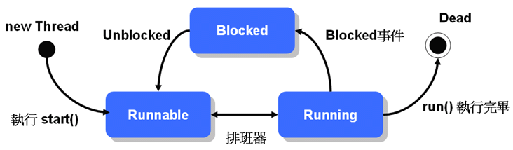
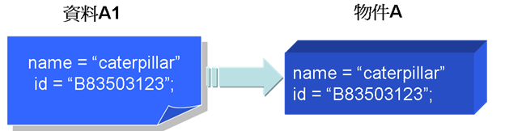
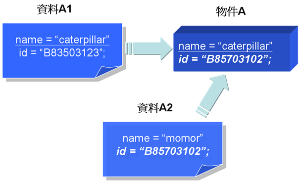
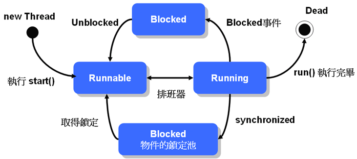
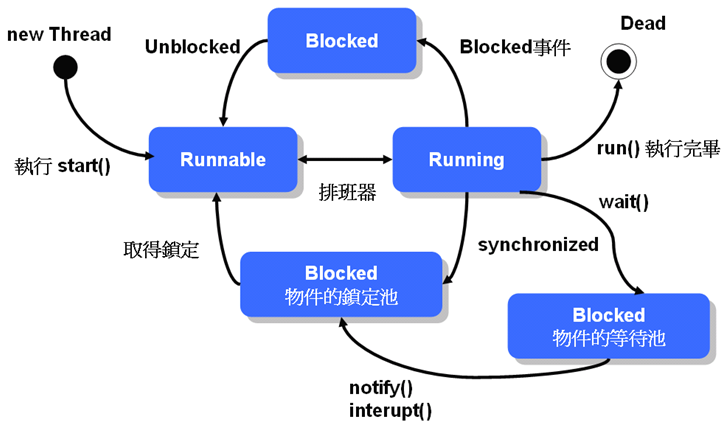

# 第 15 章 執行緒（Thread）

到目前為止所介紹過的各種範例都是所謂的單執行緒程式，也就是您啟動一個Java程式，而這個 Java 程式「同時間」只會作一件事，文字模式下最常進行的就是單執行緒程式，有的時候您會需要程式「同時間」可以作很多事，也就是所謂的「多執行緒」（Multi-thread）程式，在視窗程式、網路程式等會常使用多執行緒功能，在 JSP/Servlet 中，瞭解多執行緒的觀念與注意事項也是非常重要的。

這個章節會告訴您一些多執行緒的觀念，並實作一些範例讓您瞭解如何讓程式具有多執行緒功能，您會知道多執行緒程式的設計其實是複雜的，尤其是在資料共享的時候更要注意到「執行緒安全」（Thread-safe），您也會在這個章節中瞭解到如何使用「同步化」（Synchronized）功能，來保護多執行緒下被共用的資料。

-------------------

## 15.1 執行緒入門

想要讓物件能具有多執行緒（Multi-thread）功能，只要繼承 java.lang.Thread 類別或是實作 java.lang.Runnable 介面，單就實作方式來看，執行緒並不困難，至少在這個小節中是這樣的。

### 15.1.1 繼承Thread

一個進程（Process）是一個包括有自身執行位址的程式，在一個多工的作業系統中，可以分配 CPU 時間給每一個進程，CPU 在片段時間中執行某個進程，然後下一個時間片段跳至另一個進程去執行，由於轉換速度很快，這使得每個程式像是在同時進行處理一般。

一個執行緒（Thread）則是進程中的一個執行流程，一個進程中可以同時包括多個執行緒，也就是說一個程式中同時可能進行多個不同的子流程，每個子流程可以得到一小段程式的執行時間，每執行完一個執行緒就跳到下一個執行緒，由於轉換的速度很快，這使得一個程式可以像是同時間處理多個事務，例如網路程式可以一方面接受網路上的資料，另一方面同時計算資料並顯示結果，一個多執行緒程式可以同時間處理多個子流程。

在 Java 中要實現執行緒功能，可以繼承 java.lang.Thread 類別，並重新定義 run() 方法，之後可以實例化您自定義的 Thread 類別，然後使用 start() 方法啟動執行緒。

來看一個執行緒的實例，您將定義一個文字模式下的密碼遮罩執行緒，這個執行緒在會不斷的重複返回上一個字元位置並顯示遮罩字元，您可以在擷取使用者密碼輸入前啟動這個執行緒，模擬密碼遮罩功能，以避免使用者輸入的密碼被窺視。

#### **範例 15.1  EraserThread.java**
```java
package onlyfun.caterpillar;

public class EraserThread extends Thread {
    private boolean active;
    private String mask;
    
    public EraserThread() {
        this('*');
    }

    public EraserThread(char maskChar) {
        active = true;
        mask = "\010" + maskChar;
    }

    // 停止執行緒時設定為false
    public void setActive(boolean active) {
        this.active = active;
    }

    public boolean isActive() {
        return active;
    }

    // 重新定義run()方法
    public void run () {
        while(isActive()) {
            System.out.print(mask);
	     try {
                // 暫停目前的執行緒50毫秒
	        Thread.currentThread().sleep(50);
             } 
             catch(InterruptedException e) {
                 e.printStackTrace();
             }
        }
    }
}
```

在文字模式輸出 "\010" 表示返回一個字元位置，在啟動 EraserThread 執行緒後會不斷的重複返回一個字元位置並顯示遮罩字元，藉此抹去使用者輸入的密碼字元，範例 15.2 示範了如何使用 EraserThread 類別。

#### **範例 15.2  EraserThreadDemo.java**
```java
package onlyfun.caterpillar;

import java.util.Scanner;

public class EraserThreadDemo {
    public static void main(String[] args) {
        Scanner scanner = new Scanner(System.in);
        
        while(true) {
            System.out.print("輸入名稱：");
            String name = scanner.next();

            System.out.print("輸入密碼： ");
            // 啟動 Eraser 執行緒
            EraserThread eraserThread = new EraserThread('#');
            eraserThread.start();
            String password = scanner.next();
            eraserThread.setActive(false);

            if("caterpillar".equals(name) &&
               "123456".equals(password)) {
                System.out.println("歡迎 caterpillar ");
                break;
            }
            else {
                System.out.printf("%s，名稱或密碼錯誤，請重新輸入！%n", name);
            }
        }

    }
}
```

一個執行緒物件在使用 start() 啟動後會執行 run() 方法，由於 EraserThread 在 run() 中使用 while 迴圈不斷顯示遮罩字元，為了讓 while 迴圈有機會終止，使用了 active 來控制，而您可以操作 setActive() 來設定 active 為 false 來讓迴圈終止，藉此停止執行緒的運作，一個執行結果如下所示：

    輸入名稱：caterpillar
    輸入密碼：#######
    歡迎 caterpillar

在這個範例中會有兩個執行緒：一個是主（Main）執行緒，一個是 EraserThread 物件所啟動的執行緒。主執行緒負責取得使用者輸入，而 EraserThread 則在啟動後不斷的重複顯示遮罩字元，這是執行緒運用的一個基本模式。

事實上在 Java SE 6 中，您可以使用 System.console() 來取得 java.io.Console 物件，並使用 Console 物件的 readPassword() 方法，就可以避免輸入的密碼被窺視的問題，關於 Console 的使用，請見第 21 章關於 JDK6 新功能的介紹。

### 15.1.2 實作 Runnable 介面

您可以繼承 Thread 類別來定義一個執行緒類別，如果您使用繼承的方法來定義執行緒類別，就意味著您定義的類別是一個 Thread 類型，且由於在 Java 中一次只能繼承一個類別，如果您的類別已經要繼承某個類別，那麼您就不能繼承 Thread 類別（反之亦然，繼承了Thread類別，您就不能再繼承其它類別）。

您可以實作 java.lang.Runnable 介面來定義具執行緒功能的類別，Runnable 介面中定義一個 run() 方法要實作，在實例化一個 Thread 物件時，可以傳入一個實作 Runnable 介面的物件作為引數，Thread 物件會調用 Runnable 物件的 run() 方法，進而執行當中所定義的流程。直接使用 Runnable 改寫一下範例 15.1 作示範。

#### **範例 15.3  Eraser.java**
```java
package onlyfun.caterpillar;

public class Eraser implements Runnable { // 實作Runnable
    private boolean active;
    private String mask;
    
    public Eraser() {
        this('*');
    }

    public Eraser(char maskChar) {
        active = true;
        mask = "\010" + maskChar;
    }

    // 停止執行緒時設定為false
    public void setActive(boolean active) {
        this.active = active;
    }

    public boolean isActive() {
        return active;
    }

    // 重新定義run()方法
    public void run () {
        while(isActive()) {
            System.out.print(mask);
	     try {
                // 暫停目前的執行緒50毫秒
	        Thread.currentThread().sleep(50);
             } 
             catch(InterruptedException e) {
                 e.printStackTrace();
             }
        }
    }
}
```

配合範例 15.3 的改寫，範例 15.2 可以改寫為範例 15.4 的內容，而執行結果是相同的。

#### **範例 15.4  EraserDemo.java**
```java
package onlyfun.caterpillar;

import java.util.Scanner;

public class EraserDemo {
    public static void main(String[] args) {
        Scanner scanner = new Scanner(System.in);
        
        while(true) {
            System.out.print("輸入名稱：");
            String name = scanner.next();

            System.out.print("輸入密碼： ");

            // Eraser實作Runnable介面
            Eraser eraser = new Eraser('#');

            // 啟動 Eraser 執行緒
            Thread eraserThread = new Thread(eraser);
            eraserThread.start();
            String password = scanner.next();
            eraser.setActive(false);

            if("caterpillar".equals(name) &&
               "123456".equals(password)) {
                System.out.println("歡迎 caterpillar ");
                break;
            }
            else {
                System.out.printf("%s，名稱或密碼錯誤，請重新輸入！%n", name);
            }
        }
    }
} 
```

> **良葛格的話匣子** 基本上是建議以實作 Runnable 的方式讓物件具有執行緒功能，保留日後修改的彈性。

### 15.1.3 Daemon 執行緒

您想要設計一個程式，除了主執行緒之外，還運用了一個執行緒於背景進行相關運算工作，您的程式可能像是這樣：

    public class SimpleThread { 
        public static void main(String[] args) { 
            Thread thread = new Thread(new Runnable() {
                public void run() { 
                    while(true) { 
                        System.out.print("T"); 
                    } 
                }        
            }); 
            thread.start(); 

            // 主執行緒繼續進行其它工作........ 
            // such...such.... 
            // 現在主執行緒執行到這邊了，工作應該結束了 
        }
    }
    
您的執行緒已經運行到最後一個陳述了，這時應該是工作結束的時候，但程式並沒有終止，因為您的另一個執行緒還在運作，您怎麼停止它？在最後加上一行使用 System.exit()？這雖然也可以，但這只是強迫程式結束，而且這個方法並不是隨時可以適用！

一個 Daemon 執行緒是一個在背景執行服務的執行緒，例如網路伺服器傾聽連接埠的服務、隱藏的系統執行緒如垃圾收集執行緒或其它 JVM 建立的執行緒，如果所有的非 Daemon 的執行緒都結束了，則 Daemon 執行緒自動就會終止。

從 Main 方法開始的是一個非 Daemon 執行緒，如果您希望某個執行緒在產生它的執行緒結束後也跟著終止，那麼您要將它設定為 Daemon 執行緒，範例 15.5 是個簡單的示範。

#### **範例 15.5  DaemonThread.java**
```java
package onlyfun.caterpillar;
 
public class DaemonThread { 
    public static void main(String[] args) {

        Thread thread = new Thread(
        // 這是匿名類別的寫法
            new Runnable() {
                public void run() { 
                    while(true) { 
                        System.out.print("T"); 
                    } 
                }        
            }); 
        // 設定為Daemon執行緒
        thread.setDaemon(true); 
        thread.start(); 
    }
}
```

這個程式在主執行緒結束之後，Daemon 執行緒也就會跟著結束，您可以使用 setDaemon() 方法來設定一個執行緒是否為 Daemon 執行緒，範例 15.5 中如果沒有使用 setDaemon() 設定為 true，則程式會不斷的印出 'T' 字元而不終止（只能按 Ctrl+C 強迫中止程式）；使用 isDaemon() 方法則可以判斷該執行緒是否為 Daemon 執行緒。

Java 預設所有從 Daemon 執行緒產生的執行緒也是 Daemon 執行緒，因為基本上由一個背景服務執行緒衍生出來的執行緒，也應該是為了在背景服務而產生的，所以在產生它的執行緒停止的話，也應該一併跟著停止。

### 15.1.4 執行緒生命周期

執行緒的生命週期頗為複雜，這邊先從基本的週期狀態開始介紹，分別為「創建執行緒」、「可執行」（Runnable）、「阻斷」（Blocked）、「終止」（Dead），狀態間的轉移如圖 15.1 所示：



圖 15.1 基本的執行緒生命週期狀態

當您實例化一個 Thread 並執行 start() 之後，執行緒進入 Runnable 狀態，此時執行緒尚未真正開始執行，必須等待排班器（Scheduler）的排班，被排入執行的執行緒才會執行 run() 方法中的定義。

雖然執行緒看起來像是同時執行，但事實上同一時間點上，還是只有一個執行緒在動作，只是執行緒之間切換的動作很快，所以看來像是同時執行。

執行緒有其優先權，由 1（Thread.MIN_PRIORITY）到 10（Thread.MAX_PRIORITY），預設是5（Thread.NORM_PRIORITY），您可以使用 Thread 的 setPriority() 方法來設定執行緒的優先權，設定必須在 1 到 10 之間，否則會丟出 IllegalArgumentException。

優先權越高，排班器越優先排入執行，如果優先權相同，則輸流執行（Round-robin方式）。
絕大多數的作業系統都支援 Timeslicing，簡單的說就是作業系統會為每個執行緒分配一小段 CPU 時間（Quantum），時間一到就換下一個執行緒，即使現有的執行緒還沒結束。對於不支援 Timeslicing 的作業系統，每一個執行緒必須完成後，才能輪到下一個執行緒，在這樣的作業系統中，如果您想要讓目前執行緒禮讓一下其它執行緒，讓它們有機會取得執行權，您可以呼叫緒行緒的 yield() 方法，例如：

    public class SomeClass { 
        // ..... 
            Thread thread = new Thread(new Runnable() {
                public void run() { 
                    // .... 
                    while(true) { 
                        // .... 
                        yield();  // 暫時讓出執行權 
                    } 
                } 
            });
            thread.start();
        // ....
    }
    
yield() 方法讓同樣優先權的執行緒有被執行的機會，當執行緒執行 yield() 方法讓出執行權時，它會再度處於 Runnable 的狀態，等待排班器的排班，對於支援 Timeslicing 的作業系統，不需要呼叫 yield() 方法，因為作業系統會自動分配時間給執行緒來輪流執行。

有幾種狀況會讓執行緒進入 Blocked 狀態：

- 等待輸入輸出完成
- 呼叫 sleep() 方法
- 嘗試取得物件鎖定（下節說明）
- 呼叫 wait() 方法（下節說明）

當執行緒因為等待使用者的文字輸入、傾聽網路連線或以上等情況時，會阻止它的執行而進入 Blocked 狀態，執行緒排班器將不分配執行時間給這個執行緒，直到以下的幾個對應情況讓執行緒回到 Runnable 狀態：

- 輸入輸出完成
- 呼叫 interrupt()
- 取得物件鎖定（下節說明）
- 呼叫 notify() 或 notifyAll()（下節說明）

最後，如果執行的工作完成（或發生例外）而離開 run() 方法，則執行緒執行完畢，進入 Dead 狀態，您可以使用 isAlive() 方法來測試執行緒是否存活。

這邊舉個簡單的例子，當您使用 Thread.sleep() 讓執行緒暫停執行進入 Blocked 狀態，您可以使用 interrupt() 讓它離開 Blocked 狀態，當使用 sleep() 暫時進入 Blocked 狀態而您 interrupt() 時，會丟出 java.lang.InterruptedException 例外物件，範例 15.6 是個簡單示範。

#### **範例 15.6  InterruptDemo.java**
```java
package onlyfun.caterpillar;
 
public class InterruptDemo { 
    public static void main(String[] args) { 
        Thread thread = new Thread(new Runnable() { 
            public void run() { 
                try { 
                    // 暫停99999毫秒
                    Thread.sleep(99999); 
                } 
                catch(InterruptedException e) { 
                    System.out.println("I'm interrupted!!"); 
                } 
             } 
        }); 
 
      thread.start(); 
      thread.interrupt(); // interrupt it right now 
   } 
}
```

執行結果：

    I'm interrupted!

當然如果您要暫停執行緒，但暫停的時間未知，使用 sleep() 並不是個好方法，您可以使用 wait() 讓執行緒進入 Blocked 狀態，然後讓別的執行緒用 notify() 或 notifyAll() 來通知 Blocked 的執行緒回到 Runnable 狀態，wait()、notify()、notifyAll() 的使用在下一個小節會介紹。

### 15.1.5 執行緒的加入（join）

如果有一個A執行緒正在運行，您希望插入一個B執行緒，並要求 B 執行緒先執行完畢，然後再繼續 A 執行緒的流程，您可以使用 join() 方法來完成這個需求，這就好比您手頭上有一個工作正在進行，老闆插入一個工作要求您先作好，然後您再進行原先正進行的工作。

當執行緒使用 join() 加入至另一個執行緒時，另一個執行緒會等待這個被加入的執行緒工作完畢，然後再繼續它的動作，join() 的意思表示將執行緒加入成為另一個執行緒的流程之一，使用範例 15.7 來作示範。

#### **範例 15.7  ThreadA.java**
```java
package onlyfun.caterpillar;
 
public class ThreadA {
    public static void main(String[] args) {
        System.out.println("Thread A 執行");

        Thread threadB = new Thread(new Runnable() { 
            public void run() { 
                try { 
                    System.out.println("Thread B 開始.."); 
                    for(int i = 0; i < 5; i++) { 
                        Thread.sleep(1000); 
                        System.out.println("Thread B 執行.."); 
                    }
                    System.out.println("Thread B 即將結束.."); 
                } 
                catch(InterruptedException e) { 
                    e.printStackTrace(); 
                } 
            } 
        });
        
        threadB.start();

        try {
            // Thread B 加入 Thread A
            threadB.join();
        } 
        catch(InterruptedException e) { 
            e.printStackTrace(); 
        } 

        System.out.println("Thread A 執行");
    }
} 
```

程式啟動後主執行緒就開始，在主執行緒中您新建 threadB，並在啟動 threadB 後，將之加入（join）主執行緒的流程之中，所以 threadB 必須先執行完畢，主執行緒才會再繼續它原本的流程，執行結果如下：

    Thread A 執行
    Thread B 開始..
    Thread B 執行..
    Thread B 執行..
    Thread B 執行..
    Thread B 執行..
    Thread B 執行..
    Thread B 即將結束..
    Thread A 執行
    
如果程式中 threadB 沒有使用 join() 將之加入主執行緒的流程中，則最後一行顯示 "Thread A 執行" 的陳述會先執行完畢（因為 threadB 使用了 sleep()，這讓主執行緒有機會取得時間來執行）。
有時候加入的執行緒有可能處理太久，您不想無止境的等待這個執行緒的工作完畢，則您可以在 join() 上指定時間，例如 join(10000)，表示加入成為流程之一的執行緒至多處理 10000 毫秒，也就是 10 秒，如果加入的執行緒還沒執行完畢就不理它了，目前的執行緒可以繼續執行原本的工作流程。

### 15.1.6 執行緒的停止

如果您想要停止一個執行緒的執行，當您查看 API 時，您會發現 Thread 的 stop() 方法已經被標示為 "deprecated"，不建議您使用 stop() 來停止一個執行緒的運行。

如果您想要停止一個執行緒，您最好自行實作，一個執行緒要進入 Dead 狀態，就是執行完 run() 方法，簡單的說，如果您想要停止一個執行緒的執行，就要提供一個方式讓執行緒可以完成 run() 的流程， 而這也是您自行實作執行緒停止的基本概念。

如果執行緒的 run() 方法中執行的是一個重複執行的迴圈，您可以提供一個旗標（flag）來控制迴圈是否執行，藉此讓迴圈有機會終止，執行緒可以離開 run() 方法以終止執行緒：

    public class SomeThread implements Runnable { 
        private boolean isContinue = true; 
        public void terminate() { 
            isContinue = false; 
        } 
        public void run() { 
            while(isContinue) { 
                // ... some statements 
            } 
        } 
    }
    
如果執行緒因為執行 sleep() 而進入 Blocked 狀態，而您想要停止它，您可以使用 interrupt()，而程式會丟出 InterruptedException 例外，因而使得執行緒離開 run() 方法，如範例 15.8 所示範的。

#### **範例 15.8  SomeThread.java**
```java
package onlyfun.caterpillar;

public class SomeThread implements Runnable {
    public void run() { 
        System.out.println("sleep....至 blocked 狀態"); 
        while(true) {
	        try { 
	            Thread.sleep(9999); 
	        } 
	        catch(InterruptedException e) { 
	            System.out.println("I am interrupted...."); 
	        } 
        }
    } 

    public static void main(String[] args) { 
        Thread thread = 
                 new Thread(new SomeThread()); 
        thread.start(); 
        thread.interrupt(); 
    } 
}
```

執行結果：

    sleep....至 blocked 狀態
    I am interrupted....

如果沒有執行 interrupt()，這個程式會一直執行下去（除非您使用 Ctrl+C 中斷），因為 SomeThread 中的 run() 方法有個無窮迴圈。

如果程式因為輸入輸出的裝置等待而停滯（進入 Blocked 狀態），基本上您必須等待輸入輸出的動作完成才能離開 Blocked 狀態，您無法使用 interrupt() 來使得執行緒離開 run() 方法，您要提供替代的方法，基本上的概念也是引發一個例外，而這個例外要如何引發，要看您所使用的輸入輸出而定，例如您使用 readLine() 在等待網路上的一個訊息，此時執行緒進入 Blocked 直到讀到一個訊息，您要讓它離開 run() 的方法就是使用 close() 關閉它的串流，這時會引發一個 IOException 例外而使得執行緒離開 run() 方法，例如：

    public class Client implements Runnable { 
        private Socket skt; 
        // ..... 
        public void terminate() { 
            skt.close(); 
        } 

        public void run() { 
            // ..... 
        
            try { 
                BufferedReader buf = new BufferedReader(
                   new InputStreamReader(skt.getInputStream())); 

                // 讀取客戶端訊息
                // 執行readLine()會進入Blocked狀態
                // 直到讀到客戶端訊息
                while((userMessage = buf.readLine()) != null) { 
                   // .... 
                } 
            } 
            catch(IOException e) { 
                System.out.println("執行緒被終止......."); 
            } 
        }
    }

上面這個程式是個簡單的架構示範，實際的設計必須視您的程式功能與 I/O 類型而定。除了 stop() 之外，suspend()、resume() 方法也被標示為 "deprecated"，如果您要達成與這些方法相同的功能，您都必須自行實作。

> **良葛格的話匣子** 有關於執行緒的終止，還可以參考「Two-phase Termination 模式」：
> 
> - https://openhome.cc/Gossip/DesignPattern/TwoPhaseTermination.htm

### 15.1.7 ThreadGroup

在 Java 中每個執行緒都屬於某個「執行緒群組」（ThreadGroup）管理的一員，例如若您是在 main() 主工作流程中產生一個執行緒，則產生的執行緒屬於 main 這個執行緒群組管理的一員，您可以使用下面的指令來取得目前執行緒所屬的執行緒群組名稱：

    Thread.currentThread().getThreadGroup().getName();
    
每一個執行緒產生時，都會被歸入某個執行緒群組，這視您的執行緒是在哪個群組中產生，如果沒有指定，則歸入產生該子執行緒的執行緒群組中，您也可以自行指定執行緒群組，執行緒一但歸入某個群組，就無法更換群組。

java.lang.ThreadGroup 類別正如其名，可以統一管理整個群組中的執行緒，您可以使用以下的方式來產生群組，並在產生執行緒的時候，一併指定其群組：

    ThreadGroup threadGroup1 = new ThreadGroup("group1");
    ThreadGroup threadGroup2 = new ThreadGroup("group2");
    Thread thread1 = 
              new Thread(threadGroup1, "group1's member");
    Thread thread2 = 
               new Thread(threadGroup2, "group2's member");
               
ThreadGroup 中的某些方法，可以對所有的執行緒產生作用，例如 interrupt() 方法可以 interrupt 群組中所有的執行緒，setMaxPriority() 方法可以設定群組中執行緒所能擁有的最大優先權（本來就擁有更高優先權的執行緒不受影響）。

如果您想要一次取得群組中所有的執行緒來進行某種操作，您可以使用 enumerate() 方法，例如：

    Thread[] threads = new Thread[threadGroup1.activeCount()];
    threadGroup1.enumerate(threads);
    
activeCount() 方法取得群組中作用中的執行緒數量，enumerate() 方法要傳入一個 Thread 陣列，它會將執行緒物件設定至每個陣列欄位中，之後您就可以指定陣列索引來操作這些執行緒。

ThreadGroup 中有個 uncaughtException() 方法，這是當群組中某個執行緒發生非受檢例外（Unchecked exception）時，由執行環境呼叫此方法進行處理，如果有必要，您可以重新定義此方法，直接使用範例15.9 來示範如何實作。

#### **範例 15.9  ThreadGroupDemo.java**
```java
package onlyfun.caterpillar;
 
import java.io.*;
 
public class ThreadGroupDemo {
    public static void main(String[] args) {
        ThreadGroup threadGroup1 = 
        // 這是匿名類別寫法
            new ThreadGroup("group1") {
                // 繼承ThreadGroup並重新定義以下方法
                // 在執行緒成員丟出unchecked exception
                // 會執行此方法
                public void uncaughtException(Thread t, Throwable e) {
                    System.out.println(t.getName() + ": " 
                             + e.getMessage());
                }
            };
        
        // 這是匿名類別寫法
        Thread thread1 = 
            // 這個執行緒是threadGroup1的一員
            new Thread(threadGroup1,
              new Runnable() {
                public void run() {
                    // 丟出unchecked例外
                    throw new RuntimeException("測試例外");
                }
            }); 
     
        thread1.start();
    }
}
```

在 uncaughtException() 方法的參數中，第一個參數可以取得發生例外的執行緒實例，而第二個參數可以取得例外物件，範例中顯示了執行緒的名稱及例外訊息，結果如下所示：

    Thread-0: 測試例外

### 15.1.8 UncaughtExceptionHandler

在 J2SE 5.0 之前，如果您想要統一處理某些執行緒的非受檢例外（Unchecked Exception），您可以使用一個 ThreadGroup 來管理，在繼承 ThreadGroup 之後重新定義其 uncaughtException() 方法，就如範例 15.9 所示，而在 J2SE 5.0 之後，您不用這麼麻煩，您可以讓您的例外處理類別實作 Thread.UncaughtExceptionHandler 介面，並實現其 uncaughtException()方法，例如您可以將範例15.9改寫一下，首先定義一個類別讓其實作 Thread.UncaughtExceptionHandler 介面。

#### **範例 15.10  ThreadExceptionHandler.java**
```java
package onlyfun.caterpillar;
 
public class ThreadExceptionHandler 
          implements Thread.UncaughtExceptionHandler {
    public void uncaughtException(Thread t, Throwable e) {
        System.out.println(t.getName() + ": " 
                      + e.getMessage());
    }
} 
```

接著範例 15.9 主流程可以改寫為範例 15.11。

#### **範例 15.11  ThreadGroupDemo2.java**
```java
package onlyfun.caterpillar;
 
import java.io.*;
 
public class ThreadGroupDemo2 {
    public static void main(String[] args) {
        // 建立例外處理者
        ThreadExceptionHandler handler = 
                 new ThreadExceptionHandler();
        ThreadGroup threadGroup1 = new ThreadGroup("group1");
        
        // 這是匿名類別寫法
        Thread thread1 = 
            // 這個執行緒是threadGroup1的一員
            new Thread(threadGroup1,
              new Runnable() {
                public void run() {
                    // 丟出unchecked例外
                    throw new RuntimeException("測試例外");
                }
            }); 

        // 設定例外處理者
        thread1.setUncaughtExceptionHandler(handler);     
        thread1.start();
    }
} 
```

執行結果與範例 15.9 是相同的。

## 15.2 同步化（synchronized）議題

您只要繼承 Thread 類別或是實作 Runnable 介面，就可以讓物件具有多執行緒功能，入門執行緒是簡單的，但如果多個執行緒會共用某些資料，資料的同步（一致性、整體性）問題就要特別注意。

### 15.2.1 同步化

如果您的程式只是一個單執行緒，單一流程的程式，那麼您只要注意到程式邏輯的正確，您的程式通常就可以正確的執行您想要的功能，但當您的程式是多執行緒程式，多流程同時執行時，那麼您就要注意到更多的細節，例如在多執行緒共用同一物件的資料時。

如果一個物件所持有的資料可以被多執行緒同時共享存取時，您必須考慮到「資料同步」的問題，所謂資料同步指的是兩份資料的整體性、一致性，例如物件 A 有 name 與 id 兩個屬性，而有一份 A1 資料有 name 與 id 的資料要用來更新物件A的屬性，如果 A1 的 name 與 id 設定給 A 物件完成，則稱 A1 與 A 同步：



圖 15.2 資料同步的示意圖

如果 A1 資料在更新了物件的 name 屬性時，突然插入了一份 A2 資料更新了 A 物件的 id 屬性，則顯然的 A1 資料與 A 就不同步，A2 資料與 A 也不同步。



圖 15.3 資料不同步的示意圖

資料在多執行緒下共享時，容易因為同時多個執行緒可能更新同一個物件的資訊，而造成物件資料的不同步，因為資料的不同步而可能引發的錯誤通常不易察覺，而且可能是在您程式執行了幾千幾萬次之後，才會發生錯誤，而這通常會發生在您的產品已經上線之後，甚至是程式已經執行了幾年之後。

這邊舉個簡單的例子，考慮您設計了一個 PersonalInfo 類別。

#### **範例 15.12  PersonalInfo.java**
```java
package onlyfun.caterpillar;
 
public class PersonalInfo {
    private String name; 
    private String id; 
    private int count; 
     
    public PersonalInfo() { 
       name = "nobody"; 
       id = "N/A"; 
    } 
     
    public void setNameAndID(String name, String id) { 
       this.name = name; 
       this.id = id; 
       if(!checkNameAndIDEqual()) {
           System.out.println(count + 
                   ") illegal name or ID.....");
       } 
       count++; 
    } 
     
    private boolean checkNameAndIDEqual() { 
       return (name.charAt(0) == id.charAt(0)) ? 
                             true : false; 
    } 
}
```

在 PersonalInfo 類別中，您可以設定使用者的名稱與縮寫 id，並簡單檢查一下名稱與id的第一個字是否相同，這邊假設 id 的第一個字元就是名稱縮寫的第一個字元，如果兩個字元不相同，就顯示錯誤訊息，單就這個類別本身而言，它並沒有任何的錯誤，但如果它被用於多執行緒的程式中，而且同一個物件被多個執行緒存取時，就會"有可能"發生錯誤，範例 15.13 是個簡單的測試程式，看看 PersonalInfo 在多執行緒共用資料下會發生什麼問題？！

#### **範例 15.13  PersonalInfoTest.java**
```java
package onlyfun.caterpillar;
 
public class PersonalInfoTest {
    public static void main(String[] args) {
        final PersonalInfo person = new PersonalInfo(); 

        // 假設會有兩個執行緒可能更新person物件
        Thread thread1 = new Thread(new Runnable() { 
           public void run() { 
              while(true) 
                  person.setNameAndID("Justin Lin", "J.L"); 
           } 
        }); 
         
        Thread thread2 = new Thread(new Runnable() { 
            public void run() { 
               while(true) 
                   person.setNameAndID("Shang Hwang", "S.H");    
            } 
        }); 
         
        System.out.println("開始測試....."); 
        
        thread1.start(); 
        thread2.start();
    }
} 
```

來看一下我電腦上執行時的一個例子：

    開始測試.....
    8601871) illegal name or ID.....
    13252379) illegal name or ID.....
    15553739) illegal name or ID.....
    17889542) illegal name or ID.....
    29136338) illegal name or ID.....
    33805462) illegal name or ID.....
    40761536) illegal name or ID.....
    43114491) illegal name or ID.....
    略...

看到了嗎？如果以單執行緒的觀點來看，上面的訊息在測試時不會出現，然而在這個程式中卻出現了錯誤，而且重點是，第一次錯誤是發生在第 8601871 次的 setNameAndId() 執行時（您的電腦上可能是不同的數字），如果您在程式完成並開始應用於實際場合之後，這個時間點可能是幾個月甚至幾年之後，問題出現哪？在於這邊：

    public void setNameAndID(String name, String id) { 
        this.name = name; 
        this.id = id; 
        if(!checkNameAndIDEqual()) {
           System.out.println(count + 
                   ") illegal name or ID.....");
        } 
        count++; 
    }
    
雖然您傳遞給 setNameAndID() 的引數並沒有問題，在某個時間點時，thread1 設定了 "Justin Lin", "J.L" 給 name 與 id，在進行 if 測試的前一刻，thread2 可能此時剛好呼叫 setNameAndID("Shang Hwang", "S.H")，在 name 被設定為 "Shang Hwang" 時，checkNameAndIDEqual() 開始執行，「此時 name 等於 "Shang Hwang"，而 id 還是 "J.L"」，所以 checkNameAndIDEqual() 就會傳回 false，結果就顯示了錯誤訊息。

您必須同步資料對物件的更新，方法在有一個執行緒正在設定 person 物件的資料時，不可以被另一個執行緒同時進行設定，您可以使用 "synchronized" 關鍵字來進行這個動作。

"synchronized" 關鍵字的一個使用方式是用於方法上，讓方法的範圍（Scope）內都成為同步化區域，例如：

    public synchronized void setNameAndID(String name, String id) { 
        this.name = name; 
        this.id = id; 
        if(!checkNameAndIDEqual()) {
           System.out.println(count + 
                   ") illegal name or ID.....");
        } 
        count++; 
    }
    
這邊要引進物件的鎖定（lock）觀念，您要知道每個物件在內部都會有一個鎖定，物件的這個鎖定在平時是沒有作用的。被標示為 "synchronized" 的方法會成為同步化區域，當執行緒執行某個物件的同步化區域時，物件的鎖定就有作用了，想要執行同步化區域的執行緒，都必須先取得物件的鎖定，執行完同步化區域之後再將鎖定歸還給物件。

因為物件的鎖定只有一個，當有個執行緒已取走鎖定而正在執行同步化區域中的程式碼時，若有其它執行緒也想執行 "synchronized" 的區域，因為其它執行緒無法取得鎖定，所以只好在物件的鎖定池（Lock Pool）等待，直到鎖定被前一個執行緒歸還為止，此時在鎖定池中的執行緒競爭被歸還的物件鎖定，只有取得鎖定的執行緒才能進入 Runnable 狀態，等待排班器排班並執行同步化區域。
說明到這邊，可以畫出如下圖的執行緒狀態圖：



圖 15.4 加入鎖定觀念的執行緒狀態圖

就上面的程式片段簡單的說，若有執行緒在執行 setNameAndID() 時，其它執行緒必須等待目前執行緒執行完畢，才有機會執行 setNameAndID()，將範例 15.12 的 setNameAndID() 加上 "synchronized"，程式就不會有錯誤訊息。

同步化的區域在有一個執行緒佔據時就像個禁區，不允許其它執行緒進入，由於同時間只能有一個執行緒在同步化區域，所以更新共享資料時，就有如單執行緒程式在更新資料一樣，藉此保證物件中的資料會與給定的資料同步。

"synchronized" 的設定不只可用於方法上，也可以用於限定某個程式區塊為同步化區域，例如：

    public void setNameAndID(String name, String id) { 
        synchronized(this) {
            this.name = name; 
            this.id = id; 
            if(!checkNameAndIDEqual()) {
               System.out.println(count + 
                   ") illegal name or ID.....");
            } 
            count++; 
        }
    }
    
這個程式片段的意思就是，在執行緒執行至 "synchronized" 設定的同步化區塊時取得物件鎖定，這麼一來就沒有其它執行緒可以來執行這個同步化區塊，這個方式可以應用於您不想鎖定整個方法區塊，而只是想在更新共享資料時再確保物件與資料的同步化，由於同步化區域只是方法中的某個區塊，在執行完區塊後執行緒即釋放對物件的鎖定，以便讓其它執行緒有機會競爭物件的鎖定，相較於將整個方法區塊都設定為同步化區域會比較有效率。

您也可以標示某個物件要求同步化，例如在多執行緒存取同一個 ArrayList 物件時，由於 ArrayList 並沒有實作資料存取時的同步化，所以當它使用於多執行緒環境時，必須注意多個執行緒存取同一個 ArrayList 時，有可能發生兩個以上的執行緒將資料存入 ArrayList 的同一個位置，造成資料的相互覆蓋，為了確保資料存入時的正確性，您可以在存取 ArrayList 物件時要求同步化，例如：

    // arraylist參考至一個ArrayList的一個實例 
    synchronized(arraylist) {
        arraylist.add(new SomeClass()); 
    }
    
同步化確保資料的同步，但所犧性的就是在於一個執行緒取得物件鎖定而佔據同步化區塊，而其它執行緒等待它釋放鎖定時的延遲，在執行緒少時可能看不出來，但在執行緒多的環境中必然造成一定的效能問題（例如大型網站的多人連線時）。

### 15.2.2 wait()、notify()

wait()、notify() 與 notifyAll() 是 由Object 類別所提供的方法，您在定義自己的類別時會繼承下來（記得 Java 中所有的物件最頂層都繼承自 Object），wait()、notify() 與 notifyAll() 都被宣告為 "final"，所以您無法重新定義它們，透過 wait() 方法您可以要求執行緒進入物件的等待池（Wait Pool），或是通知執行緒回到鎖定池的 Blocked 狀態。

您必須在同步化的方法或區塊中呼叫 wait() 方法（也就是執行緒取得鎖定時），當物件的 wait() 方法被調用，目前的執行緒會被放入物件的等待池中，執行緒歸還物件的鎖定，其它的執行緒可競爭物件的鎖定；被放在等待池中的執行緒也是處於 Blocked 狀態，所以不參與執行緒的排班。

wait() 可以指定等待的時間，如果指定時間的話，則時間到之後執行緒會再度回到鎖定池的 Blocked 狀態，等待競爭物件鎖定的機會，如果指定時間 0 或不指定，則執行緒會持續等待，直到被中斷（interrupt），或是被告知（notify）回到鎖定池的 Blocked 狀態。圖 15.5 是加入等待池狀態的執行緒狀態圖：



圖 15.5 加入等待池觀念的執行緒狀態圖

當物件的 notify() 被調用，它會從目前物件的等待池中通知「一個」執行緒加入回到鎖定池的 Blocked 狀態，被通知的執行緒是隨機的，被通知的執行緒會與其它執行緒共同競爭物件的鎖定；如果您呼叫 notifyAll()，則「所有」在等待池中的執行緒都會被通知回到鎖定池的 Blocked 狀態，這些執行緒會與其它執行緒共同競爭物件的鎖定。

簡單的說，當執行緒呼叫到物件的 wait() 方法時，表示它要先讓出物件的鎖定並等待通知，或是等待一段指定的時間，直到被通知或時間到時再與其它執行緒競爭物件的鎖定，如果取得鎖定了，就從等待點開始執行，這就好比您要叫某人作事，作到一半時某人叫您等候通知（或等候 1 分鐘之類的），當您被通知（或時間到時）某人會繼續為您服務。

說明 wait()、notify()或notifyAll() 應用最常見的一個例子，就是生產者（Producer）與消費者（Consumer）的例子：生產者會將產品交給店員，而消費者從店員處取走產品，店員一次只能持有固定數量產品，如果生產者生產了過多的產品，店員叫生產者等一下（wait），如果店中有空位放產品了再通知（notify）生產者繼續生產，如果店中沒有產品了，店員會告訴消費者等一下（wait），如果店中有產品了再通知（notify）消費者來取走產品。

以下舉一個最簡單的：生產者每次生產一個 int 整數交給店員，而消費者從店員處取走整數，店員一次只能持有一個整數，首先定義店員 Clerk 類別。

#### **範例 15.14  Clerk.java**
```java
package onlyfun.caterpillar;
 
public class Clerk {
    // -1 表示目前沒有產品
    private int product = -1; 
 
    // 這個方法由生產者呼叫
    public synchronized void setProduct(int product) { 
        if(this.product != -1) { 
            try { 
                // 目前店員沒有空間收產品，請稍候！
                wait(); 
            } 
            catch(InterruptedException e) { 
                e.printStackTrace(); 
            } 
        } 
 
        this.product = product; 
        System.out.printf("生產者設定 (%d)%n", this.product); 

        // 通知等待區中的一個消費者可以繼續工作了
        notify(); 
    } 
    
    // 這個方法由消費者呼叫
    public synchronized int getProduct() { 
        if(this.product == -1) { 
            try { 
                // 缺貨了，請稍候！
                wait(); 
            } 
            catch(InterruptedException e) { 
                e.printStackTrace(); 
            } 
        } 
 
        int p = this.product; 
        System.out.printf("消費者取走 (%d)%n", this.product); 
        this.product = -1; // 取走產品，-1表示目前店員手上無產品
 
        // 通知等待區中的一個生產者可以繼續工作了
        notify(); 
       
        return p; 
    } 
} 
```

Clerk 類別會告訴生產者、消費者何時要等待，也會通知生產者、消費者可以生產或取走產品，接著您再定義生產者 Producer 類別。

#### **範例 15.15  Producer.java**
```java
package onlyfun.caterpillar;
 
public class Producer implements Runnable {
    private Clerk clerk; 
    
    public Producer(Clerk clerk) { 
        this.clerk = clerk; 
    } 
    
    public void run() { 
        System.out.println("生產者開始生產整數......"); 

        // 生產1到10的整數
        for(int product = 1; product <= 10; product++) { 
            try { 
                // 暫停隨機時間
                Thread.sleep((int) (Math.random() * 3000)); 
            } 
            catch(InterruptedException e) { 
                e.printStackTrace(); 
            } 
            // 將產品交給店員
            clerk.setProduct(product); 
        }       
    } 
}
```

範例中生產者會生產 1 到 10 的 int 整數作為產品，產品會交給 Clerk 的實例，消費者再從店員處取走產品，範例 15.16 定義了消費者 Consumer 類別。

#### **範例 15.16  Consumer.java**
```java
package onlyfun.caterpillar;
 
public class Consumer implements Runnable {
    private Clerk clerk; 
    
    public Consumer(Clerk clerk) { 
        this.clerk = clerk; 
    } 
    
    public void run() { 
        System.out.println(
                "消費者開始消耗整數......"); 

        // 消耗10個整數
        for(int i = 1; i <= 10; i++) { 
            try { 
                // 等待隨機時間
                Thread.sleep((int) (Math.random() * 3000)); 
            } 
            catch(InterruptedException e) { 
                e.printStackTrace(); 
            } 

            // 從店員處取走整數
            clerk.getProduct(); 
        } 
    } 
 } 
```
 
您可以撰寫範例 15.17 來測試生產者、消費者與店員的行為。

#### **範例 15.17  ProductTest.java**
```java
package onlyfun.caterpillar;
 
public class ProductTest {
    public static void main(String[] args) {
        Clerk clerk = new Clerk(); 
 
        // 生產者執行緒
        Thread producerThread = 
            new Thread(
                new Producer(clerk)); 
        // 消費者執行緒
        Thread consumerThread = 
            new Thread(
                new Consumer(clerk)); 
 
        producerThread.start(); 
        consumerThread.start(); 
    }
}
```

執行結果如下：

    生產者開始生產整數......
    消費者開始消耗整數......
    生產者設定 (1)
    消費者取走 (1)
    生產者設定 (2)
    消費者取走 (2)
    生產者設定 (3)
    消費者取走 (3)
    生產者設定 (4)
    消費者取走 (4)
    生產者設定 (5)
    消費者取走 (5)
    略...

生產者會生產 10 個整數，而消費者會消耗 10 個整數，由於店員處只能放置一個整數，所以只能每生產一個就消耗一個，其結果如上所示是無誤的。

如果一個執行緒進入物件的等待池中，您可以中斷它的等待，這時將會發生 InterruptedException 例外物件，您可以使用執行緒物件的 interrupt() 方法來中斷等待的動作。

> **良葛格的話匣子** 有關於生產者消費者的例子，還可以參考「Producer Consumer 模式」：
>
> - https://openhome.cc/Gossip/DesignPattern/ProducerConsumer.htm

### 15.2.3 容器類的執行緒安全（Thread-safe）

容器類預設沒有考慮執行緒安全問題，您必須自行實作同步以確保共用資料在多執行緒存取下不會出錯，例如若您使用 List 物件時，您可以這樣實作：

    // arraylist參考至一個ArrayList的一個實例 
    synchronized(arraylist) {
        arraylist.add(new SomeClass()); 
    }
    
事實上，您也可以使用 java.util.Collections 的 synchronizedXXX() 等方法來傳回一個同步化的容器物件，例如傳回一個同步化的 List：

    List list = Collections.synchronizedList(new ArrayList());
    
以這種方式返回的 List 物件，在存取資料時，會進行同步化的工作，不過在您使用 Iterator 遍訪物件時，您仍必須實作同步化，因為這樣的 List 使用 iterator() 方法返回的 Iterator 物件，並沒有保證執行緒安全（Thread-safe），一個實作遍訪的例子如下：

    List list = Collections.synchronizedList(new ArrayList());
    ...
    synchronized(list) {
        Iterator i = list.iterator(); 
        while (i.hasNext()) {
            foo(i.next());
        }
    }

在 J2SE 5.0 之後，新增了 java.util.concurrent 這個 package，當中包括了一些確保執行緒安全的 Collection 類，例如 ConcurrentHashMap、CopyOnWriteArrayList、CopyOnWriteArraySet 等，這些新增的 Collection 類基本行為與先前介紹的 Map、List、Set 等物件是相同的，所不同的是增加了同步化的功能，而且依物件存取時的需求不同而有不同的同步化實作，以同時確保效率與安全性。

例如 ConcurrentHashMap 針對 Hash Table中不同的區段（Segment）進行同步化，而不是對整個物件進行同步化，預設上 ConcurrentHashMap 有 16 個區段，當有執行緒在存取第一個區段時，第一個區域進入同步化，然而另一個執行緒仍可以存取第一個區段以外的其它區段，而不用等待第一個執行緒存取完成，所以與同步化整個物件來說，新增的 ConcurrentHashMap、CopyOnWriteArrayList、CopyOnWriteArraySet 等類別，在效率與安全性上取得了較好的平衡。

### 15.2.4 ThreadLocal 類別

無論如何，要編寫一個多執行緒安全（Thread-safe）的程式總是困難的，為了讓執行緒共用資源，您必須小心的對共用資源進行同步，同步帶來一定的效能延遲，而另一方面，在處理同步的時候，又要注意物件的鎖定與釋放，避免產生死結，種種因素都使得編寫多執行緒程式變得困難。

嘗試從另一個角度來思考多執行緒共用資源的問題，既然共用資源這麼困難，那麼就乾脆不要共用，何不為每個執行緒創造一個資源的複本，將每一個執行緒存取資料的行為加以隔離，實現的方法就是給予每一個執行緒一個特定空間來保管該執行緒所獨享的資源，在 Java 中您可以使用 java.lang.ThreadLocal 來實現這個功能，這個類別是從 JDK 1.2 之後開始提供，不過這邊要先來看看，如何自行實現一個簡單的 ThreadLocal 類別。

#### **範例 15.18 ThreadLocal.java**
```java
package onlyfun.caterpillar;

import java.util.*;

public class ThreadLocal<T> {
    // 取得一個同步化的Map物件
    private Map<Thread, T> storage = 
             Collections.synchronizedMap(new HashMap<Thread, T>());

    public T get() {
        // 取得目前執行get()方法的執行緒
        Thread current = Thread.currentThread();
        // 根據執行緒取得執行緒自有的資源
        T t = storage.get(current);

        // 如果還沒有執行緒專用的資源空間
        // 則建立一個新的空間
        if(t == null && 
           !storage.containsKey(current)) {
            t = initialValue();
            storage.put(current, t);
        }

        return t;
    }

    public void set(T t) {
        storage.put(Thread.currentThread(), t);
    }

    public T initialValue() {
        return null;
    }
}
```

範例中您使用執行緒作為「鍵」（Key），並將所獲得的資源物件放在Map物件中，如果第一次使用get()，您也配置一個空間給執行緒，而 initialValue() 可以用來設定什麼樣的初值要先儲存在這個空間中，在範例中先簡單的設定為 null。
現在假設有一個原先在單執行緒環境下的資源 SomeResource，現在考慮要在多執行緒環境下使用，您不想考慮複雜的執行緒共用互斥問題，此時可以使用 ThreadLocal 類別來使用 SomeResource，例如：

    public class Resource {
        private static final 
           onlyfun.caterpillar.ThreadLocal<SomeResource> threadLocal = 
                new onlyfun.caterpillar.ThreadLocal<SomeResource>();
        public static SomeResource getResource() {
            // 根據目前執行緒取得專屬資源
            SomeResource resource = threadLocal.get();
            // 如果沒有取得目前專屬資源
            if(resource == null) {
                // 建立一個新的資源並存入ThreadLocal中
                resource = new SomeResource();
                threadLocal.set(resource);
            }
            return resource;
        }
    }
    
以上所實作的 ThreadLocal 類別只是一個簡單的示範，在 Java 中您可以直接使用 java.lang.ThreadLocal，在這邊簡單的示範一個記錄（Log）程式，它可以記錄每個執行緒的活動，所使用的是 java.util.logging 中的類別（請見 18.3 的介紹）。

#### **範例 15.19  SimpleThreadLogger.java**
```java
package onlyfun.caterpillar;

import java.io.*;
import java.util.logging.*;                            
 
public class SimpleThreadLogger {
    private static final 
        java.lang.ThreadLocal<Logger> threadLocal = 
                  new java.lang.ThreadLocal<Logger>();
    // 輸出訊息
    public static void log(String msg) {
        getThreadLogger().log(Level.INFO, msg);
    }
    // 根據執行緒取得專屬Logger
    private static Logger getThreadLogger() {
        Logger logger = threadLocal.get();

        if(logger == null) {
            try {
                logger = Logger.getLogger(
                           Thread.currentThread().getName());
                // Logger 預設是在主控台輸出
                // 我們加入一個檔案輸出的Handler
                // 它會輸出XML的記錄文件
                logger.addHandler(
                    new FileHandler(
                           Thread.currentThread().getName() 
                           + ".log"));
            }
            catch(IOException e) {}

            threadLocal.set(logger);
        }

        return logger;
    }
}
```

ThreadLocal 物件會為每個執行緒提供專屬的 Logger 物件，由於物件屬於每個執行緒，所以就不用擔心 Logger 物件被共用的問題，可以使用範例 15.20 來測試。

#### **範例 15.20  LoggerTest.java**
```java
package onlyfun.caterpillar;

public class LoggerTest {
    public static void main(String[] args) {
        new TestThread("thread1").start();
        new TestThread("thread2").start();
        new TestThread("thread3").start();
    }
}

class TestThread extends Thread {
    public TestThread(String name) {
        super(name);
    }

    public void run() {
        for(int i = 0; i < 10; i++) {
            SimpleThreadLogger.log(getName() + 
                                     ": message " + i);
            try {
                Thread.sleep(1000);
            }
            catch(Exception e) {
                SimpleThreadLogger.log(e.toString());
            }
        }
    }
}
```

執行範例 15.20 之後，您可以在主控台上看到輸出，並可以在同一目錄下找到三個 .log 檔，分別記錄了三個執行緒的活動，透過 ThreadLocal，您不用撰寫複雜的執行緒共用互斥邏輯，其意義在於：「有時不共用是好的」。如果共用會產生危險，那就不要共用，當然，這種方式所犧牲掉的就是空間，您必須為每一個執行緒保留它們獨立的空間，這是一種以空間換取時間與安全性的方法。

> **良葛格的話匣子** 有關於 ThreadLocal 的例子，還可以參考「Thread-Specific Storage 模式」：
>
> - https://openhome.cc/Gossip/DesignPattern/ThreadSpecificStorage.htm

## 15.3 concurrent 套件新增類別

在 J2SE 5.0 中新增了 java.util.concurrent 套件，當中的類別可以讓您在撰寫多執行緒相關功能時更為方便，在這個小節中，我們將簡介 concurrent 套件當中的幾個簡單常用的類別。

### 15.3.1 BlockingQueue

佇列（Queue）是個先前先出（First In First Out, FIFO）的資料結構。在 J2SE 5.0 中新增了 java.util.concurrent.BlockingQueue，在多執行緒的情況下，如果 BlockingQueue 的內容為空，而有個執行緒試圖從 Queue 中取出元素，則該執行緒會被 Block，直到 Queue 有元素時才解除 Block，反過來說，如果 BlockingQueue 滿了，而有個執行緒試圖再把資料填入 Queue 中，則該執行緒會被 Block，直到 Queue 中有元素被取走後解除 Block。

BlockingQueue 的幾個主要操作為下：

#### **表 15.1 BlockingQueue 的幾個操作** 

|  方法     | 說明 |
|:---        | :--- |
| add()	    | 加入元素，如果佇列是滿的，則丟出 IllegalStateException |
| remove()  | 傳回並從佇列移除元素，如果佇列是空的，則丟出 NoSuchElementException |
| element()	| 傳回元素，如果佇列是空的，則丟出 NoSuchElementException |
| offer()	| 加入元素並傳回 true，如果佇列是滿的，則傳回 false |
| poll()	| 傳回並從佇列移除元素，如果佇列是空的，則傳回 null |
| peek()	| 傳回元素，如果佇列是空的，則傳回 null |
| put()	    | 加入元素，如果佇列是滿，就 block |
| take()	| 傳回並移除元素，如果佇列是空的，就 block |

在 java.util.concurrent 下提供幾種不同的 BlockingQueue，ArrayBlockingQueue 要指定容量大小來建構。LinkedBlockingQueue 預設沒有容量上限，但也可以指定容量上限。PriorityBlockingQueue 嚴格來說不是 Queue，因為它是根據優先權（Priority）來移除元素。

在這邊以 wait()、notify() 介紹時的生產者、消費者程式為例，使用 BlockQueue 來加以改寫，好處是我們不用親自處理 wait、notify 的細節，首先生產者改寫如下：

#### **範例 15.21  ProducerQueue.java**
```java
package onlyfun.caterpillar;

import java.util.concurrent.BlockingQueue;

public class ProducerQueue implements Runnable {
    private BlockingQueue<Integer> queue;
	
    public ProducerQueue(BlockingQueue<Integer> queue) {
        this.queue = queue;
    }

    public void run() {
        for(int product = 1; product <= 10; product++) {
            try {
                // wait for a random time
                Thread.sleep((int) Math.random() * 3000);
                queue.put(product);
            }
            catch(InterruptedException e) {
                e.printStackTrace();
            }
        } 
    }
}
```

可以看到，您直接使用 BlockingQueue，它會自動幫您處理同步化、wait()、notify() 的動作。消費者類別改寫如下：

#### **範例 15.22  ConsumerQueue.java**
```java
package onlyfun.caterpillar;

import java.util.concurrent.BlockingQueue;

public class ConsumerQueue implements Runnable {
    private BlockingQueue<Integer> queue;
	
    public ConsumerQueue(BlockingQueue<Integer> queue) {
        this.queue = queue;
    }
	
    public void run() {
        for(int i = 1; i <= 10; i++) {
            try {
                // wait for a random time
                Thread.sleep((int) (Math.random() * 3000));
                queue.take();
            }
            catch(InterruptedException e) {
                e.printStackTrace();
            }
        }
    }
}
```

可以使用下面這個程式來簡單的測試一下：

#### **範例 15.23  BlockingQueueDemo.java**
```java
package onlyfun.caterpillar;

import java.util.concurrent.ArrayBlockingQueue;
import java.util.concurrent.BlockingQueue;

public class BlockingQueueDemo {
    public static void main(String[] args) {
        BlockingQueue<Integer> queue = new ArrayBlockingQueue<Integer>(1); 
        
        Thread producerThread = new Thread(
                new ProducerQueue(queue)); 
        Thread consumerThread = new Thread(
                new ConsumerQueue(queue)); 
 
        producerThread.start(); 
        consumerThread.start(); 
    }
}

```

由於 BlockingQueue 不再是由您來控制了，所以在這邊就沒有特意顯示訊息以表示生產者、消費者放入產品至 Queue 的訊息，不過您仍可以在 ProducerQueue 與 ConsumerQueue 中放入相關訊息顯示，以確認程式確實有在運作。

### 15.3.2 Callable 與 Future

java.util.concurrent.Callable 與 java.util.concurrent.Future 類別可以協助您完成 Future 模式，Future 模式在請求發生時，會先產生一個 Future 物件給發出請求的客戶，它的作用就像是代理（Proxy）物件，而同時間，所代理的真正目標物件之生成，是由一個新的執行緒持續進行，真正的目標物件生成之後，將之設定至 Future 之中，而當客戶端真正需要目標物件時，目標物件也已經準備好，可以讓客戶提取使用。

> **良葛格的話匣子** 有關於 Future 模式的說明，可以參考：
> 
> - https://openhome.cc/Gossip/DesignPattern/FuturePattern.htm

Callable 是個介面，與 Runnable 類似，有個必須實作的方法，可以啟動為另一個執行緒來執行，不過 Callable 工作完成後，可以傳回結果物件，Callable 介面的定義如下：

    public interface Callable<V> {
        V call() throws Exception;
    }

例如您可以使用 Callable 來完成某個費時的工作，工作結束後傳回結果物件，例如求質數：

#### **範例 15.24  PrimeCallable.java**
```java
package onlyfun.caterpillar;

import java.util.ArrayList;
import java.util.List;
import java.util.concurrent.Callable;

public class PrimeCallable implements Callable<int[]> {
    private int max;
	
    public PrimeCallable(int max) {
    	this.max = max;
    }
	
    public int[] call() throws Exception {
        int[] prime = new int[max+1]; 
        
        List<Integer> list = new ArrayList<Integer>(); 

        for(int i = 2; i <= max; i++) 
            prime[i] = 1; 

        for(int i = 2; i*i <= max; i++) { // 這邊可以改進 
            if(prime[i] == 1) { 
                for(int j = 2*i; j <= max; j++) { 
                    if(j % i == 0) 
                        prime[j] = 0; 
                } 
            } 
        } 

        for(int i = 2; i < max; i++) { 
            if(prime[i] == 1) { 
                list.add(i); 
            } 
        }
        
        int[] p = new int[list.size()];
        for(int i = 0; i < p.length; i++) {
        	p[i] = list.get(i).intValue();
        }
        
        return p;
    }	
}
```

> **良葛格的話匣子** 程式中的求質數方法是很簡單的，但效率不好，這邊只是為了示範方便，才使用那種方式而已，要有效率點的求質數，您可以參考 Eratosthenes 篩選求質數：
>
> - https://openhome.cc/Gossip/AlgorithmGossip/EratosthenesPrime.htm

假設現在求質數的需求是在啟動 PrimeCallable 後的幾秒之後，則我們可以搭配 Future 來取得 Callable 執行的結果，在未來的時間點取得結果，例如：

#### **範例 15.25  FutureDemo.java**
```java
package onlyfun.caterpillar;

import java.util.concurrent.Callable;
import java.util.concurrent.ExecutionException;
import java.util.concurrent.FutureTask;

public class FutureDemo {
    public static void main(String[] args) {
        Callable<int[]> primeCallable = new PrimeCallable(1000);
        FutureTask<int[]> primeTask = 
                new FutureTask<int[]>(primeCallable);
		
        Thread t = new Thread(primeTask);
        t.start();
		
        try {
            // 假設現在做其它事情
            Thread.sleep(5000);
			
            // 回來看看質數找好了嗎
            if(primeTask.isDone()) {
                int[] primes = primeTask.get();
                for(int prime : primes) {
                    System.out.print(prime + " ");
                }
                System.out.println();
            }
        } catch (InterruptedException e) {
            e.printStackTrace();
        } catch (ExecutionException e) {
            e.printStackTrace();
        }	
    }
}
```

java.util.concurrent.FutureTask 是個代理，真正執行找質數的是 Callable 物件，您使用另一個執行緒啟動 FutureTask，之後就可以先去做其它的事了，等到某個時間點，回頭用 isDone() 看看任務完成了沒，如果完成了，就可以取得成果，一個執行的結果如下，顯示所有找到的質數：

    2 3 5 7 11 13 17 19 23 29 31 37 41 43 47 53 59 61 67 71 73 79 83 89 97 101 103 107 109 113 127 131 137 139 149 151 157 163 167 173 179 181 191 193 197 199 211 223 227 229 233 239 241 251 257 263 269 271 277 281 283 293 307 311 313 317 331 337 347 349 353 359 367 373 379 383 389 397 401 409 419 421 431 433 439 443 449 457 461 463 467 479 487 491 499 503 509 521 523 541 547 557 563 569 571 577 587 593 599 601 607 613 617 619 631 641 643 647 653 659 661 673 677 683 691 701 709 719 727 733 739 743 751 757 761 769 773 787 797 809 811 821 823 827 829 839 853 857 859 863 877 881 883 887 907 911 919 929 937 941 947 953 967 971 977 983 991 997
    
考慮這樣一個情況，使用者可能快速翻頁瀏覽文件中，而圖片檔案很大，如此在瀏覽到有圖片的頁數時，就會導致圖片的載入，因而造成使用者瀏覽文件時會有停頓的現象，所以我們希望在文件開啟之後，仍有一個背景作業持續載入圖片，如此使用者在快速瀏覽頁面時，所造成的停頓可以獲得改善，這時就可以考慮使用這邊所介紹的功能。

### 15.3.3 Executors

有時候您需要建立一堆執行緒來執行一些小任務，然而頻繁的建立執行緒有時會是個開銷，因為執行緒的建立必須與作業系統互動，如果能建立一個執行緒池（Thread pool）來管理這些小的執行緒並加以重複使用，對於系統效能會是個改善的方式。
您可以使用 Executors 來建立執行緒池，Executors 有幾個靜態（static）方法，列出如下：

#### **表 15.2 Executors 幾個靜態方法**

| 方法                              | 說明 
| :---                               | :--- 
| newCachedThreadPool()	            | 建立可以快取的執行緒，每個執行緒預設可idle的時間為60秒 
| newFixedThreadPool()	            | 包括固定數量的執行緒
| newSingleThreadExecutor()	        | 只有一個執行緒，循序的執行指定給它的每個任務
| newScheduledThreadPool()	        | 可排程的執行緒
| newSingleThreadScheduledExecutor()| 單一可排程的執行緒

舉個簡單的實例，下面的程式使用 newFixedThreadPool() 方法建立執行緒池，當中包括5個可以重複使用的執行緒，您可以指定 Runnable 物件給它，程式中會產生 10 個 Runnable 物件，由於執行緒池中只有5個可用的執行緒，所以後來建立的 5 個 Runnable 必須等待有空閒的執行緒才會被執行：

#### **範例 15.26  ExecutorDemo.java**
```java
package onlyfun.caterpillar;

import java.util.concurrent.ExecutorService;
import java.util.concurrent.Executors;

public class ExecutorDemo {
    public static void main(String[] args) {
        ExecutorService service = Executors.newFixedThreadPool(5);		
        for(int i = 0; i < 10; i++) {
            final int count = i;

            Runnable runnable = 
                        new Runnable() {
                            public void run() {
                                System.out.println(count);
                                try {
                                    Thread.sleep(2000);
                                } catch (InterruptedException e) {
                                    e.printStackTrace();
                                }	
                            }
                        };

            service.submit(runnable);
        }		
        service.shutdown(); // 最後記得關閉Thread pool
    }
}
```

執行結果會顯示 0 到 9，不過重點是在執行時的時間順序，您可以自行執行程式看看顯示的時間順序有何不同。

submit() 方法也接受實作 Callable 介面的物件，最後傳回 Future 物件，可以取得 Callable 執行過後的傳回結果。

如果想利用 Executors 進行排程，例如排定某個工作 30 秒後執行，一個設定的例子如下：

    ScheduledExecutorService scheduler = 
                    Executors.newSingleThreadScheduledExecutor();
    scheduler.schedule(new Runnable() {
                          public void run() {
                              // 排程工作
                          }
                       },
                       30, TimeUnit.SECONDS);
                       
或是排定某個工作 5 秒後執行，之後每 30 秒執行一次，一個設定的例子如下：

    ScheduledExecutorService scheduler = 
            Executors.newSingleThreadScheduledExecutor();
    final ScheduledFuture future = scheduler.scheduleAtFixedRate(
                                    new Runnable() {
                                        public void run() {
                                               // 排程工作
                                               System.out.println("t");
                                           }
                                    },
                                    0, 5, TimeUnit.SECONDS);
    / 排定 60 秒後取消future
    scheduler.schedule(new Runnable() {
                            public void run() {
                                future.cancel(false);
                            }
                          }, 
                            60, TimeUnit.SECONDS);
                            
如以上的程式片段所表示的，如果想要取消排程任務，則可以呼叫 ScheduledFuture 的 cancel() 方法。

## 15.4 接下來的主題

每一個章節的內容由淺至深，初學者該掌握的深度要到哪呢？在這個章節中，對於初學者我建議至少掌握以下幾點內容：

- 會繼承 Thread 或實作 Runnable 介面來實作執行緒功能
- 知道 Daemon 執行緒與一般執行緒的差別
- 瞭解執行緒生命週期
- 懂得如何停止執行緒
- 知道執行緒同步化的目的

下一個章節要來談談 Java 的反射（Reflection）機制，藉由反射機制，您可以於執行時期動態的載入類別並辨識出物件的種種資訊，您也可由此瞭解一些 Java 中載入類別的方式，並懂得如何運用自己的類別載入器（Class loader）。


