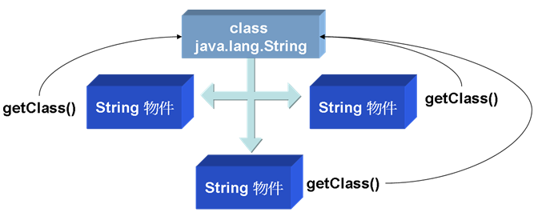
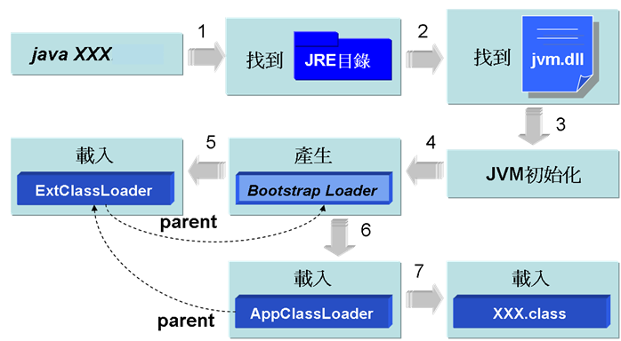
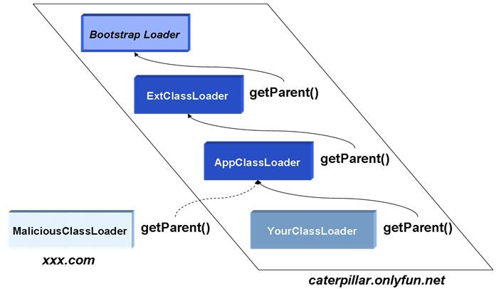

第 16 章 反射（Reflection）
===========================

Java 提供的反射機制允許您於執行時期動態載入類別、檢視類別資訊、生成物件或操作生成的物件，要舉反射機制的一個應用實例，就是在整合式開發環境中所提供的方法提示或是類別檢視工具，另外像 JSP 中的 JavaBean 自動收集請求資訊也使用到反射，而一些軟體開發框架（Framework）也常見到反射機制的使用，以達到動態載入使用者自訂類別的目的。

即使您暫時用不到反射機制，也建議您花時間看看這個章節，藉由對反射機制的認識，您可以瞭解 Java 中是如何載入類別的，而且瞭解到每個被載入的類別在 JVM 中，都以 Class 類別的一個實例存在的事實。

--------------

16.1 類別載入與檢視
-------------------

即使您拿到一個類別並對它一無所知，但其實它本身就包括了許多資訊，Java 在需要使用到某個類別時才會將類別載入，並在 JVM 中以一個 java.lang.Class 的實例存在，從 Class 實例開始，您可以獲得類別的許多訊息。

## 16.1.1 簡介 Class 與類別載入

Java 在真正需要使用一個類別時才會加以載入，而不是在程式啟動時就載入所有的類別，因為大多數的使用者都只使用到應用程式的部份資源，在需要某些功能時才載入某些資源，可以讓系統的資源運用更有效率（Java 本來就是為了資源有限的小型設備而設計的，這樣的考量是必然的）。

一個 java.lang.Class 物件代表了 Java 應用程式在運行時所載入的類別或介面實例，也用來表達 enum（屬於類別的一種）、 annotation（屬於介面的一種）、陣列、原生型態（Primitive type）、void；Class 類別沒有公開的（public）建構方法，Class 物件是由 JVM 自動產生，每當一個類別被載入時，JVM 就自動為其生成一個 Class 物件。

您可以透過 Object 的 getClass() 方法來取得每一個物件對應的 Class 物件，或者是透過 "class" 常量（Class literal），在取得 Class 物件之後，您就可以操作 Class 物件上的一些公開方法來取得類別的基本資訊，範例 16.1 簡單的使用 getClass() 方法來取得 String 類別的 Class 實例，並從中得到 String 的一些基本資訊。

#### **範例 16.1  ClassDemo.java**
```java
package onlyfun.caterpillar;
 
public class ClassDemo {
    public static void main(String[] args) {
        String name = "caterpillar";
        Class stringClass = name.getClass();
        System.out.println("類別名稱：" + 
                    stringClass.getName()); 
        System.out.println("是否為介面：" + 
                    stringClass.isInterface()); 
        System.out.println("是否為基本型態：" + 
                    stringClass.isPrimitive()); 
        System.out.println("是否為陣列物件：" + 
                    stringClass.isArray()); 
        System.out.println("父類別名稱：" + 
                    stringClass.getSuperclass().getName());
    }
} 
```

執行結果：

    類別名稱：java.lang.String
    是否為介面：false
    是否為基本型態：false
    是否為陣列物件：false
    父類別名稱：java.lang.Object

您也可以直接使用以下的方式來取得 String 類別的 Class 物件：

    Class stringClass = String.class;
    
Java 在真正需要類別時才會載入類別，所謂「真正需要」通常指的是要使用指定的類別生成物件時（或是使用者指定要載入類別時，例如使用 Class.forName() 載入類別，或是使用 ClassLoader 的 loadClass() 載入類別，稍後都會說明）。使用類別名稱來宣告參考名稱並不會導致類別的載入，可以設計一個測試類別的印證這個說法。

#### **範例 16.2  TestClass.java**
```java
package onlyfun.caterpillar;

public class TestClass {
    static {
        System.out.println("類別被載入");
    }
}
```

在範例中定義了一個靜態區塊，「預設」在類別第一次被載入時會執行靜態區塊（說預設的原因，是因為可以設定載入類別時不執行靜態區塊，使用 Class 生成物件時才執行靜態區塊，稍後會介紹），藉由在文字模式下顯示訊息，您可以瞭解類別何時被載入，可以使用範例 16.3 來測試類別載入時機。

#### **範例 16.3  LoadClassTest.java**
```java
package onlyfun.caterpillar;

public class LoadClassTest {
    public static void main(String[] args) {
        TestClass test = null;
        System.out.println("宣告TestClass參考名稱");
        test = new TestClass();
        System.out.println("生成TestClass實例");
    }
}
```

執行結果：

    宣告TestClass參考名稱
    類別被載入
    生成TestClass實例

從執行結果中可以看出，宣告參考名稱並不導致 TestClass 類別被載入，而是在使用 "new" 生成物件時才會載入類別。

Class 的訊息是在編譯時期就被加入至 .class 檔案中，這是 Java 支援執行時期型別辨識（RTTI，Run-Time Type Information或Run-Time Type Identification）的一種方式，在編譯時期編譯器會先檢查對應的 .class 檔案，而執行時期JVM在使用某類別時，會先檢查對應的 Class 物件是否已經載入，如果沒有載入，則會尋找對應的 .class 檔案並載入，一個類別在 JVM 中只會有一個 Class 實例，每個類別的實例都會記得自己是由哪個 Class 實例所生成，您可以使用 getClass() 或 .class 來取得 Class 實例。



圖 16.1 每個物件會記得生成它的 Class 實例

在 Java 中，陣列也是一個物件，也有其對應的 Class 實例，這個物件是由具相同元素與維度的陣列所共用，而基本型態像是 boolean, byte, char, short, int, long, float, double 以及關鍵字 void，也都有對應的 Class 物件，您可以用類別常量（Class literal）來取得這些物件。

#### **範例 16.4  ClassDemo2.java**
```java
package onlyfun.caterpillar;

public class ClassDemo2 { 
    public static void main(String[] args) { 
        System.out.println(boolean.class); 
        System.out.println(void.class); 

        int[] iarr = new int[10];
        System.out.println(iarr.getClass().toString());

        double[] darr = new double[10];
        System.out.println(darr.getClass().toString());
    } 
}
```

執行結果：

    boolean
    void
    class [I
    class [D

在 Java 中陣列確實是以物件的形式存在，其對應的類別是由 JVM 自動生成，當您使用 toString() 來顯示陣列物件的描述時，[表示為陣列型態，並加上一個型態代表字，範例中I表示是一個 int 陣列，而 D 表示是一個 double 陣列，16.2.4 還會對陣列物件加以討論。

## 16.1.2 使用 Class.forName() 載入類別

在一些應用中，您無法事先知道使用者將載入什麼類別，而必須讓使用者指定類別名稱以載入類別，您可以使用 Class 的靜態 forName() 方法實現動態加載類別，範例 16.5 是個簡單示範，可以讓您可以指定類別名稱來獲得類別的相關資訊。

#### **範例 16.5  ForNameDemo.java**
```java
package onlyfun.caterpillar;
 
public class ForNameDemo {
    public static void main(String[] args) { 
        try {
            Class c = Class.forName(args[0]);
            System.out.println("類別名稱：" + 
                          c.getName()); 
            System.out.println("是否為介面：" + 
                             c.isInterface()); 
            System.out.println("是否為基本型態：" + 
                             c.isPrimitive()); 
            System.out.println("是否為陣列：" + c.isArray()); 
            System.out.println("父類別：" + 
                             c.getSuperclass().getName());
        }
        catch(ArrayIndexOutOfBoundsException e) {
            System.out.println("沒有指定類別名稱");
        }
        catch(ClassNotFoundException e) {
            System.out.println("找不到指定的類別");
        }
    }
} 
```

在指定類別給 forName() 方法後，如果找不到指定的類別，會丟出 ClassNotFoundException 例外，一個的執行結果如下：

    java onlyfun.caterpillar.ForNameDemo java.util.Scanner
    類別名稱：java.util.Scanner
    是否為介面：false
    是否為基本型態：false
    是否為陣列：false
    父類別：java.lang.Object

Class 的靜態 forName() 方法有兩個版本，範例16.5所示範的是只指定類別名稱的版本，而另一個版本可以讓您指定類別名稱、載入類別時是否執行靜態區塊、指定類別載入器（Class loader）：

    static Class forName(String name, boolean initialize, ClassLoader loader)
    
之前曾經說過，預設上在載入類別的時候，如果類別中有定義靜態區塊則會執行它，您可以使用 forName() 的第二個版本，將 initialize 設定為 false，如此在載入類別時並不會馬上執行靜態區塊，而會在使用類別建立物件時才執行靜態區塊，為了印證，您可以先設計一個測試類別。

#### **範例 16.6  TestClass2.java**
```java
package onlyfun.caterpillar;

public class TestClass2 {
    static {
        System.out.println("[執行靜態區塊]");
    }
}
```

範例 16.6 中只定義了靜態區塊顯示一段訊息，以觀察靜態區塊何時被執行，您可以設計範例 16.7 使用第一個版本的 forName() 方法。

#### **範例 16.7  ForNameDemoV1.java**
```java
package onlyfun.caterpillar;
 
public class ForNameDemoV1 {
    public static void main(String[] args) { 
        try {
            System.out.println("載入TestClass2");
            Class c = Class.forName("onlyfun.caterpillar.TestClass2");

            System.out.println("使用TestClass2宣告參考名稱");
            TestClass2 test = null;

            System.out.println("使用TestClass2建立物件");                        
            test = new TestClass2();
        }
        catch(ClassNotFoundException e) {
            System.out.println("找不到指定的類別");
        }
    }
}
```

執行結果如下：

    載入TestClass2
    [執行靜態區塊]
    使用TestClass2宣告參考名稱
    使用TestClass2建立物件

從執行結果中可以看到，第一個版本的 forName() 方法在載入類別之後，預設會馬上執行靜態區塊，來看看範例 16.8 中使用第二個版本的 forName() 方法會是如何。

#### **範例 16.8  ForNameDemoV2.java**
```java
package onlyfun.caterpillar;
 
public class ForNameDemoV2 {
    public static void main(String[] args) { 
        try {
            System.out.println("載入TestClass2");
            Class c = Class.forName(
                         "onlyfun.caterpillar.TestClass2", 
                         false, // 載入類別時不執行靜態方法
                         Thread.currentThread().getContextClassLoader());

            System.out.println("使用TestClass2宣告參考名稱");
            TestClass2 test = null;

            System.out.println("使用TestClass2建立物件");                        
            test = new TestClass2();
        }
        catch(ClassNotFoundException e) {
            System.out.println("找不到指定的類別");
        }
    }
}
```

執行結果如下：

    載入TestClass2
    使用TestClass2宣告參考名稱
    使用TestClass2建立物件
    [執行靜態區塊]

由於使用第二個版本的 forName() 方法時，設定 initialize 為 false，所以載入類別時並不會馬上執行靜態區塊，而會在使用類別建立物件時才去執行靜態區塊，第二個版本的 forName() 方法會需要一個類別載入器（Class loader），範例中所使用的是主執行緒的類別載入器，16.1.4 還會詳細介紹 Java 中的類別載入器機制。

## 16.1.3 從 Class 中獲取資訊

Class 物件表示所載入的類別，取得 Class 物件之後，您就可以取得與類別相關聯的資訊，像是套件（package）（別忘了 package 也是類別名稱的一部份）、建構方法、方法成員、資料成員等的訊息，而每一個訊息，也會有相應的類別型態，例如套件的對應型態是 java.lang.Package，建構方法的對應型態是 java.lang.reflect.Constructor，方法成員的對應型態是 java.lang.reflect.Method，資料成員的對應型態是 java.lang.reflect.Field 等。

來看個簡單的示範，範例 16.9 可以讓您取得所指定類別上的套件名稱。

#### **範例 16.9  ClassInfoDemo.java**
```java
package onlyfun.caterpillar;
 
public class ClassInfoDemo {
    public static void main(String[] args) { 
        try {
            Class c = Class.forName(args[0]);
            Package p = c.getPackage();
            System.out.println(p.getName());
        }
        catch(ArrayIndexOutOfBoundsException e) {
            System.out.println("沒有指定類別");
        }
        catch(ClassNotFoundException e) {
            System.out.println("找不到指定類別");
        }
    }
}
```

執行結果：

    java onlyfun.caterpillar.ClassInfoDemo java.util.ArrayList
    java.util

您可以分別取回 Field、Constructor、Method等物件，分別代表資料成員、建構方法與方法成員，範例16.10 簡單的實作了取得類別基本資訊的程式。

#### **範例 16.10  SimpleClassViewer.java**
```java
package onlyfun.caterpillar;

import java.lang.reflect.*;

public class SimpleClassViewer {
     public static void main(String[] args) { 
        try {
            Class c = Class.forName(args[0]);
            // 取得套件代表物件
            Package p = c.getPackage();
            
            System.out.printf("package %s;%n", p.getName());
            
            // 取得型態修飾，像是class、interface
            int m = c.getModifiers();
            
            System.out.print(Modifier.toString(m) + " ");
            // 如果是介面
            if(Modifier.isInterface(m)) {
                System.out.print("interface ");
            }
            else {
                System.out.print("class ");
            }
            
            System.out.println(c.getName() + " {");

            // 取得宣告的資料成員代表物件
            Field[] fields = c.getDeclaredFields();
            for(Field field : fields) {
                // 顯示權限修飾，像是public、protected、private
                System.out.print("\t" + 
                    Modifier.toString(field.getModifiers()));
                // 顯示型態名稱
                System.out.print(" " + 
                    field.getType().getName() + " ");
                // 顯示資料成員名稱
                System.out.println(field.getName() + ";");
            }

            // 取得宣告的建構方法代表物件            
            Constructor[] constructors = 
                            c.getDeclaredConstructors();
            for(Constructor constructor : constructors) {
                // 顯示權限修飾，像是public、protected、private
                System.out.print("\t" + 
                     Modifier.toString(
                       constructor.getModifiers()));
                // 顯示建構方法名稱
                System.out.println(" " + 
                      constructor.getName() + "();");
            }
            // 取得宣告的方法成員代表物件             
            Method[] methods = c.getDeclaredMethods();
            for(Method method : methods) {
                // 顯示權限修飾，像是public、protected、private
                System.out.print("\t" + 
                     Modifier.toString(
                              method.getModifiers()));
                // 顯示返回值型態名稱
                System.out.print(" " + 
                     method.getReturnType().getName() + " ");
                // 顯示方法名稱
                System.out.println(method.getName() + "();");
            }
            System.out.println("}");
        }
        catch(ArrayIndexOutOfBoundsException e) {
            System.out.println("沒有指定類別");
        }
        catch(ClassNotFoundException e) {
            System.out.println("找不到指定類別");
        }
    }
}
```

執行結果：

    package java.util;
    public class java.util.ArrayList {
            private static final long serialVersionUID;
            private transient [Ljava.lang.Object; elementData;
            private int size;
            public java.util.ArrayList();
            public java.util.ArrayList();
            public java.util.ArrayList();
            public boolean add();
            public void add();
            public java.lang.Object clone();
            public void clear();
            public boolean contains();
            public int indexOf();
            略...
    }

一些類別檢視器的實作原理基本上就是範例 16.10 所示範的，當然還可以取得更多的資訊，您可以參考 Class 的線上 API 文件得到更多的訊息。

## 16.1.4 簡介類別載入器

Java 在需要使用類別的時候，才會將類別載入，Java 的類別載入是由類別載入器（Class loader）來達到的。

當您在文字模式下執行 java XXX 指令後，java 執行程式會嘗試找到 JRE 安裝的所在目錄，然後尋找 jvm.dll（預設是在JRE目錄下bin\client目錄中），接著啟動 JVM 並進行初始化動作，接著產生 Bootstrap Loader，Bootstrap Loader 會載入 Extended Loader，並設定 Extended Loader 的 parent 為 Bootstrap Loader，接著 Bootstrap Loader 會載入 System Loader，並將 System Loader 的 parent 設定為 Extended Loader。

Bootstrap Loader 通常由 C 撰寫而成；Extended Loader 是由 Java 所撰寫而成，實際是對應於 sun.misc.Launcher\$ExtClassLoader（Launcher 中的內部類別）；System Loader 是由 Java 撰寫而成，實際對應於sun.misc. Launcher\$AppClassLoader（Launcher 中的內部類別）。

圖 16.2 是 java 程式啟動與載入類別的順序圖，也就是所謂的「類別載入器階層架構」。



圖 16.2 Java 類別載入器階層架構

Bootstrap Loader 會搜尋系統參數 sun.boot.class.path 中指定位置的類別，預設是 JRE  classes 下之  檔案，或 lib 目錄下 .jar 檔案中（例如 rt.jar）的類別並載入，您可以使用 System.getProperty("sun.boot.class.path") 陳述來顯示 sun.boot.class.path 中指定的路徑，例如在我的電腦中顯示的是以下的路徑：

    C:\Program Files\Java\jre1.5.0_03\lib\rt.jar;
    C:\Program Files\Java\jre1.5.0_03\lib\i18n.jar;
    C:\Program Files\Java\jre1.5.0_03\lib\sunrsasign.jar;
    C:\Program Files\Java\jre1.5.0_03\lib\jsse.jar;
    C:\Program Files\Java\jre1.5.0_03\lib\jce.jar;
    C:\Program Files\Java\jre1.5.0_03\lib\charsets.jar;
    C:\Program Files\Java\jre1.5.0_03\classes

Extended Loader（sun.misc.Launcher$ExtClassLoader）是由 Java 撰寫而成，會搜尋系統參數 java.ext.dirs 中指定位置的類別，預設是 JRE 目錄下的 lib\ext\classes 目錄下的 .class 檔案，或 lib\ext 目錄下的 .jar 檔案中（例如 rt.jar）的類別並載入，您可以使用 System.getProperty("java.ext.dirs") 陳述來顯示  中指定的路徑，例如在我的電腦中顯示的是以下的路徑：

    C:\Program Files\Java\jre1.5.0_03\lib\ext
    
System Loader（sun.misc.Launcher$AppClassLoader）是由 Java 撰寫而成，會搜尋系統參數 java.class.path 中指定位置的類別，也就是 Classpath 所指定的路徑，預設是目前工作路徑下的 .class 檔案，您可以使用 System.getProperty("java.class.path") 陳述來顯示 java.class.path 中指定的路徑，在使用 java 執行程式時，您也可以加上 -cp 來覆蓋原有的 Classpath 設定，例如：

    java –cp ./classes SomeClass
    
Bootstrap Loader 會在 JVM 啟動之後產生，之後它會載入 Extended Loader 並將其 parent 設為 Bootstrap Loader，然後 Bootstrap Loader 再載入 System Loader 並將其 parent 設定為 ExtClassLoader，接著 System Loader 開始載入您指定的類別，在載入類別時，每個類別載入器會先將載入類別的任務交由其 parent，如果 parent 找不到，才由自己負責載入，所以在載入類別時，會以 Bootstrap Loader→Extended Loader→System Loader 的順序來尋找類別，如果都找不到，就會丟出 NoClassDefFoundError。

類別載入器在 Java 中是以 java.lang.ClassLoader 型態存在，每一個類別被載入後，都會有一個 Class 的實例來代表，而每個 Class 的實例都會記得自己是由哪個 ClassLoader 載入的，可以由 Class 的 getClassLoader() 取得載入該類別的 ClassLoader，而從 ClassLoader 的 getParent() 方法可以取得自己的 parent，圖 16.3 顯示了一個自訂的 SomeClass 實例與 Class、ClassLoader 及各 parent 的關係。


圖 16.3 物件、Class、ClassLoader 與 parent 的關係

範例 16.11 示範了圖 16.3 的一個實際例子。

#### **範例 16.11  SomeClass.java**
```java
package onlyfun.caterpillar;

public class SomeClass {
    public static void main(String[] args) {
        // 建立SomeClass實例
        SomeClass some = new SomeClass();
        // 取得SomeClass的Class實例
        Class c = some.getClass();
        // 取得ClassLoader
        ClassLoader loader = c.getClassLoader();
        System.out.println(loader);
        // 取得父ClassLoader
        System.out.println(loader.getParent());
        // 再取得父ClassLoader
        System.out.println(loader.getParent().getParent());
    }
} 
```

執行結果：

    sun.misc.Launcher$AppClassLoader@82ba41
    sun.misc.Launcher$ExtClassLoader@923e30
    null

onlyfun.caterpillar.SomeClass 是個自訂類別，您在目前的工作目錄下執行程式，首先 AppClassLoader 會將載入類別的任務交給 ExtClassLoader，而 ExtClassLoader 會將載入類別的任務交給 Bootstrap Loader，由於 Bootstrap Loader 在它的路徑設定（sun.boot.class.path）下找不到類別，所以由 ExtClassLoader 來試著尋找，而 ExtClassLoader 在它的路徑設定（java.ext.dirs）下也找不到類別，所以由 AppClassLoader 來試著尋找，AppClassLoader 最後在 Classpath（java.class.path）設定下找到指定的類別並載入。

在執行結果中可以看到，載入 SomeClass 的 ClassLoader 是 AppClassLoader，而 AppClassLoader 的 parent 是 ExtClassLoader，而 ExtClassLoader 的 parent 是 null，null 並不是表示 ExtClassLoader 沒有設定 parent，而是因為 Bootstrap Loader 通常由 C 所撰寫而成，在 Java 中並沒有一個實際的類別來表示它，所以才會顯示為 null。

如果把 SomeClass 的 .class 檔案移至 JRE 目錄下的 lib\ext\classes下（由於設定了套件，所以實際上 SomeClass.class 要放置在 JRE 目錄下的 lib\ext\classes\onlyfun\caterpillar下），並重新（於任何目錄下）執行程式，您會看到以下的訊息：

    sun.misc.Launcher$ExtClassLoader@923e30
    null
    Exception in thread "main" java.lang.NullPointerException
            at onlyfun.caterpillar.SomeClass.main(SomeClass.java:15)

由於 SomeClass 這次可以在 ExtClassLoader 的設定路徑下找到，所以會由 ExtClassLoader 來載入 SomeClass 類別，而 ExtClassLoader 的 parent 顯示為 null，指的是它的 parent 是由 C 撰寫而成的 Bootstrap Loader，因為沒有實際的 Java 類別而表示為 null，所以再由 null 上嘗試呼叫 getParent() 方法就會丟出 NullPointerException 例外。

如果再把 SomeClass 的 .class 檔案移至 JRE 目錄下的 classes 目錄下（由於設定了套件，所以實際上 SomeClass.class 要放置在 JRE 目錄下的 classes/onlyfun/caterpillar下），並重新（於任何目錄下）執行程式，您會看到以下的訊息：

    null
    Exception in thread "main" java.lang.NullPointerException
            at onlyfun.caterpillar.SomeClass.main(SomeClass.java:13)

由於 SomeClass 這次可以在 Bootstrap Loader 的設定路徑下找到，所以會由 Bootstrap Loader 來載入 SomeClass 類別，Bootstrap Loader 通常由 C 撰寫而成，在 Java 中沒有一個實際的類別來表示，所以顯示為 null，因為表示為 null，所以再 由 null 上嘗試呼叫 getParent() 方法就會丟出 NullPointerException 例外。

取得 ClassLoader 的實例之後，您可以使用它的 loadClass() 方法來載入類別，使用 loadClass() 方法載入別時，不會執行靜態區塊，靜態區塊的執行會等到真正使用類別來建立實例時，例如您可以改寫範例 16.7 為範例 16.12。

#### **範例 16.12  ForNameDemoV3.java**
```java
package onlyfun.caterpillar;
 
public class ForNameDemoV3 {
    public static void main(String[] args) { 
        try {
            System.out.println("載入TestClass2");
            ClassLoader loader = ForNameDemoV3.class.getClassLoader();
            Class c = loader.loadClass("onlyfun.caterpillar.TestClass2");

            System.out.println("使用TestClass2宣告參考名稱");
            TestClass2 test = null;

            System.out.println("使用TestClass2建立物件");
            test = new TestClass2();
        }
        catch(ClassNotFoundException e) {
            System.out.println("找不到指定的類別");
        }
    }
}
```

從執行結果中可以看到，loadClass() 不會在載入類別時執行靜態區塊，而會在使用類別新建物件時才執行靜態區塊，結果如下所示：

    載入TestClass2
    使用TestClass2宣告參考名稱
    使用TestClass2建立物件
    [執行靜態區塊]
    
## 16.1.5 使用自己的 ClassLoader

ExtClassLoader 與 AppClassLoader 都是 java.net.URLClassLoader 的子類別，您可以在使用 java 啟動程式時，使用以下的指令來指定 ExtClassLoader 的搜尋路徑：

    java -Djava.ext.dirs=c:\workspace\ YourClass
    
可以在使用 java 啟動程式時，使用 -classpath 或 -cp 來指定 AppClassLoader 的搜尋路徑，也就是設定 Classpath：

    java -classpath c:\workspace\ YourClass

ExtClassLoader 與 AppClassLoader 在程式啟動後會在虛擬機器中存在一份，您在程式運行過程中就無法再改變它的搜尋路徑，如果在程式運行過程中，打算動態決定從其它的路徑載入類別，就要產生新的類別載入器。

您可以使用 URLClassLoader 來產生新的類別載入器，它需要 java.net.URL 作為其參數來指定類別載入的搜尋路徑，例如：

    URL url = new URL("file:/d:/workspace/");
    ClassLoader urlClassLoader = 
                        new URLClassLoader(new URL[] {url});
    Class c = urlClassLoader.loadClass("SomeClass");
    
由於 ClassLoader 是 Java SE 的標準API之一，可以在 rt.jar 中找到，因而會由 Bootstrap Loader 來載入 ClassLoader 類別，在新增了 ClassLoader 實例後，您可以使用它的 loadClass() 方法來指定要載入的類別名稱，在新增 ClassLoader 時，會自動將新建的 ClassLoader 的 parent 設定為 AppClassLoader，並在每次載入類別時，先委託 parent 代為搜尋，所以上例中搜尋 SomeClass 類別時，會一路往上委託至 Bootstrap Loader 先開始搜尋，接著是 ExtClassLoader、AppClassLoader，如果都找不到，才使用新建的 ClassLoader 搜尋。

Java 的類別載入器階層架構除了可以達到動態載入類別目的之外，還有著安全上的考量，首先，因為每次尋找類別時都是委託 parent 開始尋找，所以除非有人可以侵入您的電腦，置換掉標準 Java SE API 與您自己安裝的延伸套件，否則是不可能藉由撰寫自己的類別載入器來載入惡意類別，以置換掉標準 Java SE API與您自己安裝的延伸套件。

由於每次的類別載入是由子 ClassLoader 委託父 ClassLoader 先嘗試載入，但父 lassLoader 看不到子 ClassLoader，所以同一階層的子 ClassLoader 不會被誤用，從而避免了載入錯誤類別的可能性，例如在圖 16.4 中，您想從 YourClassLoader 來載入類別的話，類別載入器階層不會看到 MaliciousClassLoader。



圖 16.4 類別載入器階層的安全設計

由同一個 ClassLoader 載入的類別檔案，會只有一份Class實例，如果同一個類別檔案是由兩個不同的ClassLoader 載入，則會有兩份不同的 Class 實例。注意這個說法，如果有兩個不同的 ClassLoader 搜尋同一個類別，而在 parent 的 AppClassLoader 搜尋路徑中就可以找到指定類別的話，則 Class 實例就只會有一個，因為兩個不同的 ClassLoader 都是在委託父 ClassLoader 時找到該類別的，如果父 ClassLoader 找不到，而是由各自的 ClassLoader 搜尋到，則 Class 的實例會有兩份。

範例 16.13 是個簡單的示範，可用來測試載入路徑與Class實例是否為同一物件。

#### **範例 16.13  ClassLoaderDemo.java**
```java
package onlyfun.caterpillar;

import java.net.MalformedURLException;
import java.net.URL;
import java.net.URLClassLoader;

public class ClassLoaderDemo {
    public static void main(String[] args) {
        try {
            // 測試路徑
            String classPath = args[0];
            // 測試類別
            String className = args[1];

            URL url1 = new URL(classPath);
            // 建立ClassLoader
            ClassLoader loader1 = 
                      new URLClassLoader(new URL[] {url1});
            // 載入指定類別
            Class c1 = loader1.loadClass(className);
            // 顯示類別描述
            System.out.println(c1);
        
            URL url2 = new URL(classPath);
            ClassLoader loader2 = 
                      new URLClassLoader(new URL[] {url2});
            Class c2 = loader2.loadClass(className);
        
            System.out.println(c2);
        
            System.out.println("c1 與 c1 為同一實例？" 
                                     + (c1 == c2));
        }
        catch(ArrayIndexOutOfBoundsException e) {
            System.out.println("沒有指定類別載入路徑與名稱");
        }
        catch(MalformedURLException e) {
            System.out.println("載入路徑錯誤");
        }
        catch(ClassNotFoundException e) {
            System.out.println("找不到指定的類別");
        }
    }
}
```

您可以任意設計一個類別，例如 TestClass，其中 classPath 可以輸入不為 ExtClassLoader 或 AppClassLoader 的搜尋路徑，例如 file:/d:/workspace/，這樣同一個類別會分由兩個 ClassLoader 載入，結果會有兩份 Class 實例，則測試 c1 與 c2 是否為同一實例時，則結果會顯示 false，一個執行結果如下：

    java onlyfun.caterpillar.ClassLoaderDemo file:/d:/workspace/ TestClass
    class TestClass
    class TestClass
    c1 與 c1 為同一實例？false

如果您在執行程式時，以 -cp 將 file:/d:/workspace/ 加入為 Classpath 的一部份，由於兩個 ClassLoader 的 parent 都是 AppClassLoader，而 AppClassLoader 會在 Classpath 中找到指定的類別，所以最後會只有一個指定的類別之 Class 實例，則測試 c1 與 c2 是否為同一實例時，結果會顯示 true，一個執行結果如下：

    java -cp .;d:\workspace onlyfun.caterpillar.ClassLoaderDemo file:/d:/workspace/ TestClass
    class TestClass
    class TestClass
    c1 與 c1 為同一實例？true

使用 -cp 指定 Classpath 時，會覆蓋原有的 Classpath 定義，也就是連現行工作目錄的路徑也覆蓋了，由於我的 ClassLoaderDemo 類別是在現行工作目錄下，所以使用 -cp 時，也包括了現行工作目錄，記得組合多個 Classpath 路徑時，可以使用「;」。

