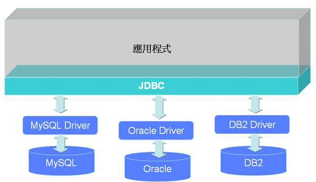
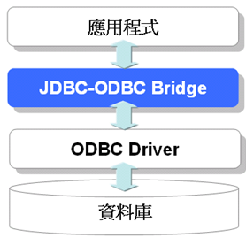
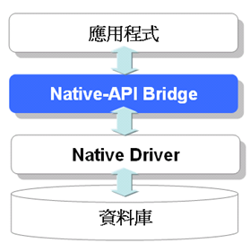
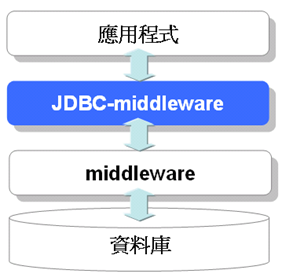

# 第 20 章 JDBC 入門

JDBC（Java DataBase Connectivity）是用於執行 SQL 的 Java 解決方案，它將不同資料庫之間各自差異 API 與標準的 SQL（Structured Query Language）陳述分開看待，實現資料庫無關的 Java 操作介面，開發人員使用 JDBC 統一的介面，並專注於標準的 SQL 陳述，就可以避免底層資料庫驅動程式與相關操作介面的差異性。

實際的資料庫存取是個非常複雜的主題，可以使用專書加以講解說明，不過在這個章節中，會告訴您一些 JDBC 基本 API 的使用與觀念，讓您對 Java 如何存取資料庫有所認識。

------------------

## 20.1 使用 JDBC 連接資料庫

在正式使用 JDBC 進行資料庫操作之前，先來認識一下 JDBC 的基本架構，了解資料庫驅動程式與資料庫之間的關係，在這個小節也將看到，如何設計一個簡單的工具類別，讓您在進行資料庫連接（Connection）時更為方便。

20.1.1 簡介 JDBC

如果要連接資料庫並進行操作，基本上必須了解所使用的資料庫所提供的 API 操作介面，然而各個廠商所提供的 API 操作介面並不一致，如果今天要使用A廠商的資料庫，就必須設計一個專用的程式來操作 A 廠商資料庫所提供的 API，將來如果要使用 B 廠商的資料庫，即使目的相同，也是要撰寫專用於 B 廠商資料庫之程式，十分的不方便。

使用 JDBC，可由廠商實作操作資料庫介面的驅動程式，而 Java 程式設計人員呼叫 JDBC 的 API 並操作 SQL，實際對資料庫的操作由 JDBC 驅動程式負責，如果要更換資料庫，基本上只要更換驅動程式，Java 程式中只要載入新的驅動程式來源即可完成資料庫的變更，Java 程式的部份則無需改變。

圖 20.1 是 JDBC API、資料庫驅動程式與資料庫之間的關係：



圖 20.1 應用程式、JDBC 與驅動程式之間的關係

簡單的說，JDBC 希望達到的目的，是讓 Java 程式設計人員在撰寫資料庫操作程式的時候，可以有個統一的操作介面，無需依賴於特定的資料庫 API，希望達到「寫一個 Java 程式，適用所有的資料庫」的目的。

JDBC 資料庫驅動程式依實作方式可以分為四個類型：

- Type 1：JDBC-ODBC Bridge

  使用者的電腦上必須事先安裝好 ODBC 驅動程式，Type 1 驅動程式利用橋接（Bridge）方式，將 JDBC 的呼叫方式轉換為 ODBC 驅動程式的呼叫方式，例如 Microsoft Access 資料庫存取就是使用這種類型。

  

  圖 20.2 Type 1: JDBC-ODBC Bridge
  
- Type 2：Native-API Bridge

  Type 1 驅動程式利用橋接方式，驅動程式上層包裝 Java 程式以與 Java 應用程式作溝通，將 JDBC 呼叫轉為原生（Native）程式碼的呼叫，下層為原生語言（像是 C、C++）來與資料庫作溝通，下層的函式庫是針對特定資料庫設計的，不若 Type 1 可以對 ODBC 架構的資料庫作存取。

  
 
  圖 20.3 Type 2: Native-API Bridge
  
- Type 3：JDBC-middleware

  透過中間件（middleware）來存取資料庫，使用者不必安裝特定的驅動程式，而是由驅動程式呼叫中間件，由中間件來完成所有的資料庫存取動作，然後將結果傳回給驅動程式。
 
  

  圖 20.4 Type 3: JDBC-moddleware

- Type 4：Pure Java Driver

  使用純 Java 程式來撰寫驅動程式與資料庫作溝通，而不透過橋接或中間件來存取資料庫。
 
  
 
  圖 20.5 Type 4: Pure Java Driver

在接下來的內容中，將使用 MySQL 資料庫系統進行操作，使用的 MySQL JDBC 驅動程式屬於 Type 4，您可以在以下的網址取得 MySQL 的 JDBC 驅動程式，這個章節中將使用 [MySQL Connector/J 3.1](http://www.mysql.com/products/connector/j/index.html)。

### 20.1.2 連接資料庫

為了要連接資料庫系統，您必須要有JDBC驅動程式，由於接下來將使用 MySQL 資料庫進行操作，所以請將下載回來的tar.gz檔案使用解壓縮軟體解開，並將當中的 mysql-connector-java-*.jar 加入至 Classpath 的設定之中，假設是放在 c:\workspace\library\mysql-connector-java-3.1.13-bin.jar，則 Classpath 中必須有 c:\workspace\library\mysql-connector-java-3.1.13-bin.jar 這個路徑設定。

在 Java SE 中與資料庫操作相關的 JDBC 類別都位於 java.sql 套件中，要連接資料庫，基本上必須有幾個動作：

- 載入 JDBC 驅動程式

  首先必須先透過 java.lang.Class 類別的 forName()，動態載入驅動程式類別，並向 DriverManager 註冊 JDBC 驅動程式（驅動程式會自動透過 DriverManager.registerDriver() 方法註冊）， MySQL 的驅動程式類別是 com.mysql.jdbc.Driver，一個載入 JDBC 驅動程式的程式片段如下所示：

  <pre>try {
      Class.forName("com.mysql.jdbc.Driver");
  }
  catch(ClassNotFoundException e) {
      System.out.println("找不到驅動程式類別");
  }</pre>

- 提供JDBC URL

  JDBC URL 定義了連接資料庫時的協定、子協定、資料來源職別：

        協定:子協定:資料來源識別
      
  「協定」在 JDBC 中總是 jdbc 開始；「子協定」是橋接的驅動程式或是資料庫管理系統名稱，使用 MySQL 的話是 "mysql"；「資料來源識別」標出找出資料庫來源的位址與連接埠。舉個例子來說，MySQL 的 JDBC URL 撰寫方式如下：
  
        jdbc:mysql://主機名稱:連接埠/資料庫名稱?參數=值&參數=值
        
  主機名稱可以是本機 localhost 或是其它連接主機，連接埠為 3306，假如要連接 demo 資料庫，並指明使用者名稱與密碼，可以如下指定：

        jdbc:mysql://localhost:3306/demo?user=root&password=123

  如果要使用中文存取的話，還必須給定參數 userUnicode 及 characterEncoding，表明是否使用 Unicode，並指定字元編碼方式，例如：
  
        jdbc:mysql://localhost:3306/demo?user=root&password=123&useUnicode=true&characterEncoding=Big5

- 取得Connection

  要連接資料庫，可以向 java.sql.DriverManager 要求並取得 java.sql.Connection 物件，Connection 是資料庫連接的具體代表物件，一個 Connection 物件就代表一個資料庫連接，您可以使用 DriverManager 的 getConneciton() 方法，指定 JDBC URL 作為引數並取得 Connection 物件：
  
  <pre>try {
      String url =  "jdbc:mysql://localhost:3306/demo?" +
                     "user=root&password=123";
      Connection conn = DriverManager.getConnection(url);
      ....
  }
  catch(SQLException e) {
      ....
  }</pre>
  
  java.sql.SQLException 是在處理 JDBC 時很常遇到的一個例外物件，SQLException 是受檢例外（Checked Exception），您必須使用 try...catch 或 throws 明確處理，它表示 JDBC 操作過程中若發生錯誤時的具體物件代表。
  
取得 Connection 物件之後，可以使用 isClosed() 方法測試與資料庫的連接是否關閉，在操作完資料庫之後，若確定不再需要連接，則必須使用 close() 來關閉與資料庫的連接，以釋放連接時相關的必要資源。

getConnection() 方法可以在參數上指定使用者名稱與密碼，例如：

    String url = "jdbc:mysql://localhost:3306/demo";
    String user = "root";
    String password = "123";
    Connection conn = DriverManager.getConnection(url, user, password);

### 20.1.3 簡單的 Connection 工具類別

在之前示範取得 Connection 的程式片段中，您可以看到當中直接用字串在程式中寫下 JDBC URL、使用者名稱與密碼等資訊，實際的程式並不會將這些敏感資訊寫在程式碼之中，而且這麼做的話，如果要更改使用者名稱或密碼時，還要修改程式、重新編譯，在程式維護上並不方便。

您可以將 JDBC URL、使用者名稱與密碼等設定資訊，撰寫在一個屬性檔案當中，由程式讀取這個屬性檔中的資訊，如果需要變更資訊，則只要修改屬性檔即可，無須修改程式、重新編譯，在 Java SE 當中，屬性檔的讀取可以交給 java.util.Properties 類別。

舉個實際的例子，假設您使用了以下的指令在MySQL後建立了demo資料庫：

    CREATE DATABASE demo;

由於取得 Connection 的方式，依所使用的環境及程式需求而有所不同，因而您可以先設計一個 DBSource 介面，規範取得 Connection 的方法，如範例 20.1 所示。

#### **範例 20.1  DBSource.java**
```java
package onlyfun.caterpillar;

import java.sql.Connection;
import java.sql.SQLException;

public interface DBSource {
    public Connection getConnection() throws SQLException;
    public void closeConnection(Connection conn) throws SQLException;
}
```

接著可以實作 DBSource 介面，您的目的是從屬性檔案中讀取設定資訊、載入 JDBC 驅動程式，可以藉由 getConnection() 取得 Connection 物件，並藉由 closeConnection() 關閉 Connection 物件，在這邊以一個簡單的 SimpleDBSource 類別作為示範，如範例 20.2 所示。

#### **範例 20.2  SimpleDBSource.java**
```java
package onlyfun.caterpillar;

import java.io.FileInputStream;
import java.io.IOException;
import java.sql.Connection;
import java.sql.DriverManager;
import java.sql.SQLException;
import java.util.Properties;

public class SimpleDBSource implements DBSource {
    private Properties props;
    private String url;
    private String user;
    private String passwd;

    public SimpleDBSource() throws IOException, 
                                         ClassNotFoundException {
        this("jdbc.properties");
    }
	
    public SimpleDBSource(String configFile) throws IOException, 
                                                    ClassNotFoundException {
        props = new Properties();
        props.load(new FileInputStream(configFile));
		
        url = props.getProperty("onlyfun.caterpillar.url");
        user = props.getProperty("onlyfun.caterpillar.user");
        passwd = props.getProperty("onlyfun.caterpillar.password");
		
        Class.forName(
                    props.getProperty("onlyfun.caterpillar.driver"));
    }

    public Connection getConnection() throws SQLException {
        return DriverManager.getConnection(url, user, passwd);
    }

    public void closeConnection(Connection conn) throws SQLException {
        conn.close();
    }
}
```

預設的建構方法設定中，是讀取 jdbc.properties 檔案中的設定，如果打算自行指定屬性檔案名稱，則可以使用另一個有參數的建構方法。Properties 的 getProperty() 方法會讀取屬性檔案中的"鍵（Key）"對應的"值（Value）"，假設您的屬性檔案設定如下：

#### **範例 20.3  jdbc.properties**
```
onlyfun.caterpillar.driver=com.mysql.jdbc.Driver
onlyfun.caterpillar.url=jdbc:mysql://localhost:3306/demo
onlyfun.caterpillar.user=root
onlyfun.caterpillar.password=123456
```

DBSource 的 getConnection() 簡單的從 DriverManager 的 getConnection() 方法取得 Connection 物件，而 closeConnection() 方法則是將給定的 Connection 關閉，就簡單的連接程式來說，這樣已經足夠，不過待會還會介紹連接池（Connection pool）的觀念，到時將會修改一下 DBSource 的 getConnection() 與 closeConnection() 方法，以達到重複使用 Connection，以簡省資源的目的。

最後，範例 20.4 使用一個簡單的程式來測試 SimpleDBSource 是否可以正確的取得與資料庫的連接，以及是否正確的關閉連接。

#### **範例 20.4  ConnectionDemo.java**
```java
package onlyfun.caterpillar;

import java.io.IOException;
import java.sql.Connection;
import java.sql.SQLException;

public class ConnectionDemo {
    public static void main(String[] args) {
        try {
            DBSource dbsource = new SimpleDBSource();
            Connection conn = dbsource.getConnection();
            
            if(!conn.isClosed()) {
                System.out.println("資料庫連接已開啟…");
            }
            
            dbsource.closeConnection(conn);
            
            if(conn.isClosed()) {
                System.out.println("資料庫連接已關閉…");
            }
            
        } catch (IOException e) {
            e.printStackTrace();
        } catch (ClassNotFoundException e) {
            e.printStackTrace();
        } catch (SQLException e) {
            e.printStackTrace();
        }
    }
}
```

如果您的 demo 資料庫已建立，並正確設定 jdbc.properties 中的相關資訊，則應該可以看到以下的執行結果：

    資料庫連接已開啟…
    資料庫連接已關閉…

### 20.1.4 簡單的連接池（Connection pool）

在資料庫應用程式中，資料庫連接的取得是一個耗費時間與資源的動作，包括了建立 Socket connection、交換資料（使用者密碼驗證、相關參數）、資料庫初始會話（Session）、日誌（Logging）、分配行程（Process）等資源。

如果資料庫的操作是很頻繁的動作，則要考慮到重複使用連接的需求，以節省在取得連接時的時間與資源，通常會實作一個連接池（Connection pool），有需要連接時可以從池中取得，不需要連接時就將連接放回池中，而不是直接關閉連接。

這邊將實作一個簡單的連接池，示範連接池中，重複使用連接的基本觀念，範例 20.5 使用 java.util.ArrayList 來實作連接池，可以將先前使用過的連接放到 ArrayList 物件中，下一次需要連接時則直接從 ArrayList 中取得。

#### **範例 20.5  BasicDBSource.java**
```java
package onlyfun.caterpillar;

import java.io.FileInputStream;
import java.io.IOException;
import java.sql.Connection;
import java.sql.DriverManager;
import java.sql.SQLException;
import java.util.ArrayList;
import java.util.List;
import java.util.Properties;

public class BasicDBSource implements DBSource {
    private Properties props;
    private String url;
    private String user;
    private String passwd;
    private int max; // 連接池中最大Connection數目
    private List<Connection> connections;

    public BasicDBSource() throws IOException, ClassNotFoundException {
        this("jdbc.properties");
    }
    
    public BasicDBSource(String configFile) throws IOException, 
                                                     ClassNotFoundException {
        props = new Properties();
        props.load(new FileInputStream(configFile));
        
        url = props.getProperty("onlyfun.caterpillar.url");
        user = props.getProperty("onlyfun.caterpillar.user");
        passwd = props.getProperty("onlyfun.caterpillar.password");
        max = Integer.parseInt(
                   props.getProperty("onlyfun.caterpillar.poolmax"));
        Class.forName(
                   props.getProperty("onlyfun.caterpillar.driver"));
        
        connections = new ArrayList<Connection>();
    }

    public synchronized Connection getConnection() 
                                                    throws SQLException {
        if(connections.size() == 0) {
            return DriverManager.getConnection(url, user, passwd);
        }
        else {
            int lastIndex = connections.size() - 1;
            return connections.remove(lastIndex);
        }
    }
    
    public synchronized void closeConnection(Connection conn) 
                                                        throws SQLException {
        if(connections.size() == max) {
            conn.close();
        }
        else {
            connections.add(conn);
        }
    }
}
```

BasicDBSource 也是實作 DBSource 介面，考慮這個類別可能在多執行緒的環境中使用，因此在 getConnection() 與 closeConnection() 上使用 syhchronized 加以修飾。在取得連接時，如果目前池中沒有 Connection 物件，則新建立一個連接，如果有存在的 Connection 物件，則從池中移出。

BasicDBSource 可以設定連接池中最大 Connection 保存數量，如果超過這個數量，則傳入 closeConnection() 方法的 Connection 物件直接關閉，否則就放入連接池中，以在下一次需要資料庫連接時直接使用。範例 20.6 是個測試 BasicDBSource 的簡單程式。

#### **範例 20.6  ConnectionPoolDemo.java**
```java
package onlyfun.caterpillar;

import java.io.IOException;
import java.sql.Connection;
import java.sql.SQLException;

public class ConnectionPoolDemo {
    public static void main(String[] args) {
        try {
            DBSource dbsource = new BasicDBSource("jdbc2.properties");
            Connection conn1 = dbsource.getConnection();
            dbsource.closeConnection(conn1);
            Connection conn2 = dbsource.getConnection();
            System.out.println(conn1 == conn2);
            
        } catch (IOException e) {
            e.printStackTrace();
        } catch (ClassNotFoundException e) {
            e.printStackTrace();
        } catch (SQLException e) {
            e.printStackTrace();
        }
        
    }
}
```

這邊所使用的設定檔案是 jdbc2.properties，當中多了連接池最大數量之設定，如下所示：

#### **範例 20.7  jdbc2.properties**
```
onlyfun.caterpillar.driver=com.mysql.jdbc.Driver
onlyfun.caterpillar.url=jdbc:mysql://localhost:3306/demo
onlyfun.caterpillar.user=root
onlyfun.caterpillar.password=123456
onlyfun.caterpillar.poolmax=10
```

程式中取得 Connection 之後，將之使用 closeConnection() 關閉，但實際上 closeConnection() 並不是真正使用 close() 方法，而是放回池中，第二次取得 Connection 時，所取得的是先前放入池中的同一物件，因此執行的結果會顯示 true。

在更複雜的情況下，您還需要考慮到初始的 Connection 數量、Connection 最大 idle 的數量、如果超過多久時間，要回收多少數量的 Connection 等問題，實際上也不需要自行設計連接池的程式，現在網路上有不少優秀的開放原始碼連接池程式，例如 [Proxool](http://proxool.sourceforge.net/index.html) 或 Apache Jakarta 的 [Common DBCP](http://jakarta.apache.org/commons/dbcp/)，您可以自行參考官方網站上的相關文件，了解它們各自是如何設定與使用。

## 20.2 使用 JDBC 進行資料操作

在了解如何使用 JDBC 進行資料庫的連接之後，接下來看看如何使用 JDBC 做資料庫基本操作，例如資料的新增、查詢等動作，而在這一個小節當中，也將稍微了解一下交易（Transaction）的基本觀念與操作。

### 20.2.1 Statement、ResultSet

前一個小節中提過，Connection 物件 Java 中資料庫連接的代表物件，接下來要執行 SQL 的話，必須取得 java.sql.Statement 物件，它是 Java 當中一個 SQL 敘述的具體代表物件，您可以使用 Connection 的 createStatement() 來建立 Statement 物件：

    Statement stmt = conn.createStatement();

取得 Statement 物件之後，可以使用 executeUpdate()、executeQuery() 等方法來執行  SQL，executeUpdate() 主要是用來執行 CREATE TABLE、INSERT、DROP TABLE、ALTER TABLE 等會改變資料庫內容的 SQL，例如可以在 demo 資料庫中建立一個 t_message 表格：

    Use demo;
    CREATE TABLE t_message ( 
        id INT NOT NULL AUTO_INCREMENT PRIMARY KEY, 
        name CHAR(20) NOT NULL, 
        email CHAR(40), 
        msg TEXT NOT NULL 
    );

如果要在這個表格中插入一筆資料，可以如下使用 Statement 的 executeUpdate() 方法：

    stmt.executeUpdate("INSERT INTO t_message VALUES(1, 'justin', " +
           "'justin@mail.com', 'mesage...')");
           
Statement 的 executeQuery() 方法則是用於 SELECT 等查詢資料庫的 SQL，executeUpdate() 會傳回 int 結果，表示資料變動的筆數，executeQuery() 會傳回 java.sql.ResultSet 物件，代表查詢的結果，查詢的結果會是一筆一筆的資料。可以使用 ResultSet 的 next() 來移動至下一筆資料，它會傳回 true 或 false 表示是否有下一筆資料，接著可以使用 getXXX() 來取得資料，例如 getString()、getInt()、getFloat()、getDouble() 等方法，分別取得相對應的欄位型態資料，getXXX() 方法都提供有依欄位名稱取得資料，或是依欄位順序取得資料的方法，一個例子如下，您指定欄位名稱來取得資料：

    ResultSet result =
              stmt.executeQuery("SELECT * FROM t_message");
    while(result.next()) {
        System.out.print(result.getInt("id") + "\t");
        System.out.print(result.getString("name") + "\t");
        System.out.print(result.getString("email") + "\t");
        System.out.print(result.getString("msg") + "\t");
    }
    
使用查詢結果的欄位順序來顯示結果的方式如下：

    ResultSet result =
              stmt.executeQuery("SELECT * FROM t_message");
    while(result.next()) {
        System.out.print(result.getInt(1) + "\t");
        System.out.print(result.getString(2) + "\t");
        System.out.print(result.getString(3) + "\t");
        System.out.print(result.getString(4) + "\t");
    }

Statement 的 execute() 可以用來執行 SQL，並可以測試所執行的 SQL 是執行查詢或是更新，傳回  true 的話表示 SQL 執行將傳回 ResultSet 表示查詢結果，此時可以使用 getResultSet() 取得 ResultSet 物件，如果 execute() 傳回 false，表示 SQL 執行會傳回更新筆數或沒有結果，此時可以使用 getUpdateCount() 取得更新筆數。如果事先無法得知是進行查詢或是更新，就可以使用 execute()。

範例 20.8 是個示範新增與查詢資料的範例，當中使用了前一節設計的 SimpleDBSource。注意在查詢結束後，要使用 Statement 的 close() 方法來釋放 Statement 的資源，而最後不使用連接時，也使用了 closeConnection() 來關閉連接。

#### **範例 20.8  StatementResultDemo.java**
```java
package onlyfun.caterpillar;

import java.io.IOException;
import java.sql.Connection;
import java.sql.ResultSet;
import java.sql.SQLException;
import java.sql.Statement;

public class StatementResultDemo {
    public static void main(String[] args) {
        DBSource dbsource = null;
        Connection conn = null;
        Statement stmt = null;
        try {
            dbsource = new SimpleDBSource();
            conn = dbsource.getConnection();
            
            stmt = conn.createStatement(); 

            stmt.executeUpdate(
               "INSERT INTO t_message VALUES(1, 'justin', " +
               "'justin@mail.com', 'mesage...')");
 
            ResultSet result = stmt.executeQuery(
                                  "SELECT * FROM t_message"); 
            while(result.next()) { 
                System.out.print(result.getInt(1) + "\t"); 
                System.out.print(result.getString(2) + "\t"); 
                System.out.print(result.getString(3) + "\t"); 
                System.out.println(result.getString(4)); 
            }
        } catch (IOException e) {
            e.printStackTrace();
        } catch (ClassNotFoundException e) {
            e.printStackTrace();
        } catch (SQLException e) {
            e.printStackTrace();
        }
        finally {
            if(stmt != null) {
                try {
                    stmt.close();
                }   
                catch(SQLException e) {
                    e.printStackTrace();
                }
            }
            if(conn != null) {
                try {
                    dbsource.closeConnection(conn);
                }
                catch(SQLException e) {
                    e.printStackTrace();
                }
            }
        } 
    }
}
```

如果您依之前的 SQL 在 demo 資料庫中建立了 t_message 表格，則執行之後會在 t_message 表格中新增一筆資料，接著查詢 t_message 表格中的資料並加以顯示如下：

    1	justin	justin@mail.com	mesage...

最後注意到的是，Connection 物件預設為「自動認可」（auto commit），也就是 Statement 執行 SQL 敘述完後，馬上對資料庫進行操作變更，如果想要對 Statement 要執行的 SQL 進行除錯，可以使用 setAutoCommit(false) 來將自動認可取消，在執行完 SQL 之後，再呼叫 Connection 的 commit() 方法認可變更，使用 Connection 的 getAutoCommit() 可以測試是否設定為自動認可。不過無論是否有無執行 commit() 方法，只要 SQL 沒有錯，在關閉 Statement 或 Connection 前，都會執行認可動作，對資料庫進行變更。

> **良葛格的話匣子** 之後還會談到，使用 setAutoCommit(false)，是進行交易（Transaction）前的一個必要動作。

### 20.2.2 PreparedStatement

Statement 主要用於執行靜態的 SQL 陳述，也就是在執行 executeQuery()、executeUpdate() 等方法時，指定內容固定不變的 SQL 語句字串，每一句 SQL 只適用於當時的執行，如果您有些操作只是 SQL 語句當中某些參數會有所不同，其餘的 SQL 子句皆相同，則您可以使用 java.sql.PreparedStatement。

您可以使用 Connection 的 preparedStatement() 方法建立好一個預先編譯（precompile）的 SQL 語句，當中參數會變動的部份，先指定 "?" 這個佔位字元，例如：

    PreparedStatement stmt = conn.prepareStatement(
                    "INSERT INTO t_message VALUES(?, ?, ?, ?)");

等到需要真正指定參數執行時，再使用相對應的 setInt()、setString() 等方法，指定 "?" 處真正應該有的參數，例如：

    stmt.setInt(1, 2);
    stmt.setString(2, "momor");
    stmt.setString(3, "momor@mail.com");
    stmt.setString(4, "message2...");
    
所以使用 PreparedStatement，可以讓您先準備好一段 SQL，並重複使用這段 SQL 語句，範例 20.9 改寫自範例 20.8，使用 PreparedStatement 來插入兩筆資料，而您只要準備一次 SQL 語句就可以了：

#### **範例 20.9  PreparedStatementDemo.java**
```java
package onlyfun.caterpillar;

import java.io.IOException;
import java.sql.Connection;
import java.sql.ResultSet;
import java.sql.SQLException;
import java.sql.PreparedStatement;

public class PreparedStatementDemo {
    public static void main(String[] args) {
        DBSource dbsource = null;
        Connection conn = null;
        PreparedStatement stmt = null;
        try {
            dbsource = new SimpleDBSource();
            conn = dbsource.getConnection();
            
            stmt = conn.prepareStatement(
                    "INSERT INTO t_message VALUES(?, ?, ?, ?)");
            
            stmt.setInt(1, 2);
            stmt.setString(2, "momor");
            stmt.setString(3, "momor@mail.com");
            stmt.setString(4, "message2...");
            
            stmt.executeUpdate();
            stmt.clearParameters();
            
            stmt.setInt(1, 3);
            stmt.setString(2, "bush");
            stmt.setString(3, "bush@mail.com");
            stmt.setString(4, "message3...");
            
            stmt.executeUpdate();
            stmt.clearParameters();

            ResultSet result = stmt.executeQuery(
                                  "SELECT * FROM t_message"); 
            while(result.next()) { 
                System.out.print(result.getInt(1) + "\t"); 
                System.out.print(result.getString(2) + "\t"); 
                System.out.print(result.getString(3) + "\t"); 
                System.out.println(result.getString(4)); 
            }
        } catch (IOException e) {
            e.printStackTrace();
        } catch (ClassNotFoundException e) {
            e.printStackTrace();
        } catch (SQLException e) {
            e.printStackTrace();
        }
        finally {
            if(stmt != null) {
                try {
                    stmt.close();
                }   
                catch(SQLException e) {
                    e.printStackTrace();
                }
            }
            if(conn != null) {
                try {
                    dbsource.closeConnection(conn);
                }
                catch(SQLException e) {
                    e.printStackTrace();
                }
            }
        } 
    }
}
```

setXXX() 方法的第一個參數指定"?"的位置，而第二個參數為要新增至資料表欄位的值，要讓 SQL 執行生效，要執行 executeQuery() 或 executeUpdate() 方法，使用 setXXX() 來設定的參數會一直有效，可以於下一次使用，如果想要清除設定好的參數，可以執行 clearParameters() 方法。以下是這個範例的執行結果參考：

    1	justin	justin@mail.com	mesage...
    2	momor	momor@mail.com	message2...
    3	bush	bush@mail.com	message3...

### 20.2.3 LOB 讀寫

如果將要檔案寫入資料庫，您可以在表格欄位上使用 BLOB 或 CLOB 資料型態，BLOB 全名 Binary Large Object，用於儲存大量的二進位資料，CLOB 全名 Character Large Object，用於儲存大量的文字資料。

在 JDBC 中也提供了 java.sql.Blob 與 java.sql.Clob 兩個類別分別代表 BLOB 與 CLOB 資料，您可以使用 PreparedStatement 的 setBinaryStream()、 setObject()、setAsciiStream()、setUnicodeStream() 等方法來代替，例如可以如下取得一個檔案，並將之存入資料庫中：

```java
// 取得檔案
File file = new File("./logo_phpbb.jpg");
int length = (int) file.length();
InputStream fin = new FileInputStream(file);
 // 填入資料庫
PreparedStatement pstmt = conn.prepareStatement(
                       "INSERT INTO files VALUES(?, ?, ?)");
pstmt.setInt(1, 1);
pstmt.setString(2, "filename");
pstmt.setBinaryStream (3, fin, length);
pstmt.executeUpdate();
pstmt.clearParameters();
pstmt.close();
fin.close();
```

如果要從資料庫中取得 BLOB 或 CLOB 資料，您可以如下進行，其中 result 參考一個 ResultSet 的實例：

    Blob blob = result.getBlob(2);  // 取得BLOB
    Clob clob = result.getClob(2)  // 取得CLOB
    
Blob 擁有 getBinaryStream()、getBytes() 等方法，可以取得二進位串流或 byte 等資料，同樣的，Clob 擁有 getCharacterStream()、getSubString() 等方法，可以取得字元串流或子字串等資料，您可以查看 API 文件來獲得更詳細的訊息。

接下來舉個完整的範例，假設您使用以下的 SQL 建立了 t_file 表格，當中的 BLOB 欄位將儲入指定的檔案：

    CREATE TABLE t_file ( 
        id INT(11) NOT NULL auto_increment PRIMARY KEY,
        filename VARCHAR(100) NOT NULL,
        file BLOB
    );
    
範例 20.10 示範將檔案存入資料庫，而後查詢出資料並另存新檔的基本流程：

#### **範例 20.10  LobDemo.java**
```java
package onlyfun.caterpillar;

import java.io.*; 
import java.sql.*;

public class LobDemo {    
    public static void main(String[] args) {
        DBSource dbsource = null;
        Connection conn = null;
        PreparedStatement pstmt = null;
        
        try {
            dbsource = new SimpleDBSource();
            conn = dbsource.getConnection(); 

            // 取得檔案
            File file = new File(args[0]); 
            int length = (int) file.length(); 
            InputStream fin = new FileInputStream(file); 

            // 填入資料庫
            pstmt = conn.prepareStatement( 
                "INSERT INTO t_file VALUES(?, ?, ?)");
            pstmt.setInt(1, 1);
            pstmt.setString(2, args[0]); 
            pstmt.setBinaryStream (3, fin, length); 
            pstmt.executeUpdate(); 
            pstmt.clearParameters(); 

            fin.close(); 
        }
        catch(SQLException e) { 
            e.printStackTrace(); 
        }  
        catch(IOException e) { 
            e.printStackTrace(); 
        } catch (ClassNotFoundException e) {
            e.printStackTrace();
        } 
        finally {
            if(pstmt != null) {
                try {
                    pstmt.close();
                }   
                catch(SQLException e) {
                    e.printStackTrace();
                }
            }
        } 

        Statement stmt = null;
        
        try {
            // 從資料庫取出檔案
            stmt = conn.createStatement(); 
            ResultSet result = stmt.executeQuery(
                "SELECT * FROM t_file"); 
            result.next(); 
            String filename = result.getString(2); 
            Blob blob = result.getBlob(3); 

            // 寫入檔案，檔名附加.bak
            FileOutputStream fout = 
                new FileOutputStream(filename + ".bak"); 
            fout.write(blob.getBytes(1, (int)blob.length())); 
            fout.flush(); 
            fout.close();
        } 
        catch(SQLException e) { 
            e.printStackTrace(); 
        } 
        catch(IOException e) { 
            e.printStackTrace(); 
        } 
        finally {
            if(stmt != null) {
                try {
                    stmt.close();
                }   
                catch(SQLException e) {
                    e.printStackTrace();
                }
            }
            if(conn != null) {
                try {
                    dbsource.closeConnection(conn);
                }
                catch(SQLException e) {
                    e.printStackTrace();
                }
            }
        } 
    }
} 
```

這個程式會將您於命令列引數所指定的檔案儲存至資料庫的 t_file 表格中，並將檔案路徑名稱也一併存入，之後從 t_file 中查詢出資料時，根據先前存入的檔案路徑名稱，將檔案另存為 .bak 結尾的名稱。

> **良葛格的話匣子** Lob 的讀寫方法在 Oracle 中有所不同，您可以參考：
> 
> - https://openhome.cc/Gossip/HibernateGossip/BlobClob_Oracle.html
>
> 在 Java SE 6 中，對於 Blob、Clob 做了改進，詳細可以參考第 21 章的內容。

### 20.2.5 交易（Transaction）

交易是一組原子（Atomic）操作（一組 SQL 執行）的工作單元，這個工作單元中的所有原子操作在進行期間，與其它交易隔離，免於數據來源的交相更新而發生混亂，交易中的所有原子操作，要嘛全部執行成功，要嘛全部失敗（即使只有一個失敗，所有的原子操作也要全部撤消）。

舉個簡單的例子，一個客戶從 A 銀行轉帳至 B 銀行，要做的動作為從A銀行的帳戶扣款、在 B 銀行的帳戶加上轉帳的金額，兩個動作必須成功，如果有一個動作失敗，則此次轉帳失敗。

在 JDB C中，可以操作 Connection 的 setAutoCommit() 方法，給它 false 引數，在下達一連串的 SQL 語句後，自行呼叫 Connection 的 commit() 來送出變更，如果中間發生錯誤，則呼叫 rollback() 來撤消所有的執行，一個示範的流程如下所示：

```java
try { 
    …
    conn.setAutoCommit(false); // 設定auto commit為false

    stmt = conn.createStatement(); 
    stmt.execute("...."); // SQL
    stmt.execute("....");
    stmt.execute("....");
    
    conn.commit(); // 正確無誤，確定送出
 } 
 catch(SQLException e) { // 喔喔！在commit()前發生錯誤
    try { 
         conn.rollback(); // 撤消操作
    } catch (SQLException e1) {
         e1.printStackTrace();
    }
    e.printStackTrace(); 
 }
```
 
如果您在交易管理時，僅想要撤回（rollback）某個SQL執行點，則您可以設定儲存點（save point），例如： 

```java
conn.setAutoCommit(false);
Statement stmt = conn.createStatement();
stmt.executeUpdate("....");
stmt.executeUpdate("....");
Savepoint savepoint = conn.setSavepoint(); // 設定save point
stmt.executeUpdate("....");
// 如果因故rollback
conn.rollback(savepoint);
. . .
conn.commit();
// 記得釋放save point
stmt.releaseSavepoint(savepoint);
```

> **良葛格的話匣子** 您的資料表格必須支援交易，才可以執行以上所提到的功能，例如在 MySQL 中可以建立 InnoDB 類型的表格：
> 
>     CREATE TABLE t_xxx (
>         ... 
>     ) Type = InnoDB;
> 
> 實際的交易還有非常多要考量的因素，實際撰寫專案時，常會依賴於持久層框架所提供的交易管理機制，以獲得更多有關交易的完善功能。

### 20.2.6 批次處理

Statement 的 execute 等方法一次只能執行一個 SQL 敘述，如果有多個 SQL 敘述要執行的話，可以使用 executeBatch() 方法，在一次方法呼叫中執行多個 SQL 敘述，以增加執行的效能，您可以使用 addBatch() 方法將要執行的 SQL 敘述加入，然後執行  executeBatch() 即可：

```java
conn.setAutoCommit(false);
Statement stmt = conn.createStatement();
stmt.addBatch("..."); // SQL
stmt.addBatch("...");
stmt.addBatch("...");
...
stmt.executeBatch();
conn.commit();
```

在執行 executeBatch() 時而 SQL 有錯誤的情況下，會丟出 BatchUpdateException 例外，您可以由這個例外物件的 getUpdateCounts() 方法取得發生錯誤的SQL句數，如果中間有個 SQL 執行錯誤，則應該撤回（rollback）整個批次處理過程的SQL操作。

使用 PreparedStatement 也可以進行批次處理，直接來看個例子：

```java
PreparedStatement stmt = conn.prepareStatement(
    "INSERT INTO t_message VALUES(?, ?, ?, ?)");
Message[] messages = ...;

for(int i = 0; i < messages.length; i++) {
     stmt.setInt(1, messages[i].getID());
     stmt.setString(2, messages[i].getName());
     stmt.setString(3, messages[i].getEmail());
     stmt.setString(4, messages[i].getMsg());
     stmt.addBatch();
}
 
stmt.executeBatch(); 
```

#### 20.2.7 ResultSet 游標控制

在建立 Statement 或 PreparedStatement 時，您所使用的是 Connection 無參數的 createStatement()，或是僅指定預編譯的 SQL 之 preparedStatement()，這樣取得的 Statement 或 PreparedStatement，在執行 SQL 後所得到的 ResultSet，將只能使用 next() 方法逐筆取得查詢結果。

您可以在建立 Statement 物件時指定 resultSetType，可指定的參數有 ResultSet.TYPE_FORWARD_ONLY、ResultSet.TYPE_SCROLL_INSENSITIVE 與 ResultSet.TYPE_SCROLL_SENSITIVE，在不指定的情況下，預設是第一個，也就是只能使用 next() 來逐筆取得資料，指定第二個或第三個時，則可以使用 ResultSet 的 afterLast()、previous()、absolute()、relative() 等方法來移動以取得資料。

TYPE_SCROLL_INSENSITIVE 與 TYPE_SCROLL_SENSITIVE 的差別，在於能否取得 ResultSet 改變值後的資料，另外您還必須指定 resultSetConcurrency，有 ResultSet.CONCUR_READ_ONLY 與 ResultSet.CONCUR_UPDATABLE 兩個參數可以設定，前者表示只能讀取 ResultSet 的資料，後者表示可以直接使用 ResultSet 來操作資料庫，這會在下一個主題後說明。

createStatement() 不給定參數時，預設是 TYPE_FORWARD_ONLY、 CONCUR_READ_ONLY。

這邊先示範如何控制 ResultSet 的讀取游標，在建立 Statement 時，使用 TYPE_SCROLL_INSENSITIVE 及 CONCUR_READ_ONLY 即可，範例 20.11 示範從查詢到的資料最後一筆開始往前讀取：

#### **範例 20.11  ResultDemo.java**
```java
package onlyfun.caterpillar;

import java.io.IOException;
import java.sql.Connection;
import java.sql.ResultSet;
import java.sql.SQLException;
import java.sql.Statement;

public class ResultDemo {
    public static void main(String[] args) {
        DBSource dbsource = null;
        Connection conn = null;
        Statement stmt = null;
        try {
            dbsource = new SimpleDBSource();
            conn = dbsource.getConnection();
            
            stmt = conn.createStatement(
                            ResultSet.TYPE_SCROLL_INSENSITIVE, 
                            ResultSet.CONCUR_READ_ONLY); 
 
            ResultSet result = stmt.executeQuery(
                                  "SELECT * FROM t_message");
            result.afterLast(); 
            
            while(result.previous()) { 
                System.out.print(result.getInt("id") + "\t"); 
                System.out.print(result.getString("name") + "\t"); 
                System.out.print(result.getString("email") + "\t"); 
                System.out.println(result.getString("msg")); 
            }
        } catch (IOException e) {
            e.printStackTrace();
        } catch (ClassNotFoundException e) {
            e.printStackTrace();
        } catch (SQLException e) {
            e.printStackTrace();
        }
        finally {
            if(stmt != null) {
                try {
                    stmt.close();
                }   
                catch(SQLException e) {
                    e.printStackTrace();
                }
            }
            if(conn != null) {
                try {
                    dbsource.closeConnection(conn);
                }
                catch(SQLException e) {
                    e.printStackTrace();
                }
            }
        } 
    }
} 
```

afterLast() 會將 ResultSet 的讀取游標移至最後一筆資料之後，您使用 previous() 方法往前移動讀取游標，執行的結果如下所示：

    3	bush	bush@mail.com	message3...
    2	momor	momor@mail.com	message2...
    1	justin	justin@mail.com	mesage....
    
您也可以使用 absolute() 方法指定查詢到的資料之位置，例如 absolute(4) 表示第四筆資料，absoulte(10) 則是第十筆資料，如果指定負數，則從最後往前數，例如 absolute(-1) 則是最後一筆資料，若有 100 筆資料，absoulte(-4) 則是第 97 筆資料。

relative() 方法則從目前游標處指定相對位置，例如若目前在第 25 筆資料，則 relative(-2) 則表示第 23 筆資料，而 relative(4) 則表示第 29 筆資料。另外還有 beforeFirst()，可以將游標移至資料的第一筆之前，first() 可以將游標移至第一筆資料，而 last() 可以將游標移至最後一筆資料。

### 20.2.8 ResultSet 新增、更新、刪除資料

之前要進行新增、更新或刪除資料，都必須要撰寫 SQL，然後使用 executeUpdate() 來執行 SQL，將 SQL 寫在 executeUpdate() 之中，其實是麻煩又容易出錯的動作，如果只是想要針對查詢到的資料進行一些簡單的新增、更新或刪除資料，可以藉由 ResultSet 的一些方法來執行，而不一定要撰寫 SQL 並執行。

想要使用 ResultSet 直接進行新增、更新或刪除資料，在建立 Statement 時必須在 createStatement() 上指定 TYPE_SCROLL_SENSITIVE（或 TYPE_SCROLL_INSENSITIVE，如果不想取得更新後的資料的話）與 CONCUR_UPDATABLE，例如：

    Statement stmt = conn.createStatement(
                            ResultSet.TYPE_SCROLL_SENSITIVE, 
                            ResultSet.CONCUR_UPDATABLE);
                            
假如想要針對查詢到的資料進行更新的動作，則先移動游標至想要更新的資料位置，然後使用 updateXXX() 等對應的方法即可，最後記得使用 updateRow() 讓更新生效，例如：

    ResultSet result = stmt.executeQuery(
            "SELECT * FROM t_message WHERE name='justin'");
    result.last();
    result.updateString("name", "caterpillar");
    result.updateString("email", "caterpillar@mail.com");
    result.updateRow();

使用 updateXXX() 等方法之後，並不會馬上對資料庫生效，而必須執行完 updateRow() 方法才會對資料庫進行操作，如果在 updateRow() 前想要取消之前的 updateXXX() 方法，則可以使用 cancelRowUpdates() 方法取消。

如果想要新增資料，則先使用 moveToInsertRow() 移至新增資料處，執行相對的 updateXXX() 方法，然後再執行 insertRow () 即可新增資料，例如：

    ResultSet result = stmt.executeQuery(
            "SELECT * FROM t_message WHERE name='caterpillar'");
    result.moveToInsertRow();
    result.updateInt("id", 4);
    result.updateString("name", "jazz");
    result.updateString("email", "jazz@mail.com");
    result.updateString("msg", "message4...");
    result.insertRow();
    
如果想要刪除查詢到的某筆資料，則可以將游標移至該筆資料，然後執行 deleteRow() 方法即可：

    ResultSet result = stmt.executeQuery(
            "SELECT * FROM t_message WHERE name='caterpillar'");
    result.last();
    result.deleteRow();

### 20.2.9 ResultSetMetaData

Meta Data 即「資料的資料」（Data about data），ResultSet 用來表示查詢到的資料，而 ResultSe t資料的資料，即描述所查詢到的資料背後的資料描述，即用來表示表格名稱、欄位名稱、欄位型態等，這些訊息可以透過 ResultSetMetaData 來取得。

範例 20.12 直接示範如何取得查詢到的資料欄位數、表格名稱、欄位名稱與欄位資料型態：

#### **範例 20.12  ResultSetMetaDataDemo.java**
```java
package onlyfun.caterpillar;
 
import java.io.IOException;
import java.sql.*; 
 
public class ResultSetMetaDataDemo { 
    public static void main(String[] args) {
        DBSource dbsource = null;
        Connection conn = null;
        Statement stmt = null;

        try { 
            dbsource = new SimpleDBSource();
            conn =  dbsource.getConnection();
 
            stmt = conn.createStatement(); 
            ResultSet result = stmt.executeQuery(
                                  "SELECT * FROM t_message"); 
            ResultSetMetaData metadata = 
                                  result.getMetaData(); 
 
            for(int i = 1; i <= metadata.getColumnCount(); i++) { 
                System.out.print(
                        metadata.getTableName(i) + "."); 
                System.out.print(
                        metadata.getColumnName(i) + "\t|\t"); 
                System.out.println(
                        metadata.getColumnTypeName(i)); 
            } 
        } 
        catch(SQLException e) { 
            e.printStackTrace(); 
        } catch (IOException e) {
            e.printStackTrace();
        } catch (ClassNotFoundException e) {
            e.printStackTrace();
        } 
        finally {
            if(stmt != null) {
                try {
                    stmt.close();
                }   
                catch(SQLException e) {
                    e.printStackTrace();
                }
            }
            if(conn != null) {
                try {
                    dbsource.closeConnection(conn);
                }
                catch(SQLException e) {
                    e.printStackTrace();
                }
            }
        } 
    } 
} 
```

執行的結果如下所示：

    t_message.id	|	INTEGER
    t_message.name	|	CHAR
    t_message.email	|	CHAR
    t_message.msg	|	VARCHAR

## 20.3 接下來的主題

每一個章節的內容由淺至深，初學者該掌握的深度要到哪呢？在這個章節中，對於初學者我建議至少掌握以下幾點內容：

- JDBC 的基本架構
- 知道如何建立與資料庫的連線
- 會使用 Statement、ResultSet 查詢資料
- PreparedStatement 與 Statement 的差別與使用

Java SE 6 多了不少新的功能，對於本書中有提到的主題，而 Java SE 6 中又有相對應的更新，在下一個章節中會加以介紹，在 JDBC 這方面，Java SE 6 中新的 JDBC 4.0 也有許多不錯的新增功能，這都將在下個章節為您說明。


