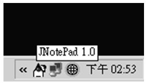
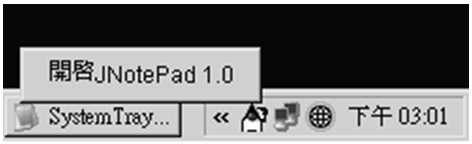
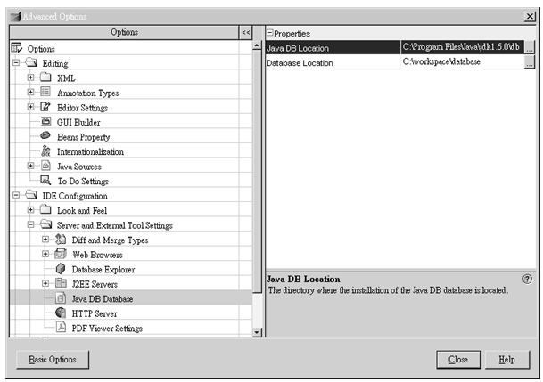
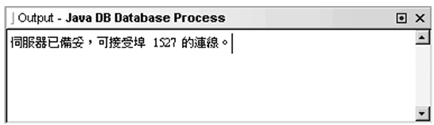
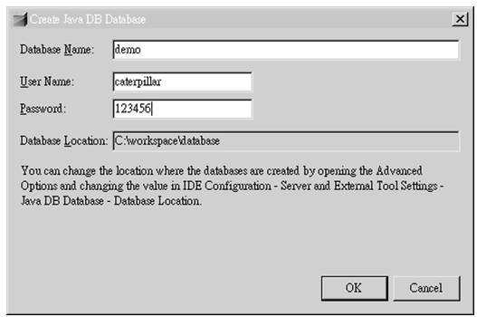
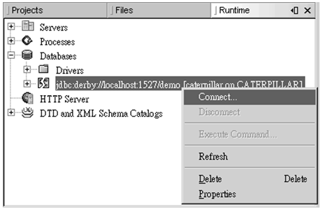
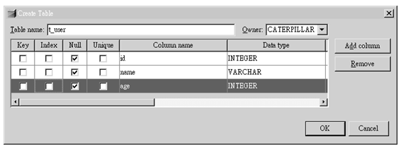
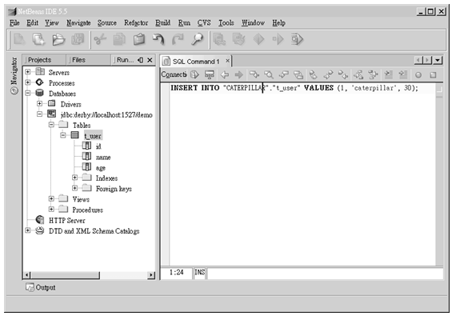
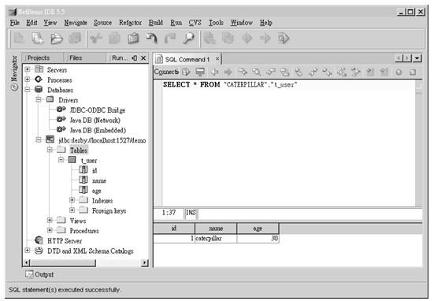

# 第 21 章 Java SE 6 新功能簡介

在 Java SE 6 中所增加的新功能，大部份都是進階使用者才會使用的功能，在這個章節中，將針對本書中有提供的相關主題，而 Java SE 6 中也有加強的功能加以說明，例如對 java.lang、java.util、java.io、java.awt 等套件中的功能加強。

在 Java SE 6 中也包括了 JDBC 4.0，而 JDK 6 當中也附帶了一個支援 JDBC 4.0 的純 Java 資料庫：Apache Derby。本章中將簡單的介紹一下 Apache Derby 資料庫，並使用它來體驗一下 JDBC 4.0 的一些新功能。

----------------

## 21.1 Java SE 6 基本新功能

首先來看到，對於 java.lang、java.util、java.io、java.awt 等套件，在 Java SE 中有什麼新的改變。

### 21.1.1 java.lang 套件

在 Java SE 6 之前，如果想要測試一個字串是否為空字串，必須使用 String 實例的 length() 方法取得字串長度，再判斷字串長度是否為 0，例如：

    String str = "";
    if(str.length() == 0) {
        …
    }
    
在 Java SE 6 中，String 類別上新增了 isEmpty() 方法，現在您可以直接呼叫這個方法來測試一個字串是否為空字串，例如：

    String str = "";
    if(str.isEmpty()) {
        …
    }
    
### 21.1.2 java.util 套件

在 5.2.1 進階的陣列操作中談到了陣列複製，您可以使用 System.arraycopy() 方法來進行陣列複製： 

    int[] arr1 = {1, 2, 3, 4, 5};
    int[] arr2 = new int[5];
 
    System.arraycopy(arr1, 0, arr2, 0, arr1.length);
    
這個方式必須明確自行新建立一個陣列物件。在 Java SE 6 中，Arrays 類別新增了 copyOf() 方法，可以直接傳回一個新的陣列物件，而當中包括複製的內容，例如：

#### **範例 21.1  ArrayDemo.java**
```java
package onlyfun.caterpillar;

import java.util.Arrays;

public class ArrayDemo {
    public static void main(String[] args) {
        int[] arr1 = {1, 2, 3, 4, 5}; 
        int[] arr2 = Arrays.copyOf(arr1, arr1.length);
 
        for(int i = 0; i < arr2.length; i++) 
            System.out.print(arr2[i] + " "); 
        System.out.println();
    }
}
```

執行結果如下所示：

    1 2 3 4 5
    
Arrays 的 copyOf() 方法傳回的陣列是新的陣列物件，所以您改變傳回陣列中的元素值，也不會影響原來的陣列。

copyOf() 的第二個引數指定要建立的新陣列長度，如果新陣列的長度超過原陣列的長度，則多出來的元素會保留陣列預設值，例如：

#### **範例 21.2  ArrayDemo2.java**
```java
package onlyfun.caterpillar;

import java.util.Arrays;

public class ArrayDemo2 {
    public static void main(String[] args) {
        int[] arr1 = {1, 2, 3, 4, 5}; 
        int[] arr2 = Arrays.copyOf(arr1, 10);
 
        for(int i = 0; i < arr2.length; i++) 
            System.out.print(arr2[i] + " "); 
        System.out.println();
    }
}
```

由於陣列元素是 int 型態，所以多出來的元素預設值會是 0，執行結果如下所示：

    1 2 3 4 5 0 0 0 0 0

除了 copyOf() 之外，還有 copyOfRange() 方法，您可以指定來源陣列以及要複製的索引範圍進行陣列複製，例如：

    int[] arr1 = {1, 2, 3, 4, 5}; 
    int[] arr2 = Arrays.copyOf(arr1, 1, 4);
    
以上的程式碼片段，將複製索引 1 開始到索引 4（不包括索引4）的元素，並傳回一個新陣列物件，所以 arr2 的元素將會是 2、3、4。

Arrays 類別中的 binarySearch() 方法也增加了新功能，現在您可以直接指定陣列中的某個範圍進行搜尋，例如：

#### **範例 21.3  BinarySearchDemo.java**
```java
package onlyfun.caterpillar;

import java.util.Arrays;

public class BinarySearchDemo {
    public static void main(String[] args) {
        int[] arr1 = {10, 20, 30, 40, 50, 60, 70, 80, 90};
        int result = Arrays.binarySearch(arr1, 6, 9, 85);

        if(result > -1) {
            System.out.printf("索引 %d 處找到資料%n", result);
        }
        else {
            System.out.printf("插入點 %d %n", (result + 1) * -1);
        }
    }
}
```

在這個程式中，指定搜尋索引 6 到索引 9（不包括索引 9）的範圍中是否有 85 的值，如果找到的話，傳回索引值，如果沒有找到，傳回一個負值，該負值加 1 再乘以 -1，就是插入點位置，也就是第一個比指定搜尋值大的值之索引位置，就這個程式而言，就是顯示 "插入點8" 的結果。

在 18.1.2 使用 Calendar 中，在範例 18.6 中使用 switch 進行判斷以顯示中文的日期格式，在 Java SE 6 中，您可以直接使用 getDisplayNames() 或 getDisplayName() 方法取得區域化的日期格式顯示，例如可以改寫範例 18.6 為以下的程式：

#### **範例 21.4  CalendarDemo.java**
```java
package onlyfun.caterpillar;

import java.util.*;
import static java.util.Calendar.*;

public class CalendarDemo {
    public static void main(String[] args) {
        Calendar rightNow = Calendar.getInstance();
        Locale locale = Locale.getDefault();
       
        System.out.println("現在時間是：");
        System.out.printf("%s：%d %n",
           rightNow.getDisplayName(ERA, LONG, locale),
           rightNow.get(YEAR));
        System.out.println(
           rightNow.getDisplayName(MONTH, LONG, locale));
        System.out.printf("%d 日%n", 
           rightNow.get(DAY_OF_MONTH));
        System.out.println(
           rightNow.getDisplayName(DAY_OF_WEEK, LONG, locale));

    }   
}
```

只要指定 Locale 物件，就可以適當的顯示區域化日期訊息，執行的結果如下所示：

    現在時間是：
    西元：2006
    十一月
    23 日
    星期四
    
在 Java SE 6 中，對於集合物件還增加有 Deque 介面（繼承自Queue介面）、NavigableMap 介面（繼承自 SortedMap 介面）、NavigableSet 介面（繼承自 SortedSet 介面），建議您可以查閱一下 API 文件，以了解這些集合物件的使用方式。

### 21.1.3 java.io 套件

在第 15 章中曾經介紹過，如何使用 Thread 來建立一個在文字模式下，具有密碼遮罩功能的小程式，在 Java SE 6 中，如果您希望文字模式主控台下的輸入有密碼遮罩的功能，則可以使用 System 類別上新增的 console() 方法來傳回一個 java.io.Console 物件，使用 Console 物件的 readLine() 方法可以直接讀取文字模式的使用者文字輸入，而使用 readPassword() 方法時，使用者輸入的文字將不會顯示在畫面中，例如在第 15章 的範例 15.2，就可以改寫如下：

#### **範例 21.5  PasswordDemo.java**
```java
package onlyfun.caterpillar;

public class PasswordDemo {
    public static void main(String[] args) {
        while(true) {
            System.out.print("輸入名稱：");
            String name = System.console().readLine();

            System.out.print("輸入密碼： ");
            char[] passwd = System.console().readPassword();
            String password = new String(passwd);

            if("caterpillar".equals(name) &&
               "123456".equals(password)) {
                System.out.println("歡迎 caterpillar ");
                break;
            }
            else {
                System.out.printf("%s，名稱或密碼錯誤，請重新輸入！%n", name);
            }
        }
        
    }
}
```

要注意到，readPassword() 方法傳回的是字元陣列物件，而不是 String 物件，在程式中使用傳回的字元陣列建構 String 物件，以利用其 equals() 方法直接進行字串內容的比較，執行的結果如下所示：

    輸入名稱：caterpillar
    輸入密碼：
    歡迎 caterpillar

Console 物件的 readLine() 與 readPassword() 方法，都可以直接設定輸出字串格式，類似於設定 System.out.printf() 的方式，例如可以將範例 21.5 改寫為以下的內容：

#### **範例 21.6  PasswordDemo2.java**
```java
package onlyfun.caterpillar;

import java.io.Console;

public class PasswordDemo2 {
    public static void main(String[] args) {
        Console console = System.console();
        while(true) {
            String name = console.readLine("[%s] ", "輸入名稱…");

            char[] passwd = console.readPassword("[%s]", "輸入密碼…");
            String password = new String(passwd);

            if("caterpillar".equals(name) &&
               "123456".equals(password)) {
                System.out.println("歡迎 caterpillar ");
                break;
            }
            else {
                System.out.printf("%s，名稱或密碼錯誤，請重新輸入！%n", name);
            }
        }
        
    }
}
```

執行結果如下：

    [輸入名稱…] caterpillar
    [輸入密碼…]
    歡迎 caterpillar

Console 物件還有 format()、printf() 方法，使用方法與 System.out.format() 與 System.out.printf() 方法相同，另外您還可以使用 reader() 方法傳回一個與文字模式主控台相關聯的 Reader 物件，使用 writer() 方法傳回一個與主控台相關聯的 PrintWriter 物件，以方便您進行各項主控台的操作。

在 Java SE 6 中，對於 File 類別新增了幾個方法，例如您可以使用 getTotalSpace() 取得檔案所在的磁碟機之總容量，使用 getUsableSpace() 取得檔案所在的磁碟機之可用容量，下面這個程式示範了，如何查詢目前系統中所有磁碟機的總容量與可用容量：

#### **範例 21.7  FileDemo.java**
```java
package onlyfun.caterpillar;

import java.io.File;

public class FileDemo {
    public static void main(String[] args) {
        File[] roots = File.listRoots();
        for(File root : roots) {
            System.out.printf("%s 總容量 %d，可用容量 %d %n", 
                 root.getPath(), root.getTotalSpace(), 
                root.getUsableSpace());
        }
    }
}
```

在我的電腦上執行結果如下：

    C:\ 總容量 34792636416，可用容量 24924717056
    D:\ 總容量 11569840128，可用容量 7800184832
    E:\ 總容量 11520540672，可用容量 7503691776
    F:\ 總容量 0，可用容量 0
    
如果檔案系統權限可以設定（擁有者）可讀、可寫、可執行等權限，則您還可以使用 File 物件的 setReadable()、setWritable()、setExecutable() 等方法進行設定。

### 21.1.4 java.awt 套件

在 Java SE 6 中對於視窗程式設計也作了極大的改進，雖然本書並沒有深入講解 Java 的視窗程式設計，然而在這邊可以介紹幾個有特色且使用簡單的功能。

有些視窗程式在啟動時，會有個啟動畫面，在 Java SE 6 之前，您要自己實作才可以擁有這個功能，現在您可以直接在使用 "java" 程式執行程式時下達 "-splash" 引數指定啟動畫面的圖片，就可以擁有這個功能，例如若執行 19.5 所製作出來的 Executable Jar 檔時，如下指定圖片：

    java -splash:caterpillar.jpg -jar JNotePad.jar
    
其中 caterpillar.jpg 是啟動畫面的圖片，支援的圖片可以是 JPG、GIF 或 PNG，GIF 若有動畫效果則可以呈現出來，執行時的畫面如下所示：


圖 21.1 指定啟動畫面的執行結果

您也可以在製作 Executable JAR 檔案時，於 manifest 檔案中指定 "SplashScreen-Image" 為啟動畫面的圖片，並在使用 jar 程式進行包裝時一併包裝圖片，如此啟動 JAR 檔案時，就會自動展現啟動畫面，一個 manifest 檔案的寫法如下所示：

    Manifest-Version: 1.0
    Main-Class: onlyfun.caterpillar.JNotePad
    SplashScreen-Image: caterpillar.jpg
    
如果您對於啟動畫面更進一步的控制感興趣，例如在不同的啟動階段顯示不同的圖片，或者是在啟動圖片上顯示進度列，則可以看看 java.awt. SplashScreen 的 API 文件說明。

在 Java SE 6 中加入了系統工具列圖示的支援，您可以使用 SystemTray 類別的 isSupported() 方法，測試看看目前的系統是否支援系統工具列圖示，如果支援的話，可以使用 getSystemTray() 取得 SystemTray 實例，使用 add() 方法加入 TrayIcon 實例，如此就可以加入一個系統工具列圖示，例如：

#### **範例 21.8  SystemTrayDemo.java**
```java
package onlyfun.caterpillar;

import java.awt.*;

public class SystemTrayDemo {
    public static void main(String[] args) {
        if(SystemTray.isSupported()) {
            SystemTray tray = SystemTray.getSystemTray();
            Image image = Toolkit.getDefaultToolkit()
                                 .getImage("musical_note_smile.gif");
            TrayIcon trayIcon = new TrayIcon(image, "JNotePad 1.0");
            try {
                tray.add(trayIcon);
            } catch (AWTException e) {
                System.err.println("無法加入系統工具列圖示");
                e.printStackTrace();
            }
        } else {
            System.err.println("無法取得系統工具列");
        }
    }
}
```

一個執行的結果畫面如下所示：



圖 21.2 使用系統工具列

如果想在系統工具列圖示上按右鍵時，可以出現蹦現視窗，則可以在建構 TrayIcon 實例時，指定一個 PopupMenu 實例給它，例如：

#### **範例 21.9  SystemTrayDemo2.java**
```java
package onlyfun.caterpillar;

import java.awt.*;
import javax.swing.*;

public class SystemTrayDemo2 {
    public static void main(String[] args) {
        if(SystemTray.isSupported()) {
            SystemTray tray = SystemTray.getSystemTray();
            Image image = Toolkit.getDefaultToolkit()
                                 .getImage("musical_note_smile.gif");
            PopupMenu popup = new PopupMenu();
            MenuItem item = new MenuItem("開啟JNotePad 1.0");
            popup.add(item);
            TrayIcon trayIcon = 
                    new TrayIcon(image, "JNotePad 1.0", popup);
            try {
                tray.add(trayIcon);
            } catch (AWTException e) {
                System.err.println("無法加入系統工具列圖示");
                e.printStackTrace();
            }
        } else {
            System.err.println("無法取得系統工具列");
        }
    }
}
```

執行以上程式，並在出現的圖示上按滑鼠右鍵，將會出現以下的畫面：



圖 21.3 系統工具列蹦現視窗

如果要移除系統工具列中的圖示，則可以使用SystemTray實例的remove()方法，指定要移除的圖示，例如：
tray.remove(trayIcon);

### 21.1.5 Classpath 簡化設定

在 Java SE 6 之前，如果目錄下有很多 .jar 檔案，則要一個一個 .jar 檔案分別指定，才可以正確的設定 Classpath，例如您可能在執行程式時，如下指定 Classpath：

    java –cp .;c:\jars\a.jar;c:\jars\b.jar onlyfun.caterpillar.JNotePad
    
在 Java SE 6 中，您可以使用 '*' 來指定某個目錄下的所有 .jar 檔案，例如上例在 Java SE 6 中，可以如下指定：

    java –cp .;c:\jars\* onlyfun.caterpillar.JNotePad
    
Java SE 6 中 Classpath 新的指定方式，也適用在系統環境變數的設定上。

## 21.2 Apache Derby、JDBC 4.0

Java SE 6 中包含了 JDBC 4.0，對於 JDBC 的使用有了相當的簡化，包括了簡化的資料庫驅動程式載入、例外處理的改進、增強的 BLOB/CLOB 支援等新功能，在這個小節中，也將簡介 JDK 6 中附帶的 Apache Derby 資料庫之使用，並使用它來示範 JDBC 4.0 的功能。

### 21.2.1 使用 Apache Derby

目前對於 JDBC 4.0 支援的資料庫驅動程式還不多，在 JDK 6 中綑綁了 [Apache Derby 資料庫](http://db.apache.org/derby/)，這是一個純 Java 撰寫的資料庫，支援 JDBC 4.0，您可以在 JDK 6 包裝目錄的 db 目錄下找到 Apache Derby 的相關檔案，也可以至 http://db.apache.org/derby/derby_downloads.html 下載 Apache Derby 資料庫，所下載的檔案中將包括更多的文件等相關資源。

使用 Apache Derby 資料庫最簡單的方式之一，是使用 NetBeans IDE 來啟動、連接、管理 Derby 資料庫，您可以在 [Sun 官方網站](http://java.sun.com)，或是 [NetBeans官方網站](http://www.netbeans.org/) 下載最新的 NetBeans IDE 並進行安裝，在這邊將以 NetBeans IDE 5.5 來示範，如何使用 Derby 資料庫。

首先，請啟動 NetBeans IDE，執行選單上的「Tools/Options」，接著選擇「Advanced Options」，在「IDE Configuration」中選擇「Server and External Tool Settings」的「Java DB Database」，接著在右邊的「Java DB Location」中設定 Apache Derby 的位置，在這邊是指向「C:\Program Files\Java\jdk1.6.0\db」，而在「Database Location」中設定您的資料庫儲存位置，在這邊是設定為「C:\workspace\database」，如下圖所示：



圖 21.4 設定 Apache Derby 位置與資料庫儲存位置

設定完成之後，可執行選單上「Tools/Java DB Database/Start Java DB Server」來啟動 Apache Derby 資料庫，啟動成功的話，將出現以下的畫面：



圖 21.5 啟動 Apache Derby

接著執行選單上「Tools/Java DB Database/Create Java DB Database…」，輸入資料庫名稱、使用者名稱與密碼，如下圖所示：



圖 21.6 建立資料庫

接著切換至「Runtime」窗格，選擇「Databases」並在所建立的資料庫上按右鍵執行「Connect」，如下所示：



圖 21.7 連接資料庫

連接所建立的資料庫之後，就可以開始建立表格了，如下圖所示：


圖 21.8 建立資料表格

假設您如下建立了 t_user 表格：



圖 21.9 建立資料表格

表格建立完成之後，可以在「Runtime」窗格中檢視所建立的表格，在表格上按右鍵執行「Execute command…」，則會出現「SQL Command」窗格，您可以在當中執行 SQL 指令，例如下圖示範了如何在資料表格中插入一筆資料：



圖 21.10 插入表格資料

您也可以執行資料查詢，例如下圖示範如何查詢資料表格中的所有資料，查詢到的資料將顯示於下方窗格：



圖 21.11 查詢表格資料

關於Apache Derby的介紹先到這邊告一段落，接下來將要介紹，如何撰寫程式連接Apache Derby，並使用JDBC 4.0的新功能。

21.2.2　載入驅動程式
在之前的操作中，可以從圖中看到，要連接Apache Derby，使用的JDBC URL是" jdbc:derby://localhost:1527/demo"，而Apache Derby的JDBC驅動程式是放在derbyclient.jar之中，因此請記得在您的Classpath之中加以設定。
在JDBC 4.0之前，如果您要連接資料庫的話，必須使用Class.forName()並指定驅動程式類別名稱，以載入JDBC驅動程式，例如：
String url = …;
String username = …;
String password = …;
String driver = …;
Class.forName(driver);
Connection conn = DriverManager.getConnection(url, username, password);
在JDBC 4.0之中，不需要再呼叫Class.forName()並指定驅動程式了，也就是說，只要一行就可以了：
Connection conn = DriverManager.getConnection(url, username, password);
那麼JVM如何得知要載入哪個驅動程式呢？JVM會自動在Classpath中尋找適當的驅動程式，在包裝有JDBC驅動程式的JAR檔案中，必須有一個"META-INF/services/java.sql.Driver"檔案，當中撰寫驅動程式類別名稱，以Apache Derby為例，在derbyclient.jar中的"META-INF/services/java.sql.Driver"檔案中，撰寫的是"org.apache.derby.jdbc.ClientDriver "。
以第20章的範例20.2為例，若使用JDBC 4.0，則可以將Class.forName()該行移除，並在執行時指定Classpath中包括derbyclient.jar的位置，而範例20.4仍然正常運行。

### 21.2.2 改進的例外處理

在 JDBC 4.0 之中，SQLException 新增了幾個建構函式，可以接受 Throwable 實例進行 SQLException 的建構，您可以重新將某個例外包裝為 SQLException，例如由於 IOException 發生的 SQLException，這表示您對於 SQLException 所發生的原因更加可以細分與掌握，SQLException 並實作了 `Iterable<T>` 介面，現在您可以在捕捉到 SQLException 時，使用加強的 for 迴圈來找出例外發生的原因，例如：

```
try {
    …
}
catch(SQLException ex) {
    for(Throwable t : ex) {
        System.err.println(t);
        Throwable cause = t.getCause();
        while(cause != null) {
            System.err.println("Cause: " + cause);
            cause = cause.getCause();
        }
    }
}
```

SQLException 在 JDBC 4.0 中多了幾個子類別，針對不同的錯誤將例外加以細分，您可以查看 API 文件中有關 SQLException 的說明。

### 21.2.3 BLOB、CLOB 的改進

在 20.2.3 中介紹過 JDBC 的 LOB 讀寫，當需要存入資料至 BLOB 或 CLOB 欄位時，要使用 PreparedStatement 的 setBinaryStream()、 setObject()、setAsciiStream()、setUnicodeStream() 等方法，在 API 名稱上並不是很明確。

在 JDBC 4.0 中，PreparedStatement 新增了接受 InputStream 實例的 setBlob() 等方法，這些方法並不是單純的取代 setBinaryStream() 方法名稱，在 API 文件中說道，它會將資料以 BLOB 的方式送至資料庫，而 setBinaryStream() 方法還得做額外的功夫，判斷資料是 LONGVARBINARY 或 BLOB。同樣的對於 CLOB，PreparedStatement 也增加有接受 Reader 實例的 setClob() 等方法。

而在 Connection 上，也增加有 createBlob() 與 createClob() 等方法，您可以直接透過它們建立 Blob、Clob 實例，並以這些實例進行 BLOB、CLOB 的讀寫操作，讓程式中操作的目的更為明確。

## 21.3 接下來的主題

Java SE 6 多了不少新的功能，本章只是對於一些基本的新增功能加以介紹，如果您有興趣的話，也可以看看 Java Compiler API、Scripting 等進階議題。

